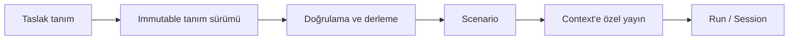

# Akış nesne kataloğu ve geliştirme sırası

## Karar

Akış, Oracle Data Integrator'ın ekranlarını veya repository şemasını bire bir
kopyalamaz. Ancak kullanıcının bir entegrasyon projesini tanımlamak, sürümlemek,
yayınlamak ve işletmek için ihtiyaç duyduğu nesneleri eksiksiz ve açık sınırlarla
modeller.

Geliştirme sırası kapılıdır:

1. Bu katalog ve nesne ilişkileri kesinleşir.
2. PostgreSQL metadata şeması, kısıtları ve migrasyon testleri tamamlanır.
3. Backend API ve domain kuralları tamamlanır.
4. UI ve uçtan uca kullanıcı akışları tamamlanır.
5. Oracle çalıştırma motoru yalnız yayımlanmış tanımları çalıştıracak şekilde bağlanır.

Bir kapının kabul kriteri geçmeden sonraki katman ürün koduna eklenmez.

## Nesne aileleri

### Organizasyon ve güvenlik

| Nesne | Sorumluluk | Kapsam |
|---|---|---|
| Proje | Fonksiyonel, güvenlik ve sahiplik sınırı | Sistem |
| Klasör | Mapping, Paket ve Prosedürleri hiyerarşik düzenler | Proje |
| Kullanıcı / Rol / Yetki | Görme, geliştirme, yayınlama ve çalıştırma izinleri | Sistem + proje |
| Secret referansı | Parolayı değil, dış veya yerel secret anahtarını taşır | Proje |

Mapping, Paket ve Prosedür mutlaka bir proje klasörüne aittir. Değişken,
Sequence, Kullanıcı Fonksiyonu ve Knowledge Module proje veya global kapsamda
olabilir. Global nesne kullanımı ayrıca yetkilendirilir.

### Topology ve veri modeli

| Nesne | Sorumluluk |
|---|---|
| Bağlantı | Oracle/PostgreSQL/MySQL gibi motorun kararlı kimliği |
| Bağlantı sürümü | Host, port, service/SID, sürücü, TLS ve policy'nin immutable sürümü |
| Fiziksel şema | Gerçek veritabanı namespace'i |
| Mantıksal şema | Tasarımların kullandığı ortamdan bağımsız ad |
| Context / Ortam | Mantıksal şemayı fiziksel şemaya bağlar |
| Model | Keşfedilmiş veri nesnelerinin işlevsel grubu |
| Alt model | Model içindeki hiyerarşik grup |
| Datastore / Veri nesnesi | Tablo, view veya kontrollü sorgu tanımı |
| Şema görüntüsü | Kolon, anahtar, kısıt ve tiplerin immutable keşif anı |
| Agent / Worker profili | Çalıştırıcının capability ve kaynak profilidir; secret taşımaz |

### Tasarım nesneleri

| Nesne | Akış'taki anlamı | Ana içerik |
|---|---|---|
| Mapping | Deklaratif kaynak-hedef veri akışı | Typed IR, kolon eşlemeleri, yazma stratejisi |
| Yeniden kullanılabilir Mapping | Başka mapping'lere imzalı alt akış sağlar | Girdi/çıktı portları ve typed IR |
| Paket | Bir entegrasyon işinin kontrol akışıdır | İlk adım, adımlar, başarılı/başarısız geçişler |
| Prosedür | Mapping'e uymayan kontrollü teknik görev grubudur | Sıralı görevler, kaynak/hedef komutları, seçenekler |
| Değişken | Tek bir typed çalışma değeridir | Tip, varsayılan, refresh tanımı, geçmiş politikası |
| Sequence | Her kullanımda ilerleyen değer üreticisidir | Native/repository/table uygulaması ve artış politikası |
| Kullanıcı Fonksiyonu | Tekrar kullanılan typed ifade fonksiyonudur | İmza ve teknolojiye özel güvenli uygulamalar |
| Knowledge Module | Entegrasyon stratejisi/code template tanımıdır | RKM/CKM/LKM/IKM/XKM/JKM/SKM türü, capability ve seçenekler |

Prosedür serbest bir uzaktan kod çalıştırma yüzeyi değildir. İlk sürümde yalnız
kayıtlı bağlantılarda allowlist'li SQL/JDBC görevleri açıktır. İşletim sistemi,
Jython/Groovy, JMS ve dış process komutları varsayılan olarak kapalıdır ve ileride
ayrı capability, sandbox ve yetki kararı gerektirir.

### Dağıtım ve orkestrasyon nesneleri

| Nesne | Sorumluluk |
|---|---|
| Tanım sürümü | Tasarım nesnesinin immutable, hash'li içerik sürümü |
| Doğrulama | Belirli tanım sürümü + context için bulgu ve karar |
| Scenario | Mapping/Paket/Prosedür/Değişken sürümünden üretilen immutable executable |
| Yayın | Scenario/planı belirli context ve fiziksel bağımlılıklara sabitler |
| Load Plan | Scenario'ları sıralı, paralel ve koşullu çalıştıran üst seviye plan |
| Zamanlama | Yayınlanmış Scenario veya Load Planı takvime bağlar |

Scenario kullanıcı tarafından serbestçe düzenlenmez. Kaynak tanım sürümünden
deterministik derlenir; kaynak değişince mevcut Scenario değişmez, yeni sürüm
üretilir. Load Plan, Paket'in yerine geçmez: Paket geliştirme kontrol akışıdır;
Load Plan yayınlanmış çalıştırılabilirleri operasyonel restart ve paralellik
politikalarıyla düzenler.

### Çalışma ve kanıt nesneleri

| Nesne | Sorumluluk |
|---|---|
| İş talebi | Manuel veya zamanlanmış çalışma niyeti ve idempotency kimliği |
| Çalıştırma / Session | Bir iş talebinin immutable denemesi |
| Çalıştırma adımı | Paket/Load Plan/Scenario içindeki izlenebilir adım |
| Görev / Task | Prosedür veya derlenmiş mapping içindeki en küçük teknik iş |
| Değişken değer olayı | Başlangıç ve her adım sonrasındaki typed değer kanıtı |
| Sequence değer olayı | Üretilen değer ve uygulama türü kanıtı |
| Checkpoint | Hedefte doğrulanmış batch/publish/watermark kanıtı |
| Metrik / hata / olay | Sayım, sınıflandırılmış hata ve append-only geçmiş |
| Audit / lineage | Kim-ne-yaptı ve veri soyunun güvenli kanıtı |

## Paket sözleşmesi

Paket bir yönlendirilmiş kontrol grafıdır ve tam olarak bir ilk adıma sahiptir.
İlk sürüm adım türleri:

- `MAPPING`: yayımlanabilir bir Mapping sürümüne referans.
- `PROCEDURE`: Prosedür sürümüne ve option değerlerine referans.
- `VARIABLE_DECLARE`: değişkeni session kapsamına alır.
- `VARIABLE_REFRESH`: kayıtlı refresh sorgusunu çalıştırır.
- `VARIABLE_SET`: typed değeri atar.
- `VARIABLE_INCREMENT`: sayısal değeri kontrollü artırır.
- `VARIABLE_EVALUATE`: koşul üretir.
- `PACKAGE`: başka Paket sürümüne referans; dependency cycle yasaktır.

Her adım en fazla bir koşulsuz başarılı ve bir başarısız geçiş taşır. Evaluate
adımı typed koşul dalları taşıyabilir. Ulaşılamayan adım, birden fazla ilk adım,
izin verilmeyen cycle ve eksik referans yayınlamayı engeller.

## Prosedür sözleşmesi

Prosedür sıralı görevlerden oluşur. Her görevde kaynak komutu, hedef komutu veya
ikisi bulunabilir; teknoloji ve bağlantı rolü açıkça belirtilir. Option tanımları
typed, gerekli/default ve secret sınıfı taşır. Secret option değeri tanıma veya
çalışma loguna yazılmaz; yalnız secret referansı kabul edilir.

DDL ve destructive DML ayrıca risk sınıfı taşır. `DROP`, `TRUNCATE`, sınırsız
`DELETE` veya işletim sistemi komutu genel Prosedür yetkisiyle çalıştırılamaz.

## Değişken sözleşmesi

Desteklenen kanonik tipler `STRING`, `INTEGER`, `DECIMAL`, `BOOLEAN`, `DATE`,
`TIMESTAMP` ve `JSON`'dır. Değişken adları case-sensitive değildir; kanonik kod
tek biçimde saklanır. Scope `GLOBAL`, `PROJECT`, `PACKAGE_RUN` veya `STEP` olabilir.

Değer kaynağı `INPUT`, `DEFAULT`, `REFRESH_QUERY`, `EXPRESSION` ya da önceki adım
çıktısıdır. Geçmiş politikası `NONE`, `LATEST` veya `ALL` olabilir. Secret ve
hassas değişkenlerde değer geçmişi tutulmaz; yalnız redakte edilmiş kanıt tutulur.

## Sequence sözleşmesi

Uygulama türleri:

- `NATIVE`: fiziksel veritabanı sequence/identity nesnesini kullanır; tercih edilir.
- `REPOSITORY`: PostgreSQL metadata deposunda atomik sayaç kullanır.
- `TABLE`: kayıtlı fiziksel tabloda kilitlenen bir sayaç hücresini kullanır.

Başlangıç, artış, minimum, maksimum, cycle ve cache davranışı açık tanımdır.
Sequence değeri rollback ile geri alınmış sayılmaz ve commit sırasını kanıtlamaz.
Bu nedenle tek başına kayıpsız incremental watermark olarak kullanılamaz.

## Sürümleme ve bağımlılık

Değişebilir kimlik kaydı ile immutable içerik sürümü ayrıdır. Paket adımı güncel
nesne adına değil, yayın sırasında sabitlenen tanım sürümüne bağlanır. Bağımlılık
tablosu en az şu rolleri taşır: `CALLS`, `READS`, `WRITES`, `USES_VARIABLE`,
`USES_SEQUENCE`, `USES_FUNCTION`, `USES_KM`, `GENERATED_FROM`.

Taslak kaydedilebilir fakat çalıştırılamaz. Akış sırası:

## Kapsama alınan ve ertelenen ODI kavramları

İlk ürün modelinde Proje, Klasör, Mapping, Yeniden Kullanılabilir Mapping, Paket,
Prosedür, Değişken, Sequence, Kullanıcı Fonksiyonu, Knowledge Module, Scenario,
Load Plan ve Zamanlama katalogda yer alır. Her ekranın aynı anda etkin olması
gerekmez; fakat nesne kimliği, sürüm ve dependency sözleşmesi sonradan eklenmez.

CDC/journal, dimension/cube, web service, shortcut, marker/memo, SDK/Groovy ve
genel amaçlı ODI Tool uyumluluğu katalogda `ERTELENDI` capability olarak izlenir.
Bunlar sessizce Prosedür içine kaçırılmaz.

## Veritabanı kapısı kabul kriterleri

- Katalogdaki her kalıcı nesnenin sahibi, scope'u ve yaşam döngüsü bellidir.
- Proje dışı referanslar ve klasör/proje uyuşmazlıkları FK/kısıtla reddedilir.
- Tanım sürümleri ve Scenario payload'ları append-only'dir.
- Paket ve Load Plan dependency cycle'ları yayın öncesinde reddedilir.
- Değişken tip/geçmiş, Sequence concurrency ve rollback davranışı şemada açıktır.
- Secret değeri tutan kolon yoktur.
- Temiz PostgreSQL üzerinde tüm migrasyonlar ve şema lint testi geçer.
- Aynı migrasyon ikinci kez şema değiştirmez.

## Resmî davranış dayanakları

- [Oracle ODI Projects and Folders](https://docs.oracle.com/en/middleware/fusion-middleware/data-integrator/12.2.1.4/quick-ref/projects.html)
- [Oracle ODI Packages](https://docs.oracle.com/en/middleware/fusion-middleware/data-integrator/12.2.1.4/quick-ref/packages.html)
- [Oracle ODI Procedures, Variables, Sequences and User Functions](https://docs.oracle.com/en/middleware/fusion-middleware/data-integrator/12.2.1.4/odidg/creating-and-using-procedures-variables-sequences-and-user-functions.html)
- [Oracle ODI Mappings](https://docs.oracle.com/en/middleware/fusion-middleware/data-integrator/12.2.1.4/quick-ref/mappings.html)
- [Oracle ODI Knowledge Modules](https://docs.oracle.com/en/middleware/fusion-middleware/data-integrator/12.2.1.4/quick-ref/knowledge-modules.html)

