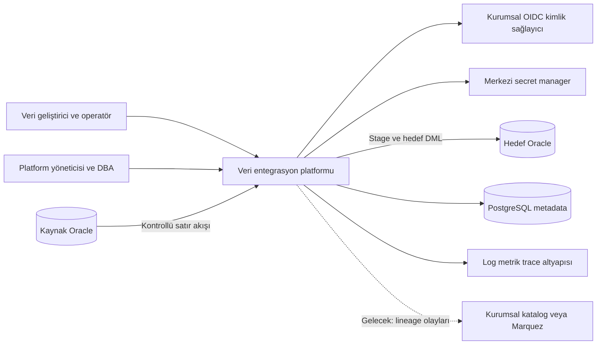
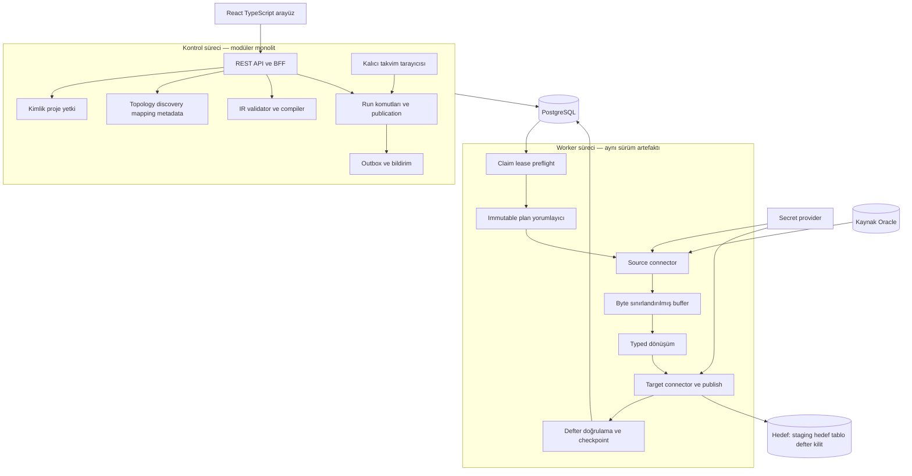
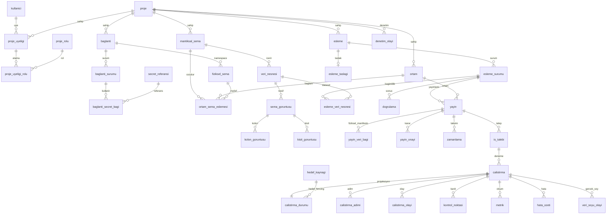
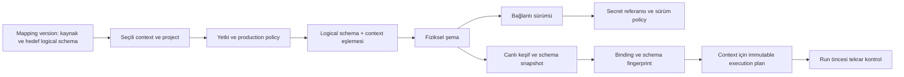
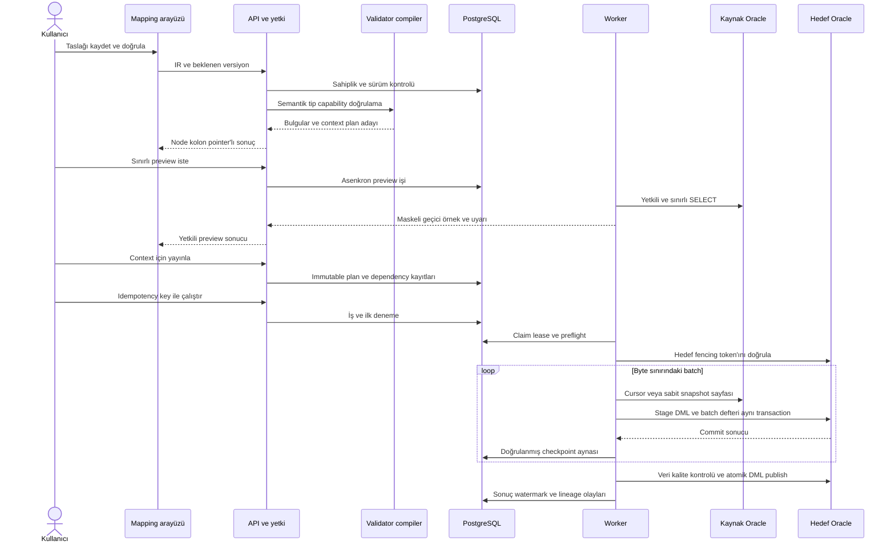
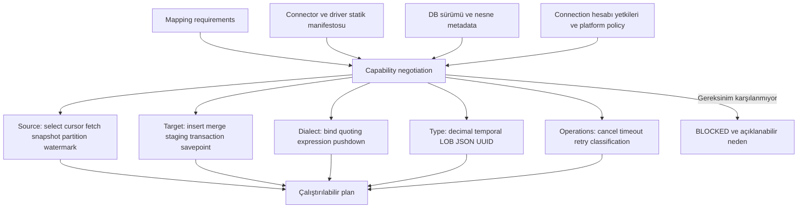
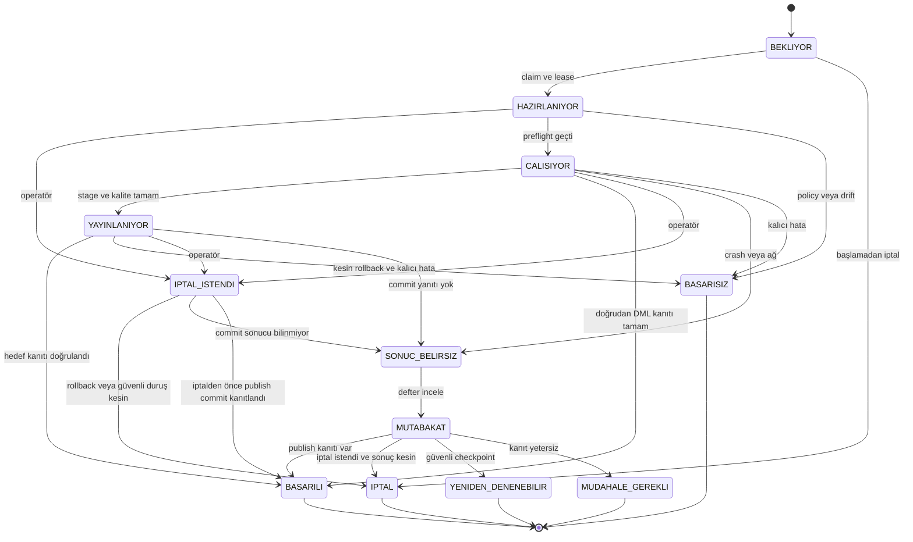
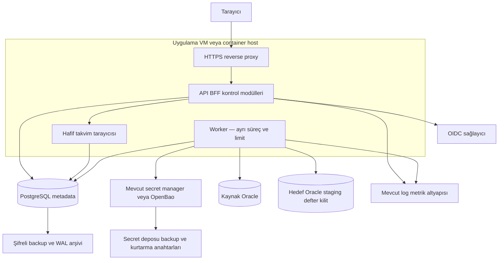

# ODI Benzeri Veri Entegrasyon Platformu: Teknik Araştırma ve Hedef Mimari

**Araştırma kesim tarihi: 10 Eylül 2026.**

Bu rapor bir mimari karar ve uygulamaya hazırlık belgesidir. Uygulama, veritabanı migrasyonu veya çalışan prototip değildir. Sayısal kapasite değerleri ölçüm sonucu değil, teknik denemeler için önerilen başlangıç koşulları ve kabul hedefleridir.

**Okuma anahtarı:** “Doğrulanmış bulgu” resmi kaynaktan doğrulanan davranışı; “Öneri” bu ürün için tasarlanan kararı; **VARSAYIM** sağlanmamış ortam bilgisini; **PROTOTİPLE DOĞRULANACAK** deney gerektiren kararı; **DOĞRULANAMADI** yeterli kanıt bulunmayan bilgiyi belirtir. Aksi belirtilmedikçe veri modeli, API, politika, puanlar ve yol haritası ürün tasarımı önerileridir; mevcut bir ürünün hazır özellikleri değildir.

---

## 1. Yönetici özeti

**Önerilen ürün, küçük bir ODI kopyası değil; güçlü bir mapping derleyicisi, dar bir connector sözleşmesi ve kanıtlanabilir çalıştırma geçmişi etrafında kurulmuş bir veri taşıma platformudur.** Kullanıcı deneyiminin merkezi kolon eşleştirme tablosu olmalı; grafik yalnız kaynak, dönüşüm ve hedef arasındaki ana akışı açıklamalıdır.

Başlangıç mimarisi **Java 21 + Spring Boot 4.1.x + JDBC**, **React + TypeScript + React Flow** ve **PostgreSQL 18.x metadata veritabanıdır**. Aynı kod tabanı iki süreç rolünde dağıtılır: API/kontrol süreci ve ayrı worker süreci. Harici mesaj kuyruğu, Kubernetes, Spark, Airflow veya CDC altyapısı ilk kurulumun şartı değildir. Spring Boot'un araştırmada erişilen gereksinim sayfası Java 21'i kapsayan bir Java aralığı gösterir; Oracle JDBC'nin sürücü/JDK/veritabanı eşleşmesi ayrıca doğrulanmalıdır. Bu, belirli bir kombinasyonun bu çalışmada test edildiği anlamına gelmez. [S021 · Spring Boot — System Requirements](https://docs.spring.io/spring-boot/system-requirements.html) [S005 · Oracle JDBC Frequently Asked Questions](https://www.oracle.com/database/technologies/faq-jdbc.html)

PostgreSQL sadece proje, yetki, topology, mapping, yayın, kuyruk, çalışma olayları ve checkpoint metadata'sını saklar. **Asıl taşınan satırlar PostgreSQL'den geçirilmez.** Varsayılan veri yolu kaynak Oracle → boyut sınırı olan JDBC okuma/dönüşüm tamponu → hedef Oracle staging → hedefte kontrollü DML publish şeklindedir. Basit append için doğrudan hedefe yazma mümkündür; ancak daha düşük toparlanma garantisi kullanıcıya açıkça gösterilir.

**ODI'den alınacak temel fikir fiziksel bağlantıdan bağımsız mantıksal şema/context modelidir.** ODI'nin repository, agent ve deklaratif dönüşüm ayrımı tasarım referansıdır; Knowledge Module sistemi, master/work repository ayrımı ve ürünün tüm operasyonel yüzeyi aynen taşınmaz. [S001 · Overview of Oracle Data Integrator, 12.2.1.4](https://docs.oracle.com/en/middleware/fusion-middleware/data-integrator/12.2.1.4/odiun/overview-oracle-data-integrator.html)

En önemli güvenilirlik kararı şudur: **kaynak Oracle, hedef Oracle ve PostgreSQL tek transaction değildir.** Platform genel bir “exactly once” vaadi vermeyecektir. Sunulabilecek garantiler; en az bir kez taşıma, şartları sağlanan idempotent tekrar çalıştırma, uygun yükleme modunda atomik hedef publish ve süresi yeterli kaynak snapshot tutarlılığıdır. Hedefte veri değişikliğiyle aynı transaction'da yazılan küçük bir işlem defteri, PostgreSQL checkpoint'i ile hedef commit'i arasındaki belirsizliği çözmek için gereklidir. Bu defter yoksa bazı güvenilirlik özellikleri kapatılacaktır.

**Oracle `TRUNCATE`, geri alınabilir full refresh değildir.** Ana hedef için varsayılan tam yenileme, önce staging'e yükleme ve sonrasında yeterli undo/işlem penceresi varsa tek hedef transaction'ında `DELETE + INSERT` olacaktır. `TRUNCATE + LOAD` bakım penceresi, açık yıkıcı işlem onayı ve daha zayıf garanti etiketiyle ayrı sunulur. İki tabloyu art arda yeniden adlandırmak da kendiliğinden atomik swap değildir. Oracle normal DDL işlemlerinin commit sınırları ve `TRUNCATE`'ın geri alınamazlığı bu ayrımı zorunlu kılar. [S010 · SQL Language Reference 19c — COMMIT](https://docs.oracle.com/en/database/oracle/oracle-database/19/sqlrf/COMMIT.html) [S011 · SQL Language Reference 19c — TRUNCATE TABLE](https://docs.oracle.com/en/database/oracle/oracle-database/19/sqlrf/TRUNCATE-TABLE.html)

Mapping'in gerçek tanımı React Flow JSON'u değildir. Sürümlenen **kanonik IR**, typed expression ağacı, dataset/kolon kimlikleri, yazma stratejisi ve capability gereksinimlerini taşır. Arayüz yerleşimi ayrı tutulur. Worker yalnız doğrulanmış, context'e bağlanmış, hash'i ve bağımlılık sürümleri sabitlenmiş execution plan'ı çalıştırır. Yeni PostgreSQL/MySQL adaptörleri aynı SPI'ı uygular; iş kuralları çekirdeğe dağılmış veritabanı türü koşullarına dönüşmez.

Güvenlik başlangıç şartıdır: OIDC tabanlı oturum, API ve worker'da proje yetkilendirmesi, production için ayrı çalıştırma yetkisi, salt okunur kaynak hesabı, hedefte en az ayrıcalık, ağ allowlist'i ve merkezi secret referansı. Sıfırdan kurulacak self-hosted ortam için **OpenBao KV v2** önerilir; kurumda zaten yönetilen bir secret manager varsa önce o kullanılır. OpenBao'nun MPL-2.0 lisansı ile HashiCorp Vault'un ürün/lisans koşulları aynı değildir. Oracle dinamik credential desteği de otomatik olarak ücretsiz varsayılmamalıdır. [S097 · OpenBao — KV Secrets Engine v2](https://openbao.org/docs/secrets/kv/kv-v2/) [S098 · OpenBao — MPL-2.0 License](https://raw.githubusercontent.com/openbao/openbao/main/LICENSE) [S094 · Vault — Oracle Database Secrets Engine](https://developer.hashicorp.com/vault/docs/secrets/databases/oracle)

**Kodlama öncesi dört durdurucu kapı:** Oracle tiplerinin kayıpsız aktarımı; bellek sınırlı batch/LOB akışı; hedef commit'inden hemen sonraki worker çökmesinde tekilleştirme; 500 kolonlu eşleştirme ekranında kullanılabilirlik. Bu dört deneme başarılı olmadan kapsamlı ekran geliştirmesine veya ek connector çalışmalarına geçilmemelidir.

## 2. Gereksinimlerin yeniden ifadesi

### 2.1 Bağlayıcı ihtiyaçlar

Gereksinim kaynağı `ODI_BENZERI_ETL_PLATFORMU_ARASTIRMA_PROMPTU.md` dosyasıdır. Aşağıdaki maddeler dış kaynak bulgusu değil, ürünün değiştirilmeyen sınırlarıdır.

| Kimlik | Gereksinim | Tasarımdaki karşılığı | Doğrulama kanıtı |
|---|---|---|---|
| G01 | Oracle → Oracle güvenilir aktarım | JDBC kaynak/hedef adaptörü, batch ve staging | Bölüm 13 ve hata enjeksiyonu testleri |
| G02 | PostgreSQL metadata/control | Ürün metadata şeması, kalıcı iş kuyruğu | Veri satırının metadata DB'ye yazılmadığının ağ/depolama testi |
| G03 | Proje izolasyonu | Üyelik, kaynak izinleri, bileşik FK, RLS desteği | API/worker çapraz proje negatif testleri |
| G04 | Logical schema + context | Sürümlü çözümleme manifestosu | Aynı mapping'in TEST/ÜRETİM plan karşılaştırması |
| G05 | Kolay mapping | Önce kolon grid'i, gerektiğinde ana akış canvas'ı | Görev bazlı kullanıcı testi |
| G06 | Doğrulama ve immutable çalışma | IR → validated version → context plan → run | Plan hash ve drift testleri |
| G07 | Insert, full load, merge, incremental | Ayrı stratejiler ve garanti profilleri | Her strateji için crash/retry matrisi |
| G08 | Secret güvenliği | PostgreSQL'de referans, worker'da kontrollü çözümleme | Log/DB/UI sızıntı taraması |
| G09 | Genişleyebilirlik | Capability-aware connector SPI ve kanonik tip sistemi | PostgreSQL/MySQL sözleşme testleri |
| G10 | İzlenebilirlik | Audit, log, metrik ve lineage ayrı modeller | Run kanıt paketinin yeniden oluşturulması |
| G11 | Türkçe ASCII fiziksel standart | Bölüm 9'daki ortak kolon ve kısıt kuralları | İlk migrasyonun otomatik şema lint testi |

### 2.2 Varsayımlar ve alternatif sonuçlar

| Konu | VARSAYIM | Yanlışsa karar nasıl değişir? |
|---|---|---|
| Ekip | Oracle/SQL güçlü; Java, Python veya .NET için kesin ekip standardı verilmedi | Deneyimli .NET ekibi varsa backend matrisi öğrenme/bakım ağırlıklarıyla yeniden hesaplanır; SPI/IR değişmez |
| Kaynak | İlk üretim uyumluluğu Oracle 19c ailesi üzerinde doğrulanacak | Farklı sürüm, RAC veya özel driver zorunluluğu ek uyumluluk hattı açar |
| Hedef yetki | DBA hedefte staging, yükleme defteri ve kilit nesneleri oluşturabilecek | Sadece mevcut tabloya DML varsa doğrudan yükleme ve daha dar retry garantisiyle sınırlı profil |
| Hacim | İlk pilot 100 bin–10 milyon satır; eşzamanlı iki run | Daha yüksek hacim önce ölçülür; otomatik olarak dağıtık motor seçilmez |
| Dağıtım | Kurum içi Linux VM/container çalıştırılabilir | Windows servis dağıtımı ayrıca paketleme/test hattı ister; iş istasyonu üretim sunucusu kabul edilmez |
| Ağ | Worker kaynak ve hedef Oracle'a kontrollü erişebilir | Ayrı güvenlik bölgelerine worker yerleştirilir; veri tarayıcı/API üzerinden tünellenmez |
| Secret | Mevcut yönetilen secret manager bilgisi yok | Mevcut Vault/cloud manager varsa yeni OpenBao işletilmez |
| Ürünleşme | İlk kullanım kurum içi; ileride dağıtım/SaaS mümkün | Dağıtılan Oracle/MySQL sürücüleri ve yeniden kullanılan bileşenler için hukuki lisans değerlendirmesi zorunlu |
| Tutarlılık | Kaynakta uzun süre yeniden okunabilir snapshot garanti edilmemiş | Checkpoint'ten devam kapatılabilir; yeni pencere veya full reload gerekir |
| Hassasiyet | Aktarılan veri kişisel veya ticari hassas veri içerebilir | En kısıtlı preview/log politikası varsayılan kalır; sınıflandırma yapılmadan gevşetilmez |

### 2.3 Araştırma soruları ve çözüm sırası

Önce garantiler ve transaction sınırları; sonra kaynak/hedef yetkileri ve tip semantiği; ardından SPI ve execution plan; en son UI, zamanlama ve operasyon ayrıntıları ele alınmalıdır. “Hangi graph kütüphanesi?” sorusu, “hangi işlem gerçekten tekrar çalıştırılabilir?” sorusunun önüne geçmemelidir.

Kesin ekip yetkinliği, lisanslı Oracle test ortamı, hedefteki trigger/FK yapısı, uzun transaction toleransı ve kurumun secret altyapısı **DOĞRULANAMADI**. Bunlar mimariyi baştan yazdıracak gizli varsayımlar olarak bırakılmamış; farklı sonuçları yukarıda ve bölüm 24'te belirtilmiştir.

## 3. MVP ile gelecek vizyonunun sınırı

**MVP, Faz 1–3 sonunda güvenilir Oracle → Oracle ürün çekirdeğidir.** Faz 2 tek başına “tüm gereksinimler tamamlandı” sayılmaz. Faz 4 gelişmiş ürünleşme, Faz 5 heterojen veritabanlarıdır.

| Yetenek | Faz 2 temel dilim | Faz 3 güvenilir MVP | Faz 4–5 / sonrası |
|---|---|---|---|
| Tablo/view/izinli SELECT | Evet; serbest SELECT ayrı yetki | Kayıtlı sorgu yönetimi güçlenir | Dosya/API ayrı adaptör |
| Kolon, sabit, null/default, cast | Evet | Tip profili ve reject politikası | Geniş fonksiyon kataloğu |
| Filtre, expression | Whitelist, typed ve sınırlı | Aynı kaynak Oracle'da seçili fonksiyonlar | Daha fazla dialect |
| Join, lookup | Onaylı kaynak SQL/view ile sınırlı | Aynı fiziksel kaynakta sınırlı görsel join | Cross-source lookup; ancak bellek sınırıyla |
| Aggregate | Kaynak view/SELECT içinde | Görsel aggregate sonraya bırakılır | Capability uygunsa pushdown |
| Insert/full load | Evet; kontrollü stratejiler | Dayanıklı stage/publish | Özel bulk yolları |
| Merge ve watermark | Veri modeli hazır; genel kullanıma kapalı | Evet; doğrulanmış anahtar/pencere | CDC/tombstone genişlemesi |
| Reject/dead-letter | Fail-fast; maskeli örnek | Açık onayla hedef reject tablosu | Gelişmiş veri kalite kuralları |
| Version/publish | Asgari immutable version ve plan zorunlu | Retry aynı planı kullanır | Gelişmiş diff, onay ve rollback UX |
| Çalıştırma | Manuel | Retry/resume/cancel | Kalıcı zamanlama ve bildirim |
| Güvenlik | OIDC, proje RBAC, secret, production gate | Hata/politika kanıtları | Four-eyes ve ayrıntılı yetkiler |
| Lineage | Statik kaynak→hedef kolon bağı | Gerçek run olayları | Marquez/kurumsal katalog entegrasyonu |

Sınırsız script, Python/Java kodu yükleme, shell komutu, döngülü graph, kendi kendine SQL çalıştıran yapay zekâ, yüzlerce connector, Spark zorunluluğu ve gerçek zamanlı CDC kapsam dışıdır. Kullanıcı tarafından yazılan expression, host uygulamanın değerlendirdiği keyfi kod değil, sınırlı bir dilin typed AST'sidir.

**Kapsam düzeltmesi:** Sürümleme, production kontrolü ve temel RBAC yalnız Faz 4'e ertelenemez. Daha erken veri yazılacaksa bu kontrollerin minimum güvenli hali Faz 2'de bulunmalıdır. Faz 4 bunların kullanılabilirliğini ve yönetişimini genişletir.

## 4. Benzer ürün analizi

### 4.1 Ürünlerin çözdüğü problem ve alınacak tasarım

Tablodaki “uygunluk” değerlendirmeleri **Çıkarım:** bu ürünün dar kapsamıyla karşılaştırmadır; bağımsız performans benchmark'ı değildir.

| Ürün / standart | Doğrulanan güçlü yön | Bu ürün için fazla veya eksik kalan | Yeniden kullanım kararı |
|---|---|---|---|
| Oracle Data Integrator | Deklaratif ELT, topology/context, repository/agent ayrımı [S001 · Overview of Oracle Data Integrator, 12.2.1.4](https://docs.oracle.com/en/middleware/fusion-middleware/data-integrator/12.2.1.4/odiun/overview-oracle-data-integrator.html) | Bütün kavramları ve yönetim yüzeyini kopyalamak öğrenme yükünü büyütür | Logical/physical/context ve derleme desenini al; runtime/SDK'yi gömme |
| Informatica PowerCenter / IDMC | IDMC resmi ürün sayfası ETL/ELT, connector, replication/CDC ve operasyon görünürlüğünü sunar [S062 · Cloud Data Integration](https://www.informatica.com/products/cloud-data-integration.html) | Kapsam daha geniş; bu raporda PowerCenter'ın sürüme özgü teknik iç işleyişi doğrulanamadı | Mapping, deployment ve operasyon ayrımını referans al; ürün içine gömülecek kütüphane sayma |
| Talend / Qlik Talend | Qlik, Open Studio'nun 31 Ocak 2024'te emekli edildiğini bildiriyor [S063 · Talend Open Studio Retirement](https://www.qlik.com/us/products/talend-open-studio) | Yeni projeyi “ücretsiz Open Studio hâlâ destekleniyor” varsayımıyla kurmak yanlış | Ticari ürünleri ayrı satın alma alternatifi say; eski dağıtımı temel alma |
| Apache NiFi | Akış kuyruğu, backpressure ve provenance kavramları [S064 · Apache NiFi Overview](https://nifi.apache.org/docs/nifi-docs/html/overview.html) | ETL tasarımcısının bütün flow/runtime modelini NiFi'ye dönüştürmek UI ve operasyon yükü getirir | Kuyruk sınırı ve provenance desenini al; ileride ayrı sistem entegrasyonu |
| Airbyte / CDK | Source/destination ayrımı, catalog ve state mesajları; protokolde birden fazla taşıma biçimi [S066 · Airbyte Protocol](https://docs.airbyte.com/platform/understanding-airbyte/airbyte-protocol) | Mevcut hedef tabloda özel key/merge, typed mapping ve Oracle transaction kuralları bu ürünün sahipliğinde kalmalı | İleride protokol adaptörü; MVP'de runtime veya bütün platformu gömme |
| Meltano / Singer | Tap/target, schema/record/state ve bookmark modeli [S070 · Singer Specification](https://hub.meltano.com/singer/spec/) [S071 · Singer SDK — State and Bookmarks](https://sdk.meltano.com/en/latest/implementation/state.html) | Connector'ların kalite ve semantiği tek tip kabul edilemez; görsel mapping ürünü değildir | State acknowledgment desenini al; API kaynakları için dış adaptör adayı |
| Dagster | Veri varlıkları ve bunların üretimi üzerine model [S074 · Dagster — Assets](https://docs.dagster.io/guides/build/assets) | Ürün UI'sinin ve mapping IR'ının yerine geçmez; ikinci kontrol sistemi olur | Asset tanımı ve olay desenini al; kurumsal kullanım varsa dış orkestrasyon |
| Apache Airflow | Zamanlanmış workflow/DAG orkestrasyonu [S076 · Apache Airflow — Core Concepts Overview](https://airflow.apache.org/docs/apache-airflow/stable/core-concepts/overview.html) | Satır taşıma ve tip dönüşüm motoru olarak seçilmemeli | İleride yalnız platformun run API'sini çağıran orkestratör |
| Debezium | Oracle değişiklik yakalama ve snapshot/offset modeli [S078 · Debezium Connector for Oracle](https://debezium.io/documentation/reference/stable/connectors/oracle.html) | Redo, log ve kaynak operasyonu; batch SELECT/INSERT MVP'sinden farklı problem | CDC fazında ayrı connector/runtime; Engine gömülebilirliği ayrıca değerlendirilir [S079 · Debezium Engine](https://debezium.io/documentation/reference/stable/development/engine.html) |
| dbt | SQL dönüşümleri ve geliştirme artefaktları [S081 · dbt Introduction](https://docs.getdbt.com/docs/introduction) | Genel kaynak cursor → hedef batch transferi ve görsel kolon yazma ürünü değil | Model/test/manifest fikrini al; desteklenen hedeflerde ileride dış görev |
| OpenLineage / Marquez | Job, run, dataset ve kolon lineage modeli [S084 · OpenLineage — Object Model](https://openlineage.io/docs/spec/object-model/) [S085 · OpenLineage — Column Lineage Dataset Facet](https://openlineage.io/docs/spec/facets/dataset-facets/column_lineage_facet/) | Bir lineage standardı çalıştırma motoru değildir; MVP için ayrı katalog sunucusu gerekmiyor | OpenLineage uyumlu olay; Marquez entegrasyonu sonraki faz |
| React Flow / node editörleri | Görsel node/edge etkileşimi [S048 · React Flow Documentation](https://reactflow.dev/) | Tip, transaction, yetki ve SQL semantiğini çözmez | Yalnız sunum katmanı kütüphanesi |

Informatica'nın resmi sayfasındaki hız/maliyet ifadeleri **vendor iddiasıdır**; farklı ürünlere göre ölçülmüş üstünlük olarak kullanılmamıştır. PowerCenter ayrıntılı dokümanlarına erişim sınırlaması nedeniyle ürünün sürüme özel yetenekleri hakkında kesin bir puan verilmemiştir.

### 4.2 Lisans ve sürüm ayrımları

| Bileşen | Araştırmada doğrulanan lisans / durum | Tasarıma etkisi |
|---|---|---|
| NiFi / Airflow | Apache-2.0; dağıtımın üçüncü taraf bildirimleri ayrıca mevcut [S065 · Apache NiFi License](https://raw.githubusercontent.com/apache/nifi/main/LICENSE) [S077 · Apache Airflow License](https://raw.githubusercontent.com/apache/airflow/main/LICENSE) | Desen kullanımıyla ürün dağıtımı ayrılır; paket bazlı SBOM gerekir |
| Dagster | Çekirdek depo Apache-2.0 [S075 · Dagster License](https://raw.githubusercontent.com/dagster-io/dagster/master/LICENSE) | Cloud hizmetiyle çekirdek lisansı aynı sözleşme değildir |
| Airbyte platform deposu | ELv2; önemli hosted/managed service sınırlaması içerir [S068 · Airbyte Repository — Elastic License 2.0](https://raw.githubusercontent.com/airbytehq/airbyte/master/LICENSE) | Gelecekte SaaS ürünü için koşulsuz temel seçilmez |
| Airbyte Python CDK | MIT lisansı [S069 · Airbyte Python CDK — License](https://github.com/airbytehq/airbyte-python-cdk/blob/main/LICENSE.txt) | Platform lisansıyla karıştırılmaz; her connector paketi ayrıca incelenir |
| Meltano / Singer SDK | Meltano MIT metni; SDK Apache-2.0 [S072 · Meltano License](https://raw.githubusercontent.com/meltano/meltano/main/LICENSE) [S073 · Singer SDK License](https://raw.githubusercontent.com/meltano/sdk/main/LICENSE) | “Singer ekosisteminin tamamı tek lisans” sonucu çıkarılamaz |
| Debezium | Apache-2.0 [S080 · Debezium License](https://raw.githubusercontent.com/debezium/debezium/main/LICENSE.txt) | Oracle tarafındaki ek bileşen ve erişim hakları ayrıca değerlendirilir |
| dbt Core | Açılan ana dal Apache-2.0; ana dalda v2 beta, Python v1 için ayrı dal duyurusu var [S082 · dbt Core — Repository and Version Branch Notice](https://github.com/dbt-labs/dbt-core) [S083 · dbt Core — License](https://github.com/dbt-labs/dbt-core/blob/main/LICENSE) | “dbt her sürümde aynı Python runtime” varsayımı yapılmaz; MVP bağımlılığı değil |
| OpenLineage / Marquez | Apache-2.0 [S086 · OpenLineage License](https://raw.githubusercontent.com/OpenLineage/OpenLineage/main/LICENSE) [S087 · Marquez License](https://raw.githubusercontent.com/MarquezProject/marquez/main/LICENSE) | Standardı kullanmak ayrı Marquez işletimini zorunlu kılmaz |
| ODI, Informatica, güncel ticari Talend | Bu çalışmada müşteri lisans/fiyat sözleşmesi sağlanmadı | Ücretsiz gömme/yeniden dağıtma hakkı varsayılmaz; satın alma bedeli **DOĞRULANAMADI** |

**Build vs. reuse sonucu:** JDBC sürücüsü, connection pool, OIDC kütüphanesi, graph görüntüleme ve standart gözlemlenebilirlik yeniden kullanılır. Ürüne özel mapping IR, validator/compiler, context çözümleme, yazma stratejisi, güvenilirlik protokolü ve sade UX ürünün kendi çekirdeğidir. Böylece ne bütün altyapı sıfırdan yazılır ne de ürün başka bir platformun semantiğine hapsedilir.

## 5. Önerilen hedef mimari

### 5.1 Sistem bağlam diyagramı



Buradaki “platform” hem kontrol hem worker bileşenlerini kapsar. Satırlar web tarayıcısı veya metadata veritabanından geçmez; yalnız yetkili, sınırlı preview örneği tarayıcıda gösterilebilir.

### 5.2 Bileşen diyagramı



### 5.3 Modül sınırları

| Modül | Sahip olduğu karar/veri | Sahip olmadığı iş |
|---|---|---|
| Kimlik ve yetki | Kullanıcı eşleme, membership, policy değerlendirmesi | Oracle şifresi, satır taşıma |
| Proje ve metadata | Nesne sahipliği, görünürlük, sürümlü kayıt | SQL dialect |
| Connection/secret | Endpoint sürümü, secret referansı, pool anahtarı | Secret değerini kalıcı saklamak |
| Topology/context | Mantıksal→fiziksel çözümleme, ortam policy'si | Mapping iş ifadesini değiştirmek |
| Discovery | Şema/kolon/kısıt snapshot'ı ve drift | Otomatik üretim DDL'i uygulamak |
| Mapping tasarımı | Taslak, sürüm, kullanıcı niyeti | Çalışan JVM nesnelerini saklamak |
| Compiler/validator | IR, tip sistemi, capability ve execution plan | Doğrudan kullanıcı isteğiyle veri yazmak |
| Connector runtime | Driver davranışı, bind, cursor, writer, hata sınıflama | Proje üyeliğine karar vermek |
| Execution | State machine, lease, retry, checkpoint, publish | UI koordinatları |
| Scheduling | Sonraki tetikleme ve tekil job isteği | Transaction/retry garantisini değiştirmek |
| Audit/lineage | Güvenlik olayı ve veri kökeni kanıtı | Debug log'un tamamını kopyalamak |
| Bildirim/gözlem | Outbox tüketimi, uyarı, sağlık bilgisi | Bildirim başarısız diye tamamlanan yükü geri almak |

**Önerilen servisleşme eşikleri, ölçülerek değerlendirilecek inceleme tetikleyicileridir:** API p95 gecikmesinin en az üç yük testinde worker etkisiyle 500 ms'yi aşması; bir connector'ın diğerlerine göre bağımsız sürüm ihtiyacının ayda ikiyi aşması; farklı güvenlik bölgelerinde en az iki bağımsız veri erişim alanı; 20 eşzamanlı run veya 10 worker sonrasında kuyruk claim p95'inin 250 ms'yi aşması. Önce indeks, kota ve ayrı worker ölçekleme denenir. Eşik aşımı “mikroservise otomatik geç” komutu değildir.

### 5.4 ADR-02 — Modüler monolit sınırı

**Durum:** Önerildi, Faz 0 kapısına bağlı. **Bağlam:** Kontrol işlemleri ile uzun veri aktarımı farklı kaynak/hata profiline sahiptir. **Karar:** Tek repository ve sürüm, ayrı API ve worker süreçleri; modüller arası açık arayüzler. **Alternatif:** API içinde worker daha basit, ancak süreç çökmesi ve bellek baskısını paylaşır; mikroservisler ilk günden ek ağ/sürüm yükü getirir. **Sonuç:** Dağıtım tek ürün olarak kalır, veri işlemi izole edilir. **Yeniden değerlendirme:** Yukarıdaki ölçülen eşikler veya güvenlik bölgesi zorunluluğu.

## 6. Kontrol düzlemi / veri düzlemi ayrımı

### 6.1 Satırların izleyeceği yol

Kontrol düzlemi bir çalıştırma isteğini yetkilendirir, yayın planını seçer ve kalıcı `is_talebi` kaydı oluşturur. Worker işi kısa bir PostgreSQL transaction'ıyla sahiplenir, bu transaction'ı kapatır ve Oracle bağlantılarını açar. Kaynak cursor'dan veri okunurken PostgreSQL üzerinde uzun açık transaction tutulmaz.

Satırlar `RowBatch` nesneleriyle taşınır. Her batch'in hem satır hem byte üst sınırı vardır. Writer yavaşlarsa kuyruk dolar; reader yeni satır istemeyi durdurur. Byte sayımı yalnız payload uzunluğu değil, Java nesne/encoding/bind tamponu maliyetini de kapsayan ölçülmüş bir üst sınır hesabına dayanmalıdır. İki ayrı bağlantı ve küçük tamponlar kullanmak “bütün veri RAM'e alınır” tasarımından farklıdır.

**VARSAYIM — ilk profil:** Worker container bellek sınırı 2 GiB, JVM heap 1 GiB, en fazla iki run; her run için başlangıçta 128 MiB aktarım bütçesi ve en fazla iki bekleyen batch. Kalan bellek driver, native TLS, thread, LOB ve runtime için ayrılır. Bu değerler öneri olup 10 milyon satır testinde RSS/heap ölçümüyle ayarlanır. Tek satır bile bütçeyi aşabiliyorsa satırı belleğe toplamak yerine LOB streaming gerekir; desteklenmiyorsa işlem belirgin hata ile reddedilir.

Lokal disk spill MVP'de kapalıdır. Açılacaksa şifreli geçici alan, boyut kotası, run sahipliği, crash sonrası temizlik ve hassas veri saklama politikası gerekir. Hedef staging, metadata depolaması değil, hedef veri düzleminin parçasıdır.

### 6.2 Worker / orchestrator karar matrisi

**Puanlama standardı bütün matrislerde aynıdır:** 1 zayıf uyum, 3 uygulanabilir ama belirgin ek maliyet, 5 güçlü uyum. Toplam `Σ(ağırlık × puan) / 100` olarak hesaplanır. Puanlar ürün tasarımına ilişkin uzman değerlendirmesidir; bağımsız benchmark veya tedarikçi puanı değildir.

| Seçenek | Hata izolasyonu %25 | İdempotent toparlanma %25 | Operasyon sadeliği %20 | Ölçek/iptal %20 | Model kontrolü %10 | Toplam / 5 |
|---|---|---|---|---|---|---|
| API içinde thread/job | 1 | 3 | 5 | 2 | 5 | **2.90** |
| Ayrı worker + PG kalıcı kuyruk | 5 | 4 | 4 | 4 | 5 | **4.35** |
| Broker + worker | 5 | 4 | 2 | 5 | 4 | **4.05** |
| Airflow/Dagster dış orkestrasyonu | 5 | 4 | 2 | 4 | 2 | **3.65** |


**Seçim:** Ayrı worker + PostgreSQL kalıcı kuyruk. `FOR UPDATE SKIP LOCKED`, kuyruk benzeri çok tüketicili tablolar için uygun bir mekanizma sağlar; genel amaçlı tutarlı veri okuma yöntemi olarak kullanılmamalıdır. [S033 · PostgreSQL 18 — SELECT / Locking Clauses](https://www.postgresql.org/docs/18/sql-select.html)

| Seçenek | Güçlü yan / maliyet | Retry ve iptal sorumluluğu |
|---|---|---|
| In-process | En kolay yerel geliştirme; API ile bellek ve crash alanı ortak | Tamamı üründe, hard cancel API'yi riske atabilir |
| Ayrı worker + PG | Süreç izolasyonu; tek kalıcı koordinasyon sistemi | Lease, hedef fencing ve reconciliation yine ürünün sorumluluğu |
| Broker + worker | Mesaj dağıtımı bağımsız ölçeklenir; ekstra servis/izleme | Broker acknowledgment, hedef commit ile otomatik atomik değildir |
| Airflow/Dagster | Olgun dış orkestrasyon yüzeyi | Ürünün satır/idempotency sözleşmesini yerine geçerek çözmez [S076 · Apache Airflow — Core Concepts Overview](https://airflow.apache.org/docs/apache-airflow/stable/core-concepts/overview.html) [S074 · Dagster — Assets](https://docs.dagster.io/guides/build/assets) |

**Eleme kapısı:** API'nin veri aktarımı yüzünden çökmesi veya PostgreSQL'de satır yükü biriktirilmesi kabul edilmez. Bir kuyruğun “mesajı bir kez teslim etmesi”, hedef DML'nin bir kez uygulanmasıyla eş tutulmaz.

### 6.3 Claim, lease ve kota

Başlangıç önerisi worker heartbeat 10 saniye, lease süresi 60 saniyedir. Bunlar DB saatine göre hesaplanır; worker'ın yerel saati otorite değildir. `BEKLIYOR` iş seçilir, `calistirma_durumu` projeksiyonu kilitlenir, lease nesli artırılır, olay yazılır ve transaction kapatılır. Claim sırasında ağ erişimi veya Oracle connection test yapılmaz.

Proje, connection ve worker için ayrı eşzamanlılık kotası bulunur. İlk varsayılan aynı mapping + context için bir aktif run; ikinci istek reddedilmek yerine policy'ye göre sıraya alınır. Aynı fiziksel hedefe yazan farklı mapping'ler de hedef kilidine tabidir. Yüksek öncelik düşük öncelikli işleri sonsuza kadar bekletmemeli; yaşlandırmalı FIFO önerilir.

**Kritik sınır:** PG lease süresi dolunca eski worker'ın Oracle transaction'ı kendiliğinden durmaz. Eski worker'ın hedefte yazmasını engelleyecek target-local fencing protokolü bölüm 15'te tanımlanmıştır.

## 7. Backend teknoloji karar kaydı

### 7.1 Doğrulanan teknik dayanaklar

Oracle JDBC, standart prepared-statement batching ve fetch ayarları sağlar. Eski Oracle'a özgü update batching ile standart JDBC batching aynı değildir; legacy yolun yeni sürümlerdeki davranışı nedeniyle tasarım yalnız standart JDBC batch API'sine dayanmalıdır. [S003 · JDBC Developer’s Guide 19c — Performance Extensions](https://docs.oracle.com/en/database/oracle/oracle-database/19/jjdbc/performance-extensions.html)

Python zayıf performanslı olduğu için elenmemiştir. `python-oracledb` gerçek `executemany` batch DML, batch hata bilgisi ve belirli modlarda async özellikleri sunar. SQLAlchemy de satırları ORM nesnelerine dönüştürmeden Core üzerinden akışlı kullanımı destekler. [S024 · python-oracledb stable — Batch Statement Execution](https://python-oracledb.readthedocs.io/en/stable/user_guide/batch_statement.html) [S025 · python-oracledb stable — Asyncio and Pipelining](https://python-oracledb.readthedocs.io/en/stable/user_guide/asyncio.html) [S026 · SQLAlchemy 2.0 — Working with Engines and Connections](https://docs.sqlalchemy.org/en/20/core/connections.html)

.NET de güçlü alternatiftir: ODP.NET array binding ve sürüme bağlı asenkron/pipelining yetenekleri bulunur. Bunların varlığı bütün Oracle sürümlerinde aynı kombinasyonun sertifikalı olduğu anlamına gelmez. [S027 · ODP.NET 26 — OracleCommand Features](https://docs.oracle.com/en/database/oracle/oracle-database/26/odpnt/featOraCommand.html) [S028 · ODP.NET 26 — Asynchronous Programming and Pipelining](https://docs.oracle.com/en/database/oracle/oracle-database/26/odpnt/featAsyncPipelining.html)

### 7.2 Ağırlıklı backend matrisi

| Seçenek | Oracle/typeler %25 | Akış ve iptal %20 | Bakım/test %20 | Connector %15 | Öğrenme %10 | Dağıtım/lisans %10 | Toplam / 5 |
|---|---|---|---|---|---|---|---|
| Java + Spring + JDBC | 5 | 5 | 5 | 5 | 3 | 4 | **4.70** |
| Kotlin + Spring + JDBC | 5 | 5 | 4 | 5 | 2 | 4 | **4.40** |
| Python + FastAPI + sürücü | 4 | 4 | 4 | 4 | 5 | 4 | **4.10** |
| .NET + ASP.NET Core + ADO.NET | 5 | 5 | 5 | 4 | 3 | 4 | **4.55** |
| Python kontrol + JVM worker | 5 | 5 | 3 | 5 | 2 | 2 | **4.00** |


Java'nın .NET karşısındaki küçük avantajı, heterojen connector'larda JDBC ortak arayüzünü ve tek JVM runtime'ını koruma tercihidir; “Java her koşulda daha hızlıdır” iddiası değildir. Kotlin aynı sürücü avantajını taşır; ekip standardı bilinmediği için Java üstüne ikinci dil/araç öğrenimi eklememek tercih edilmiştir. Python kontrol + Java worker, erken aşamada iki dil, iki bağımlılık grafiği ve ikinci iç protokol gerektirir.

**Duyarlılık:** Hazır deneyimli bir .NET ekibi ve ADO.NET işletim standardı varsa .NET'in öğrenme puanı 5 olabilir; bu durumda toplam 4,75 olur ve Java’nın 4,70 puanını az farkla geçer. Karar yeniden açılabilir. Python ekibi baskınsa prototip hızına daha yüksek ağırlık verilmesi de sonucu değiştirebilir. Ekip bilgisi yokken bu avantajlar varsayılmamıştır.

### 7.3 Seçilen stack ve sınırlar

| Katman | Öneri | Gerekçe / sınır |
|---|---|---|
| Dil/runtime | Java 21; kurumca onaylı JDK dağıtımı | Driver uyumluluğu ve destek sözleşmesi teyidi; “tüm OpenJDK dağıtımları Oracle tarafından aynı biçimde sertifikalı” denmez [S005 · Oracle JDBC Frequently Asked Questions](https://www.oracle.com/database/technologies/faq-jdbc.html) |
| Web/API | Spring Boot 4.1.x, MVC, Security | Tek programlama modeli; patch sürümü build manifestinde sabitlenir [S021 · Spring Boot — System Requirements](https://docs.spring.io/spring-boot/system-requirements.html) |
| Metadata erişimi | JDBC/Spring JDBC; açık transaction sınırları | ORM zorunlu değil; veri taşıma satırları kesinlikle ORM entity'si değil |
| Oracle runtime | Oracle JDBC Thin; `ojdbc17` 23.x hattı aday | Tam patch/JDK/19c eşleşmesi Faz 0 matrisiyle sabitlenir; Thin native Oracle Client zorunluluğunu azaltır [S005 · Oracle JDBC Frequently Asked Questions](https://www.oracle.com/database/technologies/faq-jdbc.html) |
| Pool | HikariCP başlangıç; UCP opsiyonel profil | Boot'un varsayılan tercih zinciri HikariCP'yi destekler; RAC/FAN ihtiyacında UCP spike'ı [S022 · Spring Boot — SQL Databases](https://docs.spring.io/spring-boot/reference/data/sql.html) [S015 · Introduction to Universal Connection Pool, 19c](https://docs.oracle.com/en/database/oracle/oracle-database/19/jjucp/intro.html) |
| İşletim | Kotalı executor, run başına sahipli connection | Sınırsız thread veya “virtual thread varsa sınırsız bağlantı” yaklaşımı yok |
| Paketleme | Aynı imajın API / worker rolleri | Aynı compiler/SPI sürümü; ayrı JVM ve kaynak limitleri |
| Lisans | Spring Boot Apache-2.0; driver ve JDK ayrı kayıt | Ürün lisansı üçüncü tarafların haklarını otomatik kapsamaz [S023 · Spring Boot — Apache-2.0 License](https://raw.githubusercontent.com/spring-projects/spring-boot/main/LICENSE.txt) |

**Pool anahtarı:** `(proje, baglanti_surumu, context, secret_surumu, erisim_rolu)`. İki farklı projenin aynı endpoint'i kullanması ortak pool kullanmaya yeterli değildir. Kullanıcıya ait session state taşınmamalı; kaynak/hedef bağlantılarında NLS, timezone ve auto-commit ayarları deterministik kurulup geri verilmeden temizlenmelidir. Secret rotasyonunda eski pool yeni işe verilmez, mevcut iş policy'ye göre tamamlanır veya durdurulur. UCP ve Hikari üst üste sarılmaz.

### 7.4 ADR-01 — Backend stack

**Durum:** Java/Spring/JDBC önerildi. **Bağlam:** Oracle ağırlıklı, typed ve uzun süre yaşayan transfer motoru. **Karar:** Kontrol ve worker aynı JVM dili/connector sözleşmesini paylaşır. **Güçlü alternatif:** .NET/ODP.NET; mevcut .NET ekip standardında eşdeğer derecede savunulabilir. **Sonuç:** Python'un hızlı prototipleme üstünlüğünden vazgeçilir; iki dilli runtime işletimi önlenir. **Eleme kriterleri:** Lisanslı/uyumlu driver, LOB aktarımı, gerçek cancel ve bounded-memory testleri başarısızsa framework puanı kararı kurtarmaz.

## 8. Frontend ve mapping editor teknoloji karar kaydı

### 8.1 Framework karşılaştırması

React, Vue ve Svelte bu arayüzü geliştirmek için teknik olarak uygundur; hiçbiri mapping semantiğini kendi başına çözmez. Resmi dokümanlar React'in bileşen/state, Vue'nun deklaratif ve bileşen tabanlı yaklaşımını, Svelte'in derleyici tabanlı bileşen modelini açıklar. [S045 · React — Quick Start](https://react.dev/learn) [S046 · Vue — Introduction](https://vuejs.org/guide/introduction.html) [S047 · Svelte — Overview](https://svelte.dev/docs/svelte/overview)

**Öneri:** React + TypeScript, mevcut ekip standardı olmadığı varsayımıyla React Flow entegrasyonunu tek yolda tutar. Vue veya Svelte'e karşı ölçülmüş genel performans üstünlüğü ileri sürülmez. Svelte Flow gibi alternatif ekosistemlerin varlığı React zorunluluğu anlamına gelmez; tercih bu ürünün entegrasyon ve test yüzeyini daraltır.

### 8.2 Graph kütüphanesi karar matrisi

| Seçenek | Özel kolon/port %25 | Lisans %20 | React uyumu %15 | Erişilebilirlik %15 | İşlem geçmişi/layout %15 | Performans kontrolü %10 | Toplam / 5 |
|---|---|---|---|---|---|---|---|
| React Flow + uygulama komutları | 5 | 5 | 5 | 4 | 3 | 4 | **4.45** |
| Rete.js + eklentiler | 5 | 5 | 4 | 3 | 4 | 4 | **4.30** |
| JointJS Community | 5 | 3 | 3 | 3 | 3 | 4 | **3.60** |
| GoJS | 5 | 2 | 4 | 3 | 5 | 4 | **3.85** |


React Flow'un çekirdeği MIT'dir; Pro ayrı bir motor değil, örnekler/destek katmanıdır. Undo/redo örneğinin Pro kapsamında bulunması, ücretsiz çekirdeğin ürünün kendi command history'siyle kullanılamayacağı anlamına gelmez. Otomatik layout için dış motor entegrasyonu gerekir. [S049 · xyflow — MIT License](https://raw.githubusercontent.com/xyflow/xyflow/main/LICENSE) [S052 · React Flow Pro](https://reactflow.dev/pro) [S053 · React Flow — Undo Redo Example](https://reactflow.dev/examples/interaction/undo-redo) [S054 · React Flow — Layouting](https://reactflow.dev/learn/layouting/layouting)

| Başlık | React Flow | Rete.js | JointJS | GoJS |
|---|---|---|---|---|
| Lisans | MIT çekirdek | MIT çekirdek [S056 · Rete.js — MIT License](https://raw.githubusercontent.com/retejs/rete/main/LICENSE) | MPL-2.0 Community; JointJS+ ayrı ticari [S058 · Licensing: JointJS and JointJS+](https://www.jointjs.com/license) | Ticari lisans; geliştirici/uygulama koşulları [S059 · GoJS Software License Agreement](https://gojs.net/latest/license) |
| Undo/redo, copy/paste | Ürün domain komutlarıyla uygulanır | History eklentisi; ürün semantiği ayrı [S057 · Rete.js — Undo / Redo](https://retejs.org/docs/guides/undo-redo/) | Community/+ kapsamı ayrı doğrulanmalı | Transaction/UndoManager modeli belgeli [S060 · GoJS — Transactions and Undo](https://gojs.net/latest/learn/transactions) |
| Otomatik yerleşim | Dış layout adaptörü | Eklenti yaklaşımı [S055 · Rete.js Documentation](https://retejs.org/docs/) | Seçilen edition üzerinden doğrulama | Yerleşim altyapısı belgeli [S061 · GoJS — Layouts](https://gojs.net/latest/learn/layouts) |
| Erişilebilirlik | Klavye/ARIA desteği belgeli; ürün testi yine gerekir [S051 · React Flow — Accessibility](https://reactflow.dev/learn/advanced-use/accessibility) | Ürün seviyesinde ayrıca test | Kesin kapsam **PROTOTİPLE DOĞRULANACAK** | Kesin kapsam **PROTOTİPLE DOĞRULANACAK** |
| Yüzlerce kolon | Her kolon için sürekli DOM/edge çizilmez | Aynı ürün kuralı | Aynı ürün kuralı | Aynı ürün kuralı |
| Kalıcı JSON | UI state olabilir; IR yerine geçmez | Engine graph'ı IR yerine geçmez | Diagram model IR yerine geçmez | Model JSON IR yerine geçmez |

Rete, görsel programlama ve eklenti yaklaşımı bakımından güçlüdür; ancak bu üründe engine ile domain anlamını istemeden birleştirme riski daha dikkatli sınırlandırılmalıdır. GoJS'nin hazır işlem geçmişi/layout kabiliyeti avantajdır; ticari lisans ve ürün semantiğine adaptasyon maliyeti bu dar MVP'de avantajı azaltır. JointJS değerlendirmesinde Community ile ücretli bileşenlerin kabiliyetleri karıştırılmamıştır.

**Lisans maliyeti:** Seçilen React Flow çekirdeği için zorunlu Pro aboneliği öngörülmez. Ticari destek alımı ayrıca bütçelenir. GoJS, JointJS+ ve kurum sözleşmeleri için karşılaştırılabilir nihai teklif **DOĞRULANAMADI**; bu nedenle dolar/TL toplam sahip olma maliyeti uydurulmamıştır.

### 8.3 UI graph state ve canonical model sınırı

Domain state; dataset, kolon kimliği, typed expression ve write strategy içerir. UI state; x/y koordinatı, zoom, kapalı panel, seçili node ve scroll konumudur. `serializeDomain()` yalnız domain alanlarını dışa verir. `renderGraph(domain, layout)` tek yönlü adapter'dır; graph kütüphanesinin özel object tipleri API sözleşmesine sızmaz.

`Kolonu eşle`, `Dönüşümü değiştir`, `Kaynağı kaldır` gibi komutlar undo/redo birimleridir. Yirmi kolonun otomatik eşleştirmesini onaylamak tek geri alınabilir işlemdir. Kalıcı veri tanımı undo stack ile değil, açık version/publish mekanizmasıyla korunur. Copy/paste yeni node/port kimlikleri üretir, proje dışı bağlantı veya secret kopyalamaz.

**Performans yaklaşımı:** Graph'ta 500 kolonun 500 kenarı sürekli görünmez. Ana canvas'ta dataset ve transformation node'ları; seçili dataset için sanallaştırılmış kolon grid'i; yalnız seçili bağlantıları gösterme modu vardır. React Flow'un memoization ve gereksiz state aboneliklerinden kaçınma önerileri uygulamaya yardımcı olur, ancak belirli node sayısında hız garantisi oluşturmaz. [S050 · React Flow — Performance](https://reactflow.dev/learn/advanced-use/performance)

### 8.4 ADR-07 — Mapping editor

**Durum:** React Flow seçildi, UX spike'ına bağlı. **Karar:** Basit kolon eşleştirme grid'i ana deneyim; canvas yardımcı görünüm. **Eleme kapıları:** Klavye ile kolon eşleme, 500 kolonlu kullanım, domain/UI round-trip kayıpsızlığı ve diagram kütüphanesi değiştirildiğinde IR'ın değişmemesi. **Sonuç:** Undo/redo ve otomatik öneri onayı ürünün sorumluluğunda kalır. **Yeniden değerlendirme:** Aynı kabul testlerinde başka kütüphane açık ve tekrarlanabilir üstünlük gösterirse adapter değiştirilir; mapping'ler göç ettirilmez.


## 9. PostgreSQL metadata modeli

### 9.1 Karar: ilişkisel çekirdek + sürümlü JSONB IR

PostgreSQL'in ilişkisel kısıtları proje sahipliği ve bağımlılıkları; JSONB ise sürümlenen mapping/execution payload'ını taşır. JSONB indekslenebilir bir belge türüdür, fakat yabancı anahtar ilişkilerini uygulamadan saklamak için gerekçe değildir. [S030 · PostgreSQL 18 — Constraints](https://www.postgresql.org/docs/18/ddl-constraints.html) [S032 · PostgreSQL 18 — JSON Types](https://www.postgresql.org/docs/18/datatype-json.html)

| Seçenek | İlişkisel bütünlük %25 | Sürüm/diff %25 | Sorgulama %20 | Evrim/IR uyumu %20 | Yazma sadeliği %10 | Toplam / 5 |
|---|---|---|---|---|---|---|
| Tam normalize graph | 5 | 3 | 5 | 2 | 2 | **3.60** |
| Tam JSONB | 2 | 5 | 2 | 5 | 5 | **3.65** |
| Hibrit: ilişkiler + kanonik IR | 5 | 5 | 4 | 5 | 4 | **4.70** |


**Seçim:** Hibrit. Proje, üyelik, bağlantı, context bağı, dataset referansı, yayın, run ve checkpoint ilişkisel; node/port/edge/expression içeriği kanonik IR olarak JSONB; UI yerleşimi ayrı JSONB. Bütün graph'ı ilişki tablolarına bölmek IR şema evrimini ağırlaştırır. Bütün veriyi tek JSONB'ye atmak ise yetki/ilişki kontrolünü kırılganlaştırır.

Yayımlanmış mapping'in kullanılan veri nesneleri `esleme_veri_nesnesi` tablosunda; context'te çözülen fiziksel bağımlılıklar `yayin_veri_bagi` tablosunda tutulur. Bu tablolar IR içindeki dataset UUID'leriyle aynı kümeyi temsil etmek zorundadır. Kaydetme/yayınlama transaction'ı ikisini birlikte oluşturur; arka planda “sonradan eşitlenir” yaklaşımı kullanılmaz. Kolon lineage indeksleri türetilebilir; semantiğin ikinci otoritesi değildir.

**Terim eşlemesi:** Ekrandaki `Mapping` fiziksel modelde `esleme`; `Context` → `ortam`; `Schema snapshot` → `sema_goruntusu`; `Checkpoint` → `kontrol_noktasi`; `Lineage` → `veri_soyu_olayi`. Ekran dili bölüm 17'de tek biçimde korunur; veritabanı adları Türkçe ASCII'dir.

### 9.2 Metadata ER diyagramı



Diyagram ana ilişkileri gösterir; her tablo ve fiziksel alan standardı aşağıdaki katalogdadır. ER'deki her ilişki otomatik `CASCADE DELETE` anlamına gelmez.

### 9.3 Fiziksel şema sözleşmesi

Ürün şeması `entegrasyon` olarak önerilir. Her katalog girdisi aşağıdaki **zorunlu genişletme** ile fiziksel tabloya dönüşür; bunlar atlanabilir örnek kolonlar değildir:

| Sıra | Blok | Fiziksel tanım |
|---|---|---|
| 1 | İlk kolon | `id BIGINT GENERATED BY DEFAULT AS IDENTITY PRIMARY KEY`; PK adı `pk_<tablo>` |
| 2 | Sahiplik/üst varlık FK | Katalogda belirtilen `proje_id`, parent FK'leri |
| 3 | Diğer FK | İlgili hedef tablo adına göre `<hedef_tablo>_id BIGINT` |
| 4 | Doğal anahtar / dış referans | Kod, sürüm, nesne kimliği, dış IdP referansı |
| 5 | Tür / durum | Açık CHECK kısıtlı kodlar |
| 6 | Domain alanları | Sayılar, limitler, zamanlar, sürümlü payload |
| 7 | Metin | Ad, açıklama ve serbest metin |
| 8 | Dış kimlik | `uuid UUID NOT NULL UNIQUE`; UQ adı `uq_<tablo>_uuid` |
| 9 | Audit | Aşağıdaki M veya E bloğu |

**M — değişebilir tablo audit'i:** `olusturulma_zamani TIMESTAMPTZ NOT NULL`, `olusturan_kullanici_id BIGINT NULL`, `guncellenme_zamani TIMESTAMPTZ NULL`, `guncelleyen_kullanici_id BIGINT NULL`, `versiyon_no BIGINT NOT NULL`. İlk `versiyon_no=1`; her başarılı değişiklikte artırılır. Güncelleme zamanı oluşumdan önce olamaz. Sistem işlemlerinde kullanıcı FK'si NULL kalabilir; sahte kullanıcı/0 kullanılmaz.

**E — append-only tablo audit'i:** `olusturulma_zamani TIMESTAMPTZ NOT NULL`, `olusturan_kullanici_id BIGINT NULL`. UPDATE yetkisi verilmez. Düzeltilmiş iş olayı, yeni sürüm veya telafi olayıyla kaydedilir; önceki kayıt değiştirilmez.

`olusturan_kullanici_id` ve `guncelleyen_kullanici_id`, gereksinimde açıkça verilen audit isimleridir ve rol niteleyicili FK adlandırma istisnasıdır. Diğer ilişkilerde bir tabloya iki farklı rol gerektiğinde `rol_kodu` içeren bağ tablosu kullanılır; rastgele `kaynak_x_id`/`hedef_x_id` varyantları üretilmez.

Katalogdaki `?` nullable alanı gösterir; `?` bulunmayan alan NOT NULL'dır. FK alanları BIGINT'tir. `uuid` uygulamada üretilir ve API'de kullanılır; API kullanıcıdan `id` kabul etmez. Identity'nin `BY DEFAULT` olması kontrollü veri taşıma/migrasyon içindir, normal kullanıcının iç ID ataması için değildir.

Proje sahibi tablolarda `(proje_id,id)` üzerinde `uq_<tablo>_proje_id_id` bulunur. Projeler arası ilişki kurulabilecek FK'ler `(proje_id,<hedef_tablo>_id)` → `(proje_id,id)` biçiminde doğrulanır. Yalnız global kullanıcı/yetki tabloları bu kurala tabi değildir. Parent ilişkileriyle aynı projenin eşleşmesi, sadece API kontrolüne bırakılmaz.

**Ortak kısıt/index politikası:** Her FK `RESTRICT` veya `NO ACTION`; UQ/PK'nin oluşturduğu indeks tekrar yaratılmaz; sorgulanan FK prefix'i mevcut indeksle karşılanmıyorsa `ix_<tablo>_<fk>` eklenir. PostgreSQL FK'nin referans veren tarafına otomatik indeks eklemez. [S030 · PostgreSQL 18 — Constraints](https://www.postgresql.org/docs/18/ddl-constraints.html)

Bütün zaman noktaları TIMESTAMPTZ ve `_zamani` son ekli; connection/database session timezone UTC; takvim günleri yalnız DATE ve `_tarihi` son ekli tutulur. TIMESTAMPTZ değerin orijinal bölge adını saklayan bir alan olarak kullanılmaz; cron için ayrı `zaman_dilimi` IANA adı gerekir. [S035 · PostgreSQL 18 — Date/Time Types](https://www.postgresql.org/docs/18/datatype-datetime.html)

### 9.4 Saklama ve düzeltme politika kodları

Bu süreler **VARSAYIM — teknik başlangıç politikasıdır**, yasal zorunluluk değildir. Veri sınıflandırma ve kurum politikasıyla kesinleştirilir.

| Kod | Saklama / silme | Düzeltme |
|---|---|---|
| R1 | Aktif kimlik/yetki/proje ömrü boyunca; referans varken fiziksel silme yok | M audit ile kapatma; geçmiş kullanıcıyı anonimleştirmek ayrı kontrollü işlem |
| R2 | Aktif metadata + ona referans veren version/run ömrü; arşivlenmiş, referanssız kayıtlar en erken 365 gün sonra temizlenebilir | M varlıkta yeni audit sürümü; E varlıkta yeni kayıt |
| R3 | Taslak/görünüm; proje kapandıktan 30 gün sonra ve yayın bağı yoksa temizleme | Optimistic lock ile güncelleme; yayın hiçbir zaman buradan okunmaz |
| R4 | İş/run/adım/olay/checkpoint 180 gün; yeniden başlatılabilir iş ve bağımlı kanıtlar varken silme yok | Olayla düzeltme; durum projeksiyonu olaylardan tekrar kurulabilir |
| R5 | Ayrıntılı metrik 30 gün; günlük özet 180 gün | Hatalı ölçüme yeni kalite/düzeltme kaydı; sessiz UPDATE yok |
| R6 | Maskeli hata örneği 7 gün; hatanın değersizleştirilmiş sınıf/sayım özeti 180 gün | Ayrı özet üret, hassas örneği yetkili retention göreviyle sil |
| R7 | Audit 365 gün çevrim içi; daha uzun arşiv kurum kararına bağlı | Sadece append; dış arşiv imzası/erişim kontrolü ayrı |
| R8 | Lineage 180 gün veya bağlı yayın/run ömrü kadar | Yeni olay; yayınlanmış olay ID'si tekrar kullanımda aynı payload |
| R9 | Outbox teslimden 7 gün sonra; teslim edilmemiş kritik audit/lineage olayları korunur | Teslim denemesi alanları M; kaynak olay E kalır |
| R10 | Idempotency anahtarı en az 30 gün ve bağlı iş aktif kaldığı sürece | Aynı anahtar/farklı istek yasak; eski kaydın sessiz üzerine yazılması yok |
| R11 | Şema migrasyon kaydı kalıcı | Yanlış migrasyon yeni düzeltme migrasyonuyla giderilir |
| R12 | Hedef nesil kaydı hedef kullanım ömrü boyunca; normal retention ile silinmez | Nesil azaltılmaz; decommission/restore yalnız hedef defteriyle mutabakat sonrası |

Aktif incremental kapsamın son başarılı `WATERMARK` kaydı, bağlı iş/run/yayın ve hedef publish kanıtı yaş nedeniyle temizlenmez; kapsam açıkça kapatılana veya daha yeni doğrulanmış watermark ile yer değiştirene kadar korunur. Hedef defteri retention süresi, izin verilen en uzun retry/resume penceresinden kısa olamaz. Tamamlanmış run'ın `hedef_kaynagi.calistirma_id` sahiplik referansı ancak Oracle transaction sonucu kesinleşip mantıksal kilit güvenle bırakıldıktan sonra NULL yapılır; kaynak nesil sayacı korunur.

Silme işlemleri UI'da geliştiriciye verilen yetki değildir. Retention servis hesabı referansları kontrol eder, gerekli arşivi doğrular ve çocuklardan ebeveyne kontrollü temizler. `RESTRICT` kaldırılarak zincirleme veri kaybı yaratılmaz. R6 uygulamasında hata örneği ile uzun ömürlü özet ayrı `kayit_turu` değerleriyle tutulur; aynı örnek satırı sonradan redakte etmek E kuralını delmez, süre sonunda fiziksel imha edilir.

### 9.5 İlk migrasyon için tablo kataloğu

Aşağıdaki katalog ilk araştırma sürümünün çekirdek tablolarını tanımlar. 9.8'de
belgelenen geliştirme nesnesi eksiği giderilmeden baseline migrasyon sayılmaz.
Bazı ekranlar ve işler sonraki fazlarda etkinleştirilse de FK, audit ve çalışma
sözleşmesi sonradan yamalanmaz. Her tablo için 9.3'teki ilk `id`, sondaki `uuid` ve audit blokları zorunludur. Alanlar bu bloklar arasındaki fiziksel sırayı gösterir. Katalogdaki UQ ve CHECK/bütünlük kuralları, ortak PK/UUID/proje kısıtlarına ilavedir. Tek satırla doğrulanabilen kurallar SQL CHECK; parent/çapraz kayıt kuralları FK, transaction içi validator veya gerekirse kontrollü trigger ile uygulanır. PostgreSQL CHECK içinde başka tablodaki değişken duruma güvenilmez. `hedef_kaynagi` gibi global koordinasyon tabloları son kullanıcı RLS bağlamının dışında, yalnız özel runtime rolüyle erişilir.

**Bu bölümdeki eski çekirdek katalog: 48 tablo.** Bu sayı 9.8 düzeltmesinden
sonra tam ürün toplamı değildir. Katalogda audit kolonları ayrıca yazılmadığı halde her tabloya M/E tanımına göre zorunlu eklenir. Standart şema lint testi tüm kolon sırasını denetler.


#### `kullanici`

**Kolonlar:** `id` → `oidc_saglayici TEXT`; `oidc_ozne TEXT`; `durum_kodu TEXT`; `son_giris_zamani TIMESTAMPTZ?`; `ad TEXT`; `eposta TEXT?` → `uuid` → **M audit**.

**Unique:** oidc_saglayici,oidc_ozne. **CHECK / bütünlük:** durum: AKTIF/PASIF; OIDC sağlayıcı kimliği ve özne boş değil. **İndeks:** durum_kodu. **Saklama, silme ve düzeltme:** R1.


#### `sistem_rolu`

**Kolonlar:** `id` → `kod TEXT`; `durum_kodu TEXT`; `ad TEXT`; `aciklama TEXT?` → `uuid` → **M audit**.

**Unique:** kod. **CHECK / bütünlük:** kod boş değil; durum: AKTIF/PASIF. **İndeks:** kod (UQ). **Saklama, silme ve düzeltme:** R1.


#### `yetki`

**Kolonlar:** `id` → `kod TEXT`; `kapsam_kodu TEXT`; `ad TEXT`; `aciklama TEXT?` → `uuid` → **M audit**.

**Unique:** kod. **CHECK / bütünlük:** kapsam: SISTEM/PROJE/KAYNAK/URETIM. **İndeks:** kapsam_kodu,kod. **Saklama, silme ve düzeltme:** R1.


#### `sistem_rolu_yetkisi`

**Kolonlar:** `id` → `sistem_rolu_id BIGINT`; `yetki_id BIGINT` → `uuid` → **M audit**.

**Unique:** sistem_rolu_id,yetki_id. **CHECK / bütünlük:** aynı izin bir role bir kez atanır. **İndeks:** yetki_id. **Saklama, silme ve düzeltme:** R1.


#### `kullanici_sistem_rolu`

**Kolonlar:** `id` → `kullanici_id BIGINT`; `sistem_rolu_id BIGINT` → `uuid` → **M audit**.

**Unique:** kullanici_id,sistem_rolu_id. **CHECK / bütünlük:** global rol ataması yalnız sistem yöneticisi. **İndeks:** sistem_rolu_id. **Saklama, silme ve düzeltme:** R1.


#### `proje`

**Kolonlar:** `id` → `kod TEXT`; `durum_kodu TEXT`; `ad TEXT`; `aciklama TEXT?` → `uuid` → **M audit**.

**Unique:** kod. **CHECK / bütünlük:** durum: AKTIF/ARSIV; kod boş değil. **İndeks:** durum_kodu,kod. **Saklama, silme ve düzeltme:** R1.


#### `proje_rolu`

**Kolonlar:** `id` → `proje_id BIGINT`; `kod TEXT`; `durum_kodu TEXT`; `ad TEXT`; `aciklama TEXT?` → `uuid` → **M audit**.

**Unique:** proje_id,kod. **CHECK / bütünlük:** durum: AKTIF/PASIF. **İndeks:** proje_id,durum_kodu. **Saklama, silme ve düzeltme:** R1.


#### `proje_rolu_yetkisi`

**Kolonlar:** `id` → `proje_id BIGINT`; `proje_rolu_id BIGINT`; `yetki_id BIGINT` → `uuid` → **M audit**.

**Unique:** proje_rolu_id,yetki_id. **CHECK / bütünlük:** rolün proje sahibi eşleşir; izin kapsamı policy ile doğrulanır. **İndeks:** yetki_id; proje_id,proje_rolu_id. **Saklama, silme ve düzeltme:** R1.


#### `proje_uyeligi`

**Kolonlar:** `id` → `proje_id BIGINT`; `kullanici_id BIGINT`; `durum_kodu TEXT`; `baslangic_zamani TIMESTAMPTZ`; `bitis_zamani TIMESTAMPTZ?` → `uuid` → **M audit**.

**Unique:** proje_id,kullanici_id. **CHECK / bütünlük:** bitis >= baslangic; durum: AKTIF/ASKIDA/SONLANDI. **İndeks:** kullanici_id,durum_kodu. **Saklama, silme ve düzeltme:** R1.


#### `proje_uyeligi_rolu`

**Kolonlar:** `id` → `proje_id BIGINT`; `proje_uyeligi_id BIGINT`; `proje_rolu_id BIGINT` → `uuid` → **M audit**.

**Unique:** proje_uyeligi_id,proje_rolu_id. **CHECK / bütünlük:** iki parent aynı projede. **İndeks:** proje_id,proje_rolu_id. **Saklama, silme ve düzeltme:** R1.


#### `secret_referansi`

**Kolonlar:** `id` → `proje_id BIGINT`; `kod TEXT`; `referans_yolu TEXT`; `surum_referansi TEXT?`; `saglayici_kodu TEXT`; `durum_kodu TEXT`; `ad TEXT` → `uuid` → **M audit**.

**Unique:** proje_id,kod. **CHECK / bütünlük:** saglayici allowlist; değer/parola alanı bulunmaz. **İndeks:** proje_id,durum_kodu. **Saklama, silme ve düzeltme:** R2.


#### `baglanti`

**Kolonlar:** `id` → `proje_id BIGINT`; `kod TEXT`; `veritabani_turu TEXT`; `durum_kodu TEXT`; `ad TEXT`; `aciklama TEXT?` → `uuid` → **M audit**.

**Unique:** proje_id,kod. **CHECK / bütünlük:** veritabani: ORACLE/POSTGRESQL/MYSQL; MVP yalnız ORACLE etkin. **İndeks:** proje_id,durum_kodu. **Saklama, silme ve düzeltme:** R2.


#### `baglanti_surumu`

**Kolonlar:** `id` → `proje_id BIGINT`; `baglanti_id BIGINT`; `surum_no INTEGER`; `surucu_referansi TEXT`; `sunucu_adi TEXT`; `servis_adi TEXT?`; `sid TEXT?`; `veritabani_adi TEXT?`; `tls_modu TEXT`; `port INTEGER`; `politika_surumu INTEGER`; `politika JSONB`; `ad TEXT?` → `uuid` → **E audit**.

**Unique:** baglanti_id,surum_no. **CHECK / bütünlük:** port 1..65535; surum_no > 0; servis/SID motor profiline uygun; URL/parola payload yasak. **İndeks:** proje_id,baglanti_id. **Saklama, silme ve düzeltme:** R2.


#### `baglanti_secret_bagi`

**Kolonlar:** `id` → `proje_id BIGINT`; `baglanti_surumu_id BIGINT`; `secret_referansi_id BIGINT`; `rol_kodu TEXT` → `uuid` → **E audit**.

**Unique:** baglanti_surumu_id,rol_kodu. **CHECK / bütünlük:** rol: KIMLIK/WALLET/CLIENT_SERTIFIKA; aynı proje. **İndeks:** proje_id,secret_referansi_id. **Saklama, silme ve düzeltme:** R2.


#### `baglanti_yetkisi`

**Kolonlar:** `id` → `proje_id BIGINT`; `baglanti_id BIGINT`; `proje_rolu_id BIGINT`; `ortam_id BIGINT`; `yetki_id BIGINT` → `uuid` → **M audit**.

**Unique:** baglanti_id,proje_rolu_id,ortam_id,yetki_id. **CHECK / bütünlük:** tüm sahipler aynı proje; ortam wildcard değil. **İndeks:** proje_id,proje_rolu_id; proje_id,ortam_id. **Saklama, silme ve düzeltme:** R1.


#### `fiziksel_sema`

**Kolonlar:** `id` → `proje_id BIGINT`; `baglanti_id BIGINT`; `kod TEXT`; `sema_referansi TEXT`; `durum_kodu TEXT`; `ad TEXT` → `uuid` → **M audit**.

**Unique:** baglanti_id,sema_referansi. **CHECK / bütünlük:** namespace boş değil; durum: AKTIF/PASIF. **İndeks:** proje_id,baglanti_id. **Saklama, silme ve düzeltme:** R2.


#### `mantiksal_sema`

**Kolonlar:** `id` → `proje_id BIGINT`; `kod TEXT`; `durum_kodu TEXT`; `ad TEXT`; `aciklama TEXT?` → `uuid` → **M audit**.

**Unique:** proje_id,kod. **CHECK / bütünlük:** kod boş değil; durum: AKTIF/PASIF. **İndeks:** proje_id,durum_kodu. **Saklama, silme ve düzeltme:** R2.


#### `ortam`

**Kolonlar:** `id` → `proje_id BIGINT`; `kod TEXT`; `risk_kodu TEXT`; `durum_kodu TEXT`; `politika_surumu INTEGER`; `politika JSONB`; `ad TEXT` → `uuid` → **M audit**.

**Unique:** proje_id,kod. **CHECK / bütünlük:** risk: DUSUK/ORTA/URETIM; politika sürümlü şemaya uygun. **İndeks:** proje_id,risk_kodu. **Saklama, silme ve düzeltme:** R2.


#### `ortam_sema_eslemesi`

**Kolonlar:** `id` → `proje_id BIGINT`; `mantiksal_sema_id BIGINT`; `ortam_id BIGINT`; `fiziksel_sema_id BIGINT`; `baglanti_surumu_id BIGINT`; `durum_kodu TEXT` → `uuid` → **M audit**.

**Unique:** mantiksal_sema_id,ortam_id. **CHECK / bütünlük:** tüm varlıklar aynı proje; fiziksel_sema ile bağlantı parent uyumu transaction içinde doğrulanır. **İndeks:** proje_id,ortam_id; proje_id,fiziksel_sema_id. **Saklama, silme ve düzeltme:** R2.


#### `veri_nesnesi`

**Kolonlar:** `id` → `proje_id BIGINT`; `mantiksal_sema_id BIGINT`; `kod TEXT`; `nesne_referansi TEXT`; `tur_kodu TEXT`; `durum_kodu TEXT`; `sorgu_tanim_surumu INTEGER?`; `sorgu_tanimi JSONB?`; `ad TEXT` → `uuid` → **M audit**.

**Unique:** mantiksal_sema_id,kod. **CHECK / bütünlük:** tur: TABLO/VIEW/SORGU; sorgu yalnız SORGU türünde; şema/bind allowlist. **İndeks:** proje_id,mantiksal_sema_id; proje_id,durum_kodu. **Saklama, silme ve düzeltme:** R2.


#### `sema_goruntusu`

**Kolonlar:** `id` → `proje_id BIGINT`; `veri_nesnesi_id BIGINT`; `fiziksel_sema_id BIGINT`; `baglanti_surumu_id BIGINT`; `parmak_izi TEXT`; `motor_surumu TEXT`; `kesif_zamani TIMESTAMPTZ`; `ozellik_surumu INTEGER`; `ozellik JSONB` → `uuid` → **E audit**.

**Unique:** veri_nesnesi_id,fiziksel_sema_id,parmak_izi,baglanti_surumu_id. **CHECK / bütünlük:** fingerprint boş değil; tip metadata şeması sürümlü. **İndeks:** proje_id,veri_nesnesi_id,kesif_zamani. **Saklama, silme ve düzeltme:** R2.


#### `kolon_goruntusu`

**Kolonlar:** `id` → `proje_id BIGINT`; `sema_goruntusu_id BIGINT`; `kolon_referansi TEXT`; `uretici_tip_kodu TEXT`; `kanonik_tip_kodu TEXT`; `sira_no INTEGER`; `hassasiyet INTEGER?`; `olcek INTEGER?`; `uzunluk BIGINT?`; `zaman_hassasiyeti INTEGER?`; `null_olabilir BOOLEAN`; `varsayilan_ifade TEXT?`; `ad TEXT` → `uuid` → **E audit**.

**Unique:** sema_goruntusu_id,kolon_referansi; sema_goruntusu_id,sira_no. **CHECK / bütünlük:** sira > 0; uzunluk >= 0; vendor izin verdiğinde negatif ölçek mümkün. **İndeks:** proje_id,sema_goruntusu_id. **Saklama, silme ve düzeltme:** R2.


#### `kisit_goruntusu`

**Kolonlar:** `id` → `proje_id BIGINT`; `sema_goruntusu_id BIGINT`; `dis_referans TEXT`; `tur_kodu TEXT`; `etkin BOOLEAN`; `ayrinti_surumu INTEGER`; `ayrinti JSONB`; `ad TEXT` → `uuid` → **E audit**.

**Unique:** sema_goruntusu_id,dis_referans. **CHECK / bütünlük:** tur: PK/UK/FK/CHECK; vendor ayrıntısı sürümlü, kolon bağı JSON içine gizlenmez. **İndeks:** proje_id,sema_goruntusu_id,tur_kodu. **Saklama, silme ve düzeltme:** R2.


#### `kisit_kolonu`

**Kolonlar:** `id` → `proje_id BIGINT`; `kisit_goruntusu_id BIGINT`; `kolon_goruntusu_id BIGINT`; `sira_no INTEGER` → `uuid` → **E audit**.

**Unique:** kisit_goruntusu_id,sira_no; kisit_goruntusu_id,kolon_goruntusu_id. **CHECK / bütünlük:** sira > 0; kolon ve kısıt aynı snapshot; dış FK hedefi vendor metadata referansı. **İndeks:** proje_id,kolon_goruntusu_id. **Saklama, silme ve düzeltme:** R2.


#### `esleme`

**Kolonlar:** `id` → `proje_id BIGINT`; `kod TEXT`; `durum_kodu TEXT`; `ad TEXT`; `aciklama TEXT?` → `uuid` → **M audit**.

**Unique:** proje_id,kod. **CHECK / bütünlük:** durum: AKTIF/ARSIV. **İndeks:** proje_id,durum_kodu,kod. **Saklama, silme ve düzeltme:** R2.


#### `esleme_taslagi`

**Kolonlar:** `id` → `proje_id BIGINT`; `esleme_id BIGINT`; `icerik_ozeti TEXT`; `ir_surumu INTEGER`; `ir JSONB` → `uuid` → **M audit**.

**Unique:** esleme_id. **CHECK / bütünlük:** ir_surumu > 0; belge byte/node limitinde; taslak çalıştırılamaz. **İndeks:** proje_id,esleme_id. **Saklama, silme ve düzeltme:** R3.


#### `esleme_gorunumu`

**Kolonlar:** `id` → `proje_id BIGINT`; `esleme_id BIGINT`; `kullanici_id BIGINT`; `gorunum_surumu INTEGER`; `gorunum JSONB` → `uuid` → **M audit**.

**Unique:** esleme_id,kullanici_id. **CHECK / bütünlük:** yalnız UI alanları; domain/secret payload yasak. **İndeks:** kullanici_id; proje_id,esleme_id. **Saklama, silme ve düzeltme:** R3.


#### `esleme_surumu`

**Kolonlar:** `id` → `proje_id BIGINT`; `esleme_id BIGINT`; `surum_no INTEGER`; `icerik_ozeti TEXT`; `ir_surumu INTEGER`; `ir JSONB`; `aciklama TEXT?` → `uuid` → **E audit**.

**Unique:** esleme_id,surum_no. **CHECK / bütünlük:** surum > 0; kanonik hash doğrulanır; E güncellenmez. **İndeks:** proje_id,esleme_id,surum_no. **Saklama, silme ve düzeltme:** R2.


#### `esleme_veri_nesnesi`

**Kolonlar:** `id` → `proje_id BIGINT`; `esleme_surumu_id BIGINT`; `veri_nesnesi_id BIGINT`; `sema_goruntusu_id BIGINT`; `dugum_kodu TEXT`; `rol_kodu TEXT` → `uuid` → **E audit**.

**Unique:** esleme_surumu_id,dugum_kodu. **CHECK / bütünlük:** rol: KAYNAK/HEDEF; IR dataset kümesiyle birebir uyum. **İndeks:** proje_id,veri_nesnesi_id. **Saklama, silme ve düzeltme:** R2.


#### `dogrulama`

**Kolonlar:** `id` → `proje_id BIGINT`; `esleme_surumu_id BIGINT`; `ortam_id BIGINT`; `icerik_ozeti TEXT`; `sonuc_kodu TEXT`; `hata_sayisi INTEGER`; `uyari_sayisi INTEGER`; `sonuc_surumu INTEGER`; `sonuc JSONB` → `uuid` → **E audit**.

**Unique:** uuid ortak UQ; aynı version için çoklu tarihli sonuç izinli. **CHECK / bütünlük:** sayılar >= 0; sonuc: GECTI/UYARI/BLOKE; sonuç ve hash tutarlı. **İndeks:** proje_id,esleme_surumu_id,olusturulma_zamani. **Saklama, silme ve düzeltme:** R2.


#### `yayin`

**Kolonlar:** `id` → `proje_id BIGINT`; `esleme_surumu_id BIGINT`; `ortam_id BIGINT`; `dogrulama_id BIGINT`; `yayin_no INTEGER`; `plan_ozeti TEXT`; `bagimlilik_ozeti TEXT`; `durum_kodu TEXT`; `plan_surumu INTEGER`; `plan JSONB`; `parametre_semasi JSONB`; `yayin_zamani TIMESTAMPTZ?`; `ad TEXT?` → `uuid` → **M audit**.

**Unique:** esleme_surumu_id,ortam_id,yayin_no. **CHECK / bütünlük:** durum: ONAY_BEKLIYOR/AKTIF/ASKIDA/IPTAL; plan/dependency alanları immutable. **İndeks:** proje_id,ortam_id,durum_kodu. **Saklama, silme ve düzeltme:** R2.


#### `yayin_veri_bagi`

**Kolonlar:** `id` → `proje_id BIGINT`; `yayin_id BIGINT`; `esleme_veri_nesnesi_id BIGINT`; `ortam_sema_eslemesi_id BIGINT`; `fiziksel_sema_id BIGINT`; `baglanti_surumu_id BIGINT`; `sema_goruntusu_id BIGINT`; `fiziksel_kimlik TEXT`; `bag_versiyon_no BIGINT` → `uuid` → **E audit**.

**Unique:** yayin_id,esleme_veri_nesnesi_id. **CHECK / bütünlük:** bag_versiyon_no > 0; publication IR ve gerçek namespace eşleşir. **İndeks:** proje_id,fiziksel_sema_id; proje_id,baglanti_surumu_id. **Saklama, silme ve düzeltme:** R2.


#### `yayin_onayi`

**Kolonlar:** `id` → `proje_id BIGINT`; `yayin_id BIGINT`; `kullanici_id BIGINT`; `plan_ozeti TEXT`; `karar_kodu TEXT`; `karar_zamani TIMESTAMPTZ`; `gerekce TEXT?` → `uuid` → **E audit**.

**Unique:** yayin_id,kullanici_id,karar_zamani. **CHECK / bütünlük:** karar: ONAY/RED/GERI_CEK; geçerli karar olay sırasından; four-eyes ayrı aktör. **İndeks:** proje_id,yayin_id,karar_zamani. **Saklama, silme ve düzeltme:** R2.


#### `zamanlama`

**Kolonlar:** `id` → `proje_id BIGINT`; `yayin_id BIGINT`; `kod TEXT`; `durum_kodu TEXT`; `cakisma_politikasi TEXT`; `kacirma_politikasi TEXT`; `sonraki_tetikleme_zamani TIMESTAMPTZ?`; `cron_ifadesi TEXT`; `zaman_dilimi TEXT`; `ad TEXT` → `uuid` → **M audit**.

**Unique:** proje_id,kod. **CHECK / bütünlük:** cron parser valid; durum AKTIF/ASKIDA; geçerli IANA zone; kaçırma SKIP/RUN_ONCE. **İndeks:** durum_kodu,sonraki_tetikleme_zamani; proje_id,yayin_id. **Saklama, silme ve düzeltme:** R2.


#### `is_talebi`

**Kolonlar:** `id` → `proje_id BIGINT`; `yayin_id BIGINT?`; `zamanlama_id BIGINT?`; `baglanti_surumu_id BIGINT?`; `fiziksel_sema_id BIGINT?`; `dogrulama_id BIGINT?`; `istek_ozeti TEXT`; `is_turu TEXT`; `oncelik INTEGER`; `planlanan_zamani TIMESTAMPTZ?`; `parametre_surumu INTEGER`; `parametre JSONB` → `uuid` → **E audit**.

**Unique:** zamanlama_id,planlanan_zamani — yalnız zamanlama doluysa kısmi UQ; zamanlama doluysa planlanan_zamani zorunlu. **CHECK / bütünlük:** tur RUN/TEST/KESIF/ONIZLEME; türe göre gerekli FK; gizli parametre yalnız referans. **İndeks:** proje_id,olusturulma_zamani; proje_id,yayin_id. **Saklama, silme ve düzeltme:** R4.


#### `calistirma`

**Kolonlar:** `id` → `proje_id BIGINT`; `is_talebi_id BIGINT`; `kontrol_noktasi_id BIGINT?`; `deneme_no INTEGER`; `plan_ozeti TEXT`; `baslatma_turu TEXT` → `uuid` → **E audit**.

**Unique:** is_talebi_id,deneme_no. **CHECK / bütünlük:** deneme > 0; başlatma ILK/RETRY/RESUME; resume checkpoint aynı mantıksal iş ve plan. **İndeks:** proje_id,is_talebi_id. **Saklama, silme ve düzeltme:** R4.


#### `hedef_kaynagi`

**Kolonlar:** `id` → `calistirma_id BIGINT?`; `fiziksel_ozet TEXT`; `durum_kodu TEXT`; `nesil_no BIGINT`; `kiralama_bitis_zamani TIMESTAMPTZ?` → `uuid` → **M audit**.

**Unique:** fiziksel_ozet. **CHECK / bütünlük:** nesil_no >= 0 ve normal işletimde yalnız artar; durum BOS/SAHIPLENILDI/ASKIDA; sahiplenilmiş kaynak için run ve lease dolu. **İndeks:** kiralama_bitis_zamani; calistirma_id. **Saklama, silme ve düzeltme:** R12. Bu koordinasyon tablosu proje sahibi değildir: aynı fiziksel hedefi paylaşan bütün platform işleri ortak nesil kullanır. Yalnız güvenilir runtime/operasyon rolüne açılır; son kullanıcıya diğer projelerin run/target ilişkisini göstermez.

#### `calistirma_durumu`

**Kolonlar:** `id` → `proje_id BIGINT`; `calistirma_id BIGINT`; `hedef_kaynagi_id BIGINT?`; `isleyici_referansi TEXT?`; `durum_kodu TEXT`; `nesil_no BIGINT`; `hedef_nesil_no BIGINT?`; `son_olay_no BIGINT`; `kiralama_bitis_zamani TIMESTAMPTZ?`; `yasam_sinyali_zamani TIMESTAMPTZ?`; `baslama_zamani TIMESTAMPTZ?`; `bitis_zamani TIMESTAMPTZ?`; `iptal_isteme_zamani TIMESTAMPTZ?` → `uuid` → **M audit**.

**Unique:** calistirma_id. **CHECK / bütünlük:** durum state machine kümesinde; nesil >= 0; bitis >= baslama. **İndeks:** durum_kodu,kiralama_bitis_zamani; proje_id,durum_kodu. **Saklama, silme ve düzeltme:** R4.


#### `calistirma_adimi`

**Kolonlar:** `id` → `proje_id BIGINT`; `calistirma_id BIGINT`; `adim_kodu TEXT`; `tur_kodu TEXT`; `sira_no INTEGER`; `ad TEXT` → `uuid` → **E audit**.

**Unique:** calistirma_id,adim_kodu. **CHECK / bütünlük:** sira > 0; tur PREFLIGHT/EXTRACT/STAGE/VALIDATE/PUBLISH/RECONCILE. **İndeks:** proje_id,calistirma_id,sira_no; proje_id,kapsam_ozeti,tur_kodu,dogrulama_zamani. **Saklama, silme ve düzeltme:** R4; aktif incremental scope için son doğrulanmış watermark ve bağımlı kanıtlar süre doldu diye silinmez.


#### `calistirma_olayi`

**Kolonlar:** `id` → `proje_id BIGINT`; `calistirma_id BIGINT`; `calistirma_adimi_id BIGINT?`; `olay_no BIGINT`; `tur_kodu TEXT`; `olay_zamani TIMESTAMPTZ`; `veri_surumu INTEGER`; `veri JSONB` → `uuid` → **E audit**.

**Unique:** calistirma_id,olay_no. **CHECK / bütünlük:** olay_no > 0; payload maskeli ve şema valid; adım aynı run. **İndeks:** proje_id,calistirma_id,olay_no. **Saklama, silme ve düzeltme:** R4.


#### `kontrol_noktasi`

**Kolonlar:** `id` → `proje_id BIGINT`; `calistirma_id BIGINT`; `calistirma_adimi_id BIGINT`; `kapsam_ozeti TEXT`; `bolum_kodu TEXT`; `sira_no BIGINT`; `paket_anahtari TEXT`; `hedef_defter_referansi TEXT`; `tur_kodu TEXT`; `dogrulama_zamani TIMESTAMPTZ`; `imlec_surumu INTEGER`; `imlec JSONB` → `uuid` → **E audit**.

**Unique:** calistirma_id,calistirma_adimi_id,bolum_kodu,sira_no. **CHECK / bütünlük:** yalnız hedefte doğrulanan commit; tur BATCH/PUBLISH/WATERMARK; payload şemalı. **İndeks:** proje_id,calistirma_id,sira_no; proje_id,kapsam_ozeti,tur_kodu,dogrulama_zamani. **Saklama, silme ve düzeltme:** R4; aktif incremental scope için son doğrulanmış watermark ve bağımlı kanıtlar süre doldu diye silinmez.


#### `metrik`

**Kolonlar:** `id` → `proje_id BIGINT`; `calistirma_id BIGINT`; `calistirma_adimi_id BIGINT?`; `kod TEXT`; `kalite_kodu TEXT`; `olcum_zamani TIMESTAMPTZ`; `deger NUMERIC?`; `birim TEXT` → `uuid` → **E audit**.

**Unique:** uuid ortak UQ; tarihli örnekler birden fazla olabilir. **CHECK / bütünlük:** kalite KESIN/TAHMIN/BILINMIYOR; bilinmiyorsa deger NULL; sayım >= 0. **İndeks:** proje_id,calistirma_id,kod,olcum_zamani. **Saklama, silme ve düzeltme:** R5.


#### `hata_ozeti`

**Kolonlar:** `id` → `proje_id BIGINT`; `calistirma_id BIGINT`; `calistirma_adimi_id BIGINT?`; `hata_kodu TEXT`; `sinif_kodu TEXT`; `kayit_turu TEXT`; `tekrar_denenebilir BOOLEAN`; `satir_sayisi BIGINT?`; `hata_zamani TIMESTAMPTZ`; `ornek_surumu INTEGER?`; `maskeli_ornek JSONB?`; `mesaj TEXT` → `uuid` → **E audit**.

**Unique:** uuid ortak UQ. **CHECK / bütünlük:** tür OZET/ORNEK; örnek limitli ve maskeli; satır sayısı bilinmiyorsa NULL. **İndeks:** proje_id,calistirma_id; kayit_turu,olusturulma_zamani. **Saklama, silme ve düzeltme:** R6.


#### `denetim_olayi`

**Kolonlar:** `id` → `proje_id BIGINT?`; `kullanici_id BIGINT?`; `dis_nesne_uuid UUID?`; `korelasyon_kodu TEXT`; `aktor_turu TEXT`; `eylem_kodu TEXT`; `sonuc_kodu TEXT`; `olay_zamani TIMESTAMPTZ`; `ayrinti_surumu INTEGER`; `ayrinti JSONB` → `uuid` → **E audit**.

**Unique:** uuid ortak UQ. **CHECK / bütünlük:** actor KULLANICI/SISTEM; secret/veri satırı yasak; sistem olayında proje NULL olabilir. **İndeks:** proje_id,olay_zamani; kullanici_id,olay_zamani. **Saklama, silme ve düzeltme:** R7.


#### `veri_soyu_olayi`

**Kolonlar:** `id` → `proje_id BIGINT`; `calistirma_id BIGINT`; `olay_anahtari TEXT`; `standart_surumu TEXT`; `tur_kodu TEXT`; `olay_zamani TIMESTAMPTZ`; `veri JSONB` → `uuid` → **E audit**.

**Unique:** olay_anahtari. **CHECK / bütünlük:** OpenLineage şema doğrulaması; credential ve ham satır yasak. **İndeks:** proje_id,calistirma_id; olay_zamani. **Saklama, silme ve düzeltme:** R8.


#### `olay_kutusu`

**Kolonlar:** `id` → `proje_id BIGINT?`; `calistirma_olayi_id BIGINT?`; `denetim_olayi_id BIGINT?`; `veri_soyu_olayi_id BIGINT?`; `hedef_kodu TEXT`; `durum_kodu TEXT`; `deneme_sayisi INTEGER`; `sonraki_deneme_zamani TIMESTAMPTZ?`; `teslim_zamani TIMESTAMPTZ?` → `uuid` → **M audit**.

**Unique:** ilgili kaynak olay FK + hedef_kodu için üç ayrı kısmi UQ. **CHECK / bütünlük:** tam bir kaynak FK dolu; deneme >= 0; payload kaynak append-only olaydan okunur. **İndeks:** durum_kodu,sonraki_deneme_zamani. **Saklama, silme ve düzeltme:** R9.


#### `istek_anahtari`

**Kolonlar:** `id` → `proje_id BIGINT`; `kullanici_id BIGINT`; `is_talebi_id BIGINT?`; `kapsam_kodu TEXT`; `anahtar_ozeti TEXT`; `istek_ozeti TEXT`; `durum_kodu TEXT`; `sona_erme_zamani TIMESTAMPTZ`; `yanit_surumu INTEGER?`; `yanit JSONB?` → `uuid` → **M audit**.

**Unique:** proje_id,kullanici_id,kapsam_kodu,anahtar_ozeti. **CHECK / bütünlük:** aynı anahtarda istek hash değişmez; yanıt secret/PII içermez. **İndeks:** sona_erme_zamani; proje_id,is_talebi_id. **Saklama, silme ve düzeltme:** R10.


#### `sema_gocu`

**Kolonlar:** `id` → `surum_no BIGINT`; `dosya_referansi TEXT`; `icerik_ozeti TEXT`; `uygulama_surumu TEXT`; `uygulama_zamani TIMESTAMPTZ`; `sure_ms BIGINT`; `aciklama TEXT?` → `uuid` → **E audit**.

**Unique:** surum_no; dosya_referansi. **CHECK / bütünlük:** surum > 0; sure_ms >= 0; yalnız tamamlanan migrasyon kaydı. **İndeks:** surum_no (UQ). **Saklama, silme ve düzeltme:** R11.


### 9.6 Durum geçmişi ile append-only kuralının uzlaştırılması

`calistirma` bir denemenin kimliğini ve başlangıç niyetini sabitler. “Şimdi çalışıyor / lease ne zaman bitiyor?” sorusuna `calistirma_durumu` cevap verir. Her transition aynı PostgreSQL transaction'ında bir `calistirma_olayi` ekler ve projeksiyonu günceller. Böylece hem hızlı sorgu hem değiştirilemeyen geçmiş vardır. Append-only deneme satırına bitiş süresini sürekli UPDATE etmek gibi çelişkili bir model kullanılmaz.

`yayin`ın yaşam döngüsü M olsa da `esleme_surumu_id`, plan içeriği, dependency hash ve parametre şeması immutable alanlardır. İptal/askıya alma mümkündür; planı değiştirmek yeni yayın gerektirir. Bu kural yalnız geliştirici disiplinine değil, yazma arayüzü ve veritabanı izinlerine de bağlanır.

### 9.7 Migrasyon, indeks ve partition kararı

İlk migrasyon önce tablo/PK/UQ tanımlarını, sonra FK'leri oluşturur. Böylece `calistirma`–`kontrol_noktasi` gibi şema düzeyinde karşılıklı bağımlılıklar kontrollü sırayla kurulur; mevcut bir run kendi gelecekteki checkpoint'ine bağlanmaz, resume yalnız önceki denemenin kanıtını referanslar. Bütün kısıtlar etkinleşmeden uygulama iş kabul etmez.

İlk migrasyon ürünün `sema_gocu` defterine ve PostgreSQL advisory lock'una dayalı, checksum'lı ve tek yürütücülü sürümlü SQL migrasyon süreci olarak tasarlanır. Bu rapor SQL üretmez. Framework'ün kendi metadata tablolarını gizlice ürün şemasına eklemek seçilmemiştir: Spring Batch'in ayrı metadata şeması gibi örnekler ek bir yaşam döngüsü taşır. [S092 · Spring Batch — Metadata Schema](https://docs.spring.io/spring-batch/reference/schema-appendix.html)

**Bedeli:** Küçük migrasyon yürütücüsünün de crash, checksum uyuşmazlığı ve tekrar uygulama testleri vardır. Ekibin Flyway/benzeri zorunlu standardı varsa, araç tarafından sahiplenilen tablolar için isim/kolon istisnası ayrıca onaylanmadan bu fiziksel standarda uyulduğu söylenemez. Şu anki öneri böyle bir istisnaya dayanmaz.

**MVP'de zaman bazlı partition yoktur.** PostgreSQL partitioned tabloda global PK/UQ'nin partition anahtarını kapsamasını gerektirir. Yalnız `id` PK ve yalnız `uuid` UNIQUE standardıyla doğrudan aylık partition açmak uyumlu değildir. İlk çözüm doğru indeks, retention ve arşivdir; gerekirse gelecekte ayrı arşiv modeli veya standart değişikliği kararı alınır. [S036 · PostgreSQL 18 — Table Partitioning](https://www.postgresql.org/docs/18/ddl-partitioning.html)

**ADR-03 — PostgreSQL metadata:** Hibrit model, merkezi ilişkisel sahiplik, immutable version/event ve ayrı mutable projeksiyon seçilmiştir. Tam normalize graph ve tek JSONB deposu elenmiştir. Faz 1 kapısı: katalog standardı, çapraz proje FK, optimistic locking, retention ve temiz DB'den migrasyon testlerinin tamamı geçmelidir.

### 9.8 Düzeltme — geliştirme nesneleri kataloğu

İlk araştırma sürümündeki 48 tablo; Mapping, topology ve runtime kanıtını ayrıntılı
modellemesine rağmen Klasör, Paket, Prosedür, Değişken, Sequence, Kullanıcı
Fonksiyonu, Knowledge Module, Scenario ve Load Plan tanımlarını birinci sınıf
metadata nesneleri olarak kapsamıyordu. Bu nedenle “48 tablo ilk migrasyonda
eksiksizdir” kabulü geri çekilmiştir; sayı bir kalite ölçütü değildir.

Tamamlayıcı domain sözleşmesi `docs/architecture/NESNE_KATALOGU.md` dosyasındadır.
PostgreSQL baseline migrasyonu bu katalogla birlikte yeniden sayılacak; ilişkisel
sahiplik/scope/dependency ile sürümlü içerik ayrımı korunacaktır. Mapping'e özel IR,
Paket kontrol grafı ve Prosedür görevleri birbirine dönüştürülmeyecektir. Scenario
tasarım nesnesinin düzenlenebilir kopyası değil, immutable derleme çıktısıdır.

Bu düzeltme bitmeden backend CRUD veya UI navigasyonu kaynak kabul edilmeyecektir.


## 10. Logical / physical architecture ve context modeli

### 10.1 Kavram sınırları

**Project**, güvenlik ve organizasyon sınırıdır. **Bağlantı**, motor türü ve kararlı bir bağlantı kimliğidir. **Bağlantı sürümü**, host/port/service, TLS, sürücü profili ve secret referanslarını sabitler. **Fiziksel şema**, bağlantıdaki gerçek namespace; **mantıksal şema**, mapping'in kullandığı ortamdan bağımsız addır. **Context**, mantıksal şemaların hangi fiziksel şemaya çözüleceğini ve hangi risk politikasının geçerli olduğunu belirtir.

Oracle schema/user, PostgreSQL schema ve MySQL database kavramları aynı fiziksel nesne değildir. Domain bunları `PhysicalNamespace` sözleşmesiyle gösterir; connector kendi keşif ve quoting kuralını uygular. “Schema” alanının motorlar arasında aynı SQL ile çözüleceği varsayılmaz.

### 10.2 Çözümleme diyagramı



Örnek: `MUSTERI_KAYNAK + TEST` → `ORA_TEST / CRM`; `MUSTERI_KAYNAK + URETIM` → `ORA_PROD / CRM`. Aynı mapping IR değişmez. Fakat fiziksel bağlantı ve policy farklı olduğu için **TEST ve ÜRETİM için execution plan/yayın ayrı oluşturulur**. “Mapping taşınabilir” ile “aynı onaylı fiziksel plan her yerde çalışır” aynı şey değildir.

Binding eksikse varsayılan context'e veya ilk bulunan bağlantıya düşülmez. Aynı `(mantıksal şema, context)` için tek aktif bağ vardır. Yayın anında bağın `versiyon_no` değeri ve bağlantı/snapshot referansları kaydedilir. Çalıştırma anında bağ değişmişse, yeni hedef sessizce kullanılmaz: `BINDING_DRIFT` ile yayın yeniden doğrulanır.

### 10.3 Yaşam döngüsü ve drift

Bağlantı önce taslak bilgilerle tanımlanır, ayrı işlemle test edilir, fiziksel namespace keşfedilir; logical/context bağı oluşturulur; mapping doğrulanır; context'e özel yayın üretilir. Test bağlantısının başarılı olması, kaynak SELECT veya hedef MERGE yetkisinin bulunduğu anlamına gelmez. Her capability ayrıca preflight kontrolünden geçer.

| Drift | Mapping / yayın etkisi | Varsayılan eylem |
|---|---|---|
| Kullanılan kolon silindi/yeniden adlandı | BLOKE | Manuel yeniden eşleme, yeni sürüm |
| Kullanılmayan nullable kolon eklendi | BİLGİ | Açık kolon listesiyle mevcut mapping korunabilir |
| Hedefte yeni NOT NULL, defaultsuz kolon | BLOKE | Değer/default sağlanmadan publish yok |
| Hedef kolon nullability daraldı | BLOKE veya kanıtlı doğrulama | Kaynak veri kuralı ve null politikasını yeniden kontrol et |
| Precision/length daraldı | BLOKE | Açık dönüşüm veya yeni hedef tasarımı |
| Precision/length genişledi | UYARI | Plan snapshot'ı ve bind tipi yeniden doğrulanır |
| Key/unique constraint değişti | BLOKE | Merge/retry tekilleştirme varsayımı değişti |
| Collation/character semantics değişti | BLOKE veya uzman onayı | Eşitlik, trim, sıralama ve byte limitlerini yeniden test et |
| Trigger/identity/default değişti | UYARI → riskli modda BLOKE | Yan etki ve generated-column politikası gözden geçirilir |
| Aynı ad başka fiziksel hedefe bağlandı | BLOKE | Yeni hedef için onaylı yayın gerekir |

Fingerprint yalnız kolon adlarından oluşmaz: tür ailesi, precision/scale, karakter/bayt uzunluğu, nullability, key, default/identity özellikleri ve run için önemli nesne seçenekleri dahil edilir. Snapshot'lar değiştirilmez; değişen metadata yeni snapshot üretir. Aynı fingerprint sonucu mevcut snapshot ile tekilleştirilebilir; tekrar keşfin zamanı ve sonucu keşif iş olayında ayrıca tutulur. Discovery yapılamıyorsa üretimde “son bildiğimiz şema ile devam” varsayılanı uygulanmaz.

## 11. Kanonik mapping IR ve mapping yaşam döngüsü

### 11.1 IR sözleşmesi

IR, açık şeması ve `irVersion` alanı olan, UI kütüphanesinden bağımsız bir belgedir. Sadece dataflow DAG destekler. Kontrol akışı ve sınırsız döngü ayrı bir programlama modeli olarak eklenmez.

| IR bölümü | Zorunlu içerik | Doğrulama |
|---|---|---|
| Kimlik | Mapping UUID, IR şema sürümü | Proje sahipliği ve şema uyumu |
| Datasets | Kararlı dataset UUID, logical schema UUID, nesne referansı, rol | Kayıtlı proje nesnesi ve izinli kaynak/hedef |
| Node / port | Kararlı node kimliği, tür, kolon kimliği, kanonik tip | Benzersizlik, port yönü, fan-in/fan-out kuralı |
| Edge | Kaynak/hedef port kimliği | Var olan uçlar; cycle yok; zorunlu target kapsanır |
| Expression | Typed AST, function ID, argümanlar, determinism | Whitelist, tip, nullability, engine capability |
| Filter / join | AST predicate, join türü, key/cardinality beklentisi | Predicate tipi boolean; motor ve kaynak co-location |
| Write strategy | APPEND/STAGED_REPLACE/MERGE/TRUNCATE_LOAD | Hedef capability, ayrı destructive izin |
| Key definition | Kolon referansları, null/duplicate politikası | Gerçek unique sözleşmesi, tüm key kolonları eşli |
| Parameters | Ad, tip, gerekli/default, gizlilik sınıfı | Değer bind edilir; secret değer değil referans |
| Requirements | Cursor, bind, precision, DML, snapshot ihtiyaçları | Connector manifesti ile uyum |
| Validation | Ayrı sonuç belgesi, pointer ve severity | IR içindeki istemci “valid=true” alanına güvenilmez |

**Örnek sözleşme parçası — uygulama kodu değil:**

```json
{
  "irVersion": 1,
  "mappingUuid": "3cb23154-6ba6-4f58-929b-57332a948101",
  "datasets": [
    {"id": "s1", "role": "SOURCE", "logicalSchemaRef": "MUSTERI_KAYNAK", "objectRef": "MUSTERI"},
    {"id": "t1", "role": "TARGET", "logicalSchemaRef": "RAPORLAMA_HEDEF", "objectRef": "MUSTERI_OZET"}
  ],
  "nodes": [{"id": "project1", "kind": "PROJECT"}],
  "columnMappings": [
    {"source": {"dataset": "s1", "column": "MUSTERI_ID"}, "target": {"dataset": "t1", "column": "MUSTERI_ID"}},
    {"expression": {"kind": "CALL", "function": "trim", "args": [{"kind": "COLUMN", "dataset": "s1", "column": "AD"}]}, "target": {"dataset": "t1", "column": "AD"}}
  ],
  "writeStrategy": {"kind": "MERGE", "key": ["MUSTERI_ID"], "deleteMissing": false},
  "parameters": [],
  "requirements": ["SOURCE_SELECT", "BOUND_PARAMETERS", "TARGET_STAGING", "TARGET_MERGE"]
}
```

Örnekte okunabilirlik için nesne/kolon referansları isimle kısaltılmıştır; gerçek API'de domain UUID ve port kimlikleri kullanılır. Bu parça tek başına tam yürütülebilir plan değildir; typed port katalogları, fiziksel bağ ve onaylı manifestoyu kapsamaz. Bir sürükle-bırak eylemi önce bu modelin domain komutuna dönüşür, React Flow state'i sonradan güncellenir.

### 11.2 Doğrulama kapıları

**Giriş/şema kapısı:** Belge boyutu, IR sürümü, bilinmeyen alan politikası, UUID ve node limitleri. **Semantik kapı:** Cycle, kopuk port, iki farklı ifadenin aynı hedefi çelişkili yazması, eksik zorunlu kolon, desteklenmeyen join. **Tip kapısı:** Precision/scale, tarih/saat anlamı, timezone, byte/char uzunluğu, nullability ve lossy dönüşüm onayı.

**Yazma kapısı:** Gerçek key, duplicate kaynak key, generated/default kolon, destructive mod ve hedef yan etkileri. **Capability kapısı:** Kaynak/hedef motor sürümü, driver, cursor/LOB, transaction ve pushdown desteği. **Güvenlik kapısı:** Proje, connection/use, SELECT policy, context ve üretim onayı. **Plan kapısı:** Fiziksel çözümleme, snapshot fingerprint, kaynak SQL/hedef DML, batch/timeout bütçeleri ve parametre şeması.

Anlık editör doğrulaması taslak hash'ine bağlanan geçici sonuç olabilir. Kalıcı `dogrulama` kaydı istendiğinde o taslak içeriği önce immutable `esleme_surumu` olarak sabitlenir; doğrulama bu sürümü referanslar. Sürüm kaydının oluşması, doğrulamanın başarılı olduğu veya sürümün yayımlandığı anlamına gelmez. Her tuş vuruşu için kalıcı sürüm oluşturulmaz; açık doğrulama/sürümleme eylemi ve içerik hash'iyle tekilleştirme kullanılır.

Draft auto-save, bazı semantik hataları olan taslağı saklayabilir; aksi takdirde kullanıcı yarım mapping yapamaz. Ancak bozuk JSON, sınır aşımı ve güvenlik ihlali kaydedilmez. Kullanıcıya “Taslak kaydedildi, 2 hata var” denir. **Doğrulanmış sürüm, yayın ve run aynı şey değildir.** Her run öncesi yetki/binding/drift kontrolü tekrar yapılır; immutable plan sessizce yeniden derlenmez.

### 11.3 Yaşam döngüsü ve sequence diyagramı



### 11.4 Immutable execution plan

Plan; IR hash, compiler sürümü, connector/sürücü manifestosu, mapping version UUID, context UUID, binding sürümleri, fiziksel dataset kimlikleri, snapshot parmak izleri, SQL template'leri, bind tipleri, write strategy ve garanti profilini kapsar. Gerçek secret değeri ve sıradan parametre değerleri plan içine gömülmez; hassas olmayan parametreler run isteğine bağlanır, secret parametreler referansla taşınır.

Kanonik hash rastgele JSON serileştirme sırasından türetilmez. Alan sırası, anlamsız UI alanlarının dışlanması, ordered array'lerin korunması, sayısal temsil ve null davranışı açık kuralla sabitlenir. Aynı anlamsal IR aynı hash'i; değişen iş kuralı farklı hash'i üretmelidir. Derleme deterministik golden testlerle kanıtlanır.

### 11.5 Pushdown sınırı

Filtre, projection ve desteklenen cast/fonksiyonlar mümkünse kaynak Oracle'a pushdown edilir. Aynı connection üzerindeki iki kaynakta join yapılabilir. Ayrı bağlantılardaki kaynakları tek SQL ile birleştirebilmek için database link varlığı varsayılmaz; MVP bu graph'ı capability hatasıyla reddeder. Uygulama içi dönüşümler satır bazlı, whitelist'li ve bellek sınırlıdır. Büyük sort, global aggregate ve sınırsız hash join worker'a gizlice taşınmaz.

**ADR-04 — Mapping IR:** Typed, sürümlü, graph kütüphanesinden bağımsız IR ve context'e bağlanan immutable plan seçildi. UI JSON'unu çalıştırmak ve serbest script motoru elendi. Kabul kapısı: aynı IR/manifest deterministik plan üretir; farklı UI layout aynı plan hash'ini değiştirmez; bilinmeyen capability sessiz fallback yapmaz.

## 12. Connector SPI ve capability modeli

### 12.1 Sözleşme yüzeyleri

Bunlar önerilen arayüzlerdir; uygulama sınıfları veya çalışır SDK kodu değildir.

| SPI yüzeyi | Girdi / çıktı | Önemli yükümlülük |
|---|---|---|
| `ConnectionProvider` | Sürümlü endpoint + geçici credential → sahipli connection | Pool izolasyonu; session state; secret loglamama |
| `DiscoveryProvider` | Namespace/object filtreleri → kolon/kısıt snapshot | Yetkisiz nesneleri göstermeme; quoted name koruma |
| `SourceReader` | Typed read plan → kapatılabilir cursor/batch | Byte sınırı, cancel/timeout, snapshot ve sıralama garantisi |
| `TargetWriter` | Typed batch + write plan → write receipt | Transaction sınırı ve kısmi hata bilgisi |
| `SqlDialect` | AST, metadata identifier ve bind → SQL template | Değer bağlama ile identifier quoting ayrımı |
| `TypeCodec` | Native value ↔ canonical type | Taşma/kayıp/null/LOB yaşam döngüsü |
| `TransactionAdapter` | Begin/commit/rollback/savepoint/unknown outcome | Desteklenmeyen işlemi capability olarak reddetme |
| `LoadStrategyProvider` | Mantıksal yazma niyeti → motor-spesifik adımlar | Merge/upsert conflict ve DDL semantiği |
| `CheckpointAdapter` | Kaynak cursor + target receipt → resume token | Tekrar okunabilirliğin koşullarını bildirme |
| `ErrorClassifier` | SQLState, vendor code, işlem evresi → hata sınıfı | Unknown commit'i normal transient retry'dan ayırma |
| `CancellationHandle` | İptal isteği → sinyal ve sonuç | Başarılı sinyal ile rollback tamamlanmasını karıştırmama |
| `CapabilityProvider` | Driver/DB/izin/policy → etkin yetenek manifestosu | Statik destek ile mevcut hesaptaki izin farklıdır |

### 12.2 Capability modeli diyagramı



`MERGE_SUPPORTED=true` gibi tek boolean yeterli değildir. Yetenek; desteklenen key türleri, nullable key, conflict hedefi, etkilenmiş satır sayımının kalitesi, generated column, transaction ve return-value sınırlarıyla bildirilir. Aynı Oracle driver'ın mevcut hesapta TRUNCATE yetkisi yoksa capability etkin değildir.

Oracle `MERGE`, PostgreSQL `ON CONFLICT` ve MySQL `ON DUPLICATE KEY UPDATE` farklı conflict sözleşmeleri taşır. MySQL tarafında birden fazla unique key ve etkilenen satır sayımı özel dikkat gerektirir. Bu farklılıklar `LoadStrategyProvider` ve doğrulayıcı sözleşmesinde karşılanır; her servis içine `if database == ...` dağıtılmaz. [S012 · SQL Language Reference 19c — MERGE](https://docs.oracle.com/en/database/oracle/oracle-database/19/sqlrf/MERGE.html) [S038 · PostgreSQL 18 — INSERT / ON CONFLICT](https://www.postgresql.org/docs/18/sql-insert.html) [S042 · MySQL 8.4 — INSERT ON DUPLICATE KEY UPDATE](https://dev.mysql.com/doc/refman/8.4/en/insert-on-duplicate.html)

### 12.2.1 Etkin capability kataloğu

Aşağıdaki adlar ürün sözleşmesidir; bir motorun bütün bu özelliklere her hesapla sahip olduğu iddiası değildir. `SUPPORTED`, `UNSUPPORTED`, `DENIED_BY_POLICY` ve `REQUIRES_PROBE` ayrı sonuçlardır.

| Capability grubu | Kodlar / sözleşme | MVP etkinleştirme kuralı |
|---|---|---|
| Erişim ve keşif | `TEST_CONNECTION`, `DISCOVER_NAMESPACE`, `DISCOVER_TABLE_VIEW`, `DISCOVER_COLUMNS_CONSTRAINTS` | Başarılı connection testiyle keşif yetkisi karıştırılmaz |
| Kaynak okuma | `READ_SELECT`, `READ_CURSOR`, `FETCH_HINT`, `READ_PARTITIONED` | Cursor varsayılan; partitioned read önce kapalı, aynı snapshot ve ayrık bölüm kanıtı gerekir |
| Yazma | `WRITE_BATCH_INSERT`, `WRITE_UPDATE`, `WRITE_UPSERT`, `WRITE_MERGE` | Hedef strategy ve unique/key koşullarıyla etkin |
| Transaction | `TX_LOCAL`, `TX_SAVEPOINT`, `COMMIT_OUTCOME_PROBE` | Source/target/metadata ayrı; probe için hedef defteri gerekir |
| Yıkıcı / DDL | `TRUNCATE_TARGET`, `CREATE_TARGET`, `DELETE_SCOPE` | Ayrı platform policy ve DB ayrıcalığı; otomatik privilege yükseltme yok |
| SQL güvenliği | `BIND_PARAMETER`, `QUOTE_IDENTIFIER`, `PUSHDOWN_EXPRESSION` | İzinli AST/nesne kataloğu ve dialect'e göre |
| Tipler | `DECIMAL_EXACT`, `TEMPORAL_PRECISION`, `LOB_STREAM`, `JSON_VALUE` | Boyut/hassasiyet ve driver sınırları manifestte |
| Operasyon | `CANCEL_STATEMENT`, `QUERY_TIMEOUT`, `CLASSIFY_ERROR` | Cancel sinyali ile sonucun kesinleşmesi ayrı |
| Artımlı okuma | `WATERMARK_RANGE`, `SNAPSHOT_AS_OF`, `RESUME_CURSOR` | Kaynak tekrar okunabilirliği ve iş sözleşmesine bağlı |
| Gelecek CDC | `CDC_INSERT_UPDATE_DELETE` | MVP'de UNSUPPORTED; sıradan watermark ile taklit edilmez |

### 12.3 Geliştirme / reuse matrisi

| Seçenek | Oracle semantiği %30 | Ürün/IR uyumu %25 | Bakım maliyeti %20 | Lisans/taşınabilirlik %15 | Yeni kaynak hızı %10 | Toplam / 5 |
|---|---|---|---|---|---|---|
| Dar SPI + JDBC adaptörleri | 5 | 5 | 3 | 4 | 3 | **4.25** |
| Airbyte protokolü dış adaptör | 3 | 3 | 4 | 2 | 5 | **3.25** |
| Singer dış adaptör | 3 | 3 | 4 | 4 | 4 | **3.45** |
| Debezium Engine temel motor | 2 | 2 | 3 | 4 | 3 | **2.60** |


**Seçim:** Dar ürün SPI'ı + JDBC adaptörleri. Airbyte/Singer state acknowledgment ve discovery desenleri referanstır; bütün connector kataloğunun bu ürünün merge/key/retry sözleşmesini karşıladığı varsayılmaz. Airbyte protokolü JSON STDIO ile sınırlı kabul edilmez; mevcut resmi tanım başka taşıma seçenekleri de içerir. [S066 · Airbyte Protocol](https://docs.airbyte.com/platform/understanding-airbyte/airbyte-protocol) [S071 · Singer SDK — State and Bookmarks](https://sdk.meltano.com/en/latest/implementation/state.html)

Debezium, ileride redo/CDC problemini çözmek için değerlidir; batch motoru diye gömülmez. Debezium Engine seçeneği Kafka'yı her senaryoda zorunlu kılmaz, fakat offset, schema history ve engine yaşam döngüsünün işletim sorumluluğu devam eder. [S079 · Debezium Engine](https://debezium.io/documentation/reference/stable/development/engine.html)

**Eleme kapıları:** Mevcut lisans dağıtım modeline uygun değilse, canonical decimal/temporal/LOB aktarımı bozuluyorsa veya hedef acknowledgment semantiği açıklanamıyorsa yüksek toplam puan yeterli değildir.

### 12.4 PostgreSQL ve MySQL adaptörü eklemek

Yeni adaptör; discovery, source cursor, batch writer, dialect, type codec, error classifier, transaction/cancel ve capability provider'ı uygular. Çekirdek state machine veya IR baştan yazılmaz. Yeni iş semantiği gerekiyorsa sürümlü capability eklenir; eski connector bunu desteklemediğini bildirir.

Aynı JDBC API'nin altında farklı akış davranışları vardır: pgJDBC cursor kullanımı için transaction/fetch ayarları önemlidir; Connector/J cursor-based fetch için `useCursorFetch` gibi ayarlara ihtiyaç duyar. “Tüm JDBC bağlantılarına fetchSize verdim, hepsi bounded-memory” testi geçerli değildir. [S039 · pgJDBC — Issuing a Query and Processing the Result](https://jdbc.postgresql.org/documentation/query/) [S043 · Connector/J — JDBC API Implementation Notes](https://dev.mysql.com/doc/connector-j/en/connector-j-reference-implementation-notes.html)

**ADR-05 — Connector SPI:** JVM içi, imzalı/onaylı connector paketleri; statik artı runtime capability negotiation; hedef stratejisi adaptör sahipliğinde. Harici kullanıcıların JAR yükleyebilmesi kapsam dışıdır. Kabul: PostgreSQL test adaptörü eklendiğinde domain/compiler çekirdeğinde vendor adıyla koşul eklenmez; yalnız registry ve ilgili adaptör değişir.

## 13. Oracle → Oracle execution tasarımı

### 13.1 Desteklenen fiziksel yollar

| Yol | Kullanım | Garanti / koşul |
|---|---|---|
| Kaynak SELECT → JDBC → hedef INSERT | Basit append, mevcut tablo, minimum ek nesne | Varsayılan best-effort append; güvenilir resume için ek defter ve deterministik yeniden okuma gerekir |
| SELECT → JDBC → hedef staging → MERGE | Upsert ve incremental için varsayılan | Stage hazırlanırken hedef eski kalır; publish tek hedef transaction'ı olabilir |
| SELECT → JDBC → staging → DELETE + INSERT | Yönetilebilir hacimde atomik full refresh | Hedefte tek transaction; undo, lock süresi, FK/trigger etkisi ölçülmeli |
| Aynı DB/PDB'de yerel INSERT SELECT / MERGE | Aynı fiziksel veritabanı ve uygun yetki kanıtlanmışsa | Worker üzerinden satır geçirmemek mümkün; görünür plan ve policy gerekir |
| Önceden onaylı database link SQL | DBA'nın yönettiği özel profil | Uygulama otomatik link yaratmaz; credential/operasyon riski ayrı |
| TRUNCATE + LOAD | Açık yıkıcı işlem isteği, bakım penceresi | Eski hedefe transaction rollback garantisi yok |

### 13.2 Oracle yükleme stratejileri matrisi

| Seçenek | Toparlanma/doğruluk %30 | Hedef görünürlük %20 | Yetki sadeliği %15 | Taşınabilirlik %15 | Kaynak maliyeti %10 | İşletim sadeliği %10 | Toplam / 5 |
|---|---|---|---|---|---|---|---|
| JDBC doğrudan append | 2 | 2 | 5 | 5 | 4 | 5 | **3.40** |
| JDBC stage + hedef DML publish | 5 | 5 | 3 | 5 | 3 | 3 | **4.30** |
| Önceden onaylı DB link SQL | 4 | 4 | 1 | 1 | 5 | 3 | **3.10** |
| TRUNCATE + JDBC yükleme | 2 | 1 | 1 | 4 | 5 | 3 | **2.35** |
| Partition exchange / özel swap | 4 | 5 | 1 | 1 | 5 | 1 | **3.10** |


Bu puanlama heterojen hedeflere açılabilecek, DBA'nın sınırlı ek nesne oluşturabildiği kurumsal pilot içindir. Stage + publish daha çok disk/DML harcar; toparlanabilirlik ve hedef görünürlüğü nedeniyle seçilir. Çok yüksek hacimde özel direct-path/partition exchange daha iyi sonuç verebilir, ancak burada ölçüm yapılmadığından varsayılan ilan edilmez.

**Kritik eleme kriterleri:** Hedefte staging/defter izni yoksa bu strateji seçilemez. Atomik görünürlük zorunluysa TRUNCATE_LOAD elenir. Cross-database yetki ve link yönetimi yoksa DB link elenir. Partition exchange için edition/lisans, fiziksel yapı ve operasyon uygunluğu ayrıca doğrulanmadan “bedelsiz atomik swap” önerilmez.

### 13.3 Okuma, DML batch ve commit birbirinden ayrıdır

Oracle'da standart prepared statement batching kullanılır: bir SQL şablonu, typed bind değerleri ve kontrollü `executeBatch`. Legacy Oracle update-batching yoluna bağımlılık kurulmaz. JDBC batch çalışması otomatik olarak business commit anlamına gelmez; uygulama transaction'ı açıkça yönetir. [S003 · JDBC Developer’s Guide 19c — Performance Extensions](https://docs.oracle.com/en/database/oracle/oracle-database/19/jjdbc/performance-extensions.html)

**Önerilen ilk deney profilleri:**

| Profil | Fetch satırı | DML batch üst sınırı | Hedef commit birimi | Diğer limit |
|---|---:|---:|---|---|
| Dar satır başlangıcı | 500 | 500 satır veya 4 MiB, önce dolan | Başlangıçta bir DML batch + defter | Kuyrukta en fazla iki batch |
| Orta/geniş satır | 100 | 100 satır veya 4 MiB | Bir sınırlı batch + defter | Tahmini değil ölçülmüş bind belleği |
| LOB | 1–8 | Streaming destek durumuna göre 1–8 | Küçük transaction | LOB tam olarak heap'e alınmaz |
| Throughput denemesi | 100/500/2.000 | 100/500/2.000 | 1/5/10 batch; byte ve süre tavanıyla | Kapı geçmeden prod varsayılanı yapılmaz |

Fetch ağ round-trip davranışını, DML batch driver çağrısını, commit ise dayanıklılık/rollback birimini etkiler. Birini büyütmek diğerlerinin de aynı sayıya ayarlanmasını gerektirmez. Üç parametre ayrı ölçülür. Driver'ın LOB prefetch ve buffer davranışı profil bazında incelenir; özellikle büyük LOB ile dar-satır profilinin güvenli olduğu varsayılmaz. [S006 · Accessing and Manipulating Oracle Data, 19c](https://docs.oracle.com/en/database/oracle/oracle-database/19/jjdbc/accessing-and-manipulating-Oracle-data.html)

### 13.4 LOB, NLS ve tip davranışı

CLOB/BLOB locator, kaynak connection/result set yaşam süresine bağlı bir kaynak olarak ele alınır. Kaynak cursor kapanmadan stream tüketilir; locator başka batch'e sınırsız taşınmaz. Driver'ın LOB bind sırasında içerik tamponlama davranışı gerçek RSS ölçümüyle doğrulanır. Aynı kaynak/hedef connection eşzamanlı thread'lerde paylaşılmaz; cursor ve writer'ın yaşam döngüsü açıkça sahiplenilir. [S004 · JDBC Developer’s Guide 19c — Coding Tips](https://docs.oracle.com/en/database/oracle/oracle-database/19/jjdbc/JDBC-coding-tips.html)

Sayı ve tarih dönüşümleri mümkün olduğunca typed bind ile yapılır; `toString()` → NLS bağımlı SQL literal zinciri yasaktır. NUMBER için BigDecimal/presence metadata; DATE için saat bileşenini koruyan codec; TIMESTAMP WITH TIME ZONE için offset/region kaybı politikası kullanılır. Quoted identifier'ın büyük-küçük harfi korunur; keşfedilen isim normalize edilip farklı Oracle nesnesine yönlendirilmez. [S006 · Accessing and Manipulating Oracle Data, 19c](https://docs.oracle.com/en/database/oracle/oracle-database/19/jjdbc/accessing-and-manipulating-Oracle-data.html)

### 13.5 Stage → publish akışı

Preflight; yetki, drift, anahtar, target resource lock, boş disk/undo için tanımlı operasyon kontrolü ve run bütçesini doğrular. Kaynak pencere/snapshot belirlenir. Hedefte run'a ait stage alanına batch'ler yüklenir; her batch commit'iyle aynı transaction'da target-local batch defteri yazılır. Stage tekillik ve zorunlu alan kontrollerinden geçmeden business hedefe publish yapılmaz.

Merge anahtarı varsayılan olarak NULL kabul etmez. Kaynakta aynı key için birden fazla satır varsa otomatik “son gelen kazanır” uygulanmaz. Belirlenmiş ve deterministik bir sıralama/dedup politikası yoksa run BLOKE olur. Oracle MERGE aynı hedef satırını bir statement içinde birden fazla kez güncellemeye izin veren belirsiz bir araç değildir. [S012 · SQL Language Reference 19c — MERGE](https://docs.oracle.com/en/database/oracle/oracle-database/19/sqlrf/MERGE.html)

Publish için küçük/orta pencere, tek hedef transaction'ında MERGE ve publish marker yazar. Full refresh'te uygun hedeflerde `DELETE + INSERT FROM stage + publish marker` tek transaction'dadır. Uzun transaction'ın undo/redo, reader ve writer etkisi başarısızsa pencere bölünür; ancak bu kez garanti “bütün run atomik” değil, **pencere bazında atomik** olarak değiştirilir.

### 13.6 TRUNCATE, DDL ve güvenli hedef oluşturma

Normal hedef tablo TRUNCATE'ı geri alınamaz. Oracle'da başka bir schema tablosunu truncate etmek için geniş sistem ayrıcalığına dayanmak tehlikelidir. Worker'a `DROP ANY TABLE` verilmez; gerekiyorsa DBA tarafından allowlist'li hedeflere sınırlanmış ayrı yürütme yolu hazırlanır. FK/bağımlılık kısıtları ayrı kontrol edilir. [S011 · SQL Language Reference 19c — TRUNCATE TABLE](https://docs.oracle.com/en/database/oracle/oracle-database/19/sqlrf/TRUNCATE-TABLE.html)

Yeni hedef tablo oluşturma yalnız DBA/özel DDL capability'si ile, önceden gösterilen DDL planına açık onayla yapılır. Oluşturma, veri publish transaction'ının parçası sayılmaz. Kullanıcı tarafından verilen arbitrary SQL çalıştırılmaz. Hedef isim çakışması, owner ve nesne fingerprint'i tekrar kontrol edilir. “Hata olursa hem DDL hem veriyi rollback ederiz” vaadi verilmez. [S010 · SQL Language Reference 19c — COMMIT](https://docs.oracle.com/en/database/oracle/oracle-database/19/sqlrf/COMMIT.html)

**ADR-06 — Oracle transferi:** Varsayılan güvenilir yol uygulama üzerinden bounded JDBC stage + hedef DML publish'tir. DB link zorunlu değildir; aynı DB ve onaylı link özel optimizasyonlardır. Stage/defter yetkisi veya undo kapasitesi yoksa daha dar garanti profili açıkça seçilir. Faz 0: driver batch, LOB, bellek ve crash-after-commit testleri; Faz 3: publish ve incremental testleri karar kapısıdır.

## 14. Veri tipi dönüşüm matrisi

### 14.1 Kanonik tip sistemi

Kanonik değer tipinden ayrı bir **tip tanımı** taşınır: aile, bit genişliği, signed/unsigned, precision/scale, nullability, karakter/byte uzunluğu, timestamp precision, timezone anlamı ve vendor metadata. “Her şeyi string'e çevir” yaklaşımı yoktur. JSON/API'de güvenli tamsayı sınırını aşabilecek değerler ve decimal'ler string temsille taşınır; UI'nın JavaScript number tipine güvenilmez.

Kanonik aileler: `Integer`, `Decimal`, `Float`, `Text`, `LocalDate`, `LocalTime`, `LocalDateTime`, `Instant`, `ZonedInstant`, `Boolean`, `Binary`, `TextLob`, `BinaryLob`, `Uuid`, `JsonDocument`, `IntervalMonths`, `IntervalDayTime`, `OpaqueVendorType`.

**Durumlar:** K = belirtilen koşullarda kayıpsız; L = açık onay ve dönüşüm politikasıyla kontrollü kayıp; D = varsayılan desteklenmez. Veri değerleri alanın sınırında değilse “çoğunlukla çalışıyor” kayıpsızlık kanıtı sayılmaz.

### 14.2 Oracle, PostgreSQL ve MySQL karşılaştırması

| Aile | Oracle karşılığı / önemli fark | PostgreSQL hedefi | MySQL hedefi | Karar ve sınır |
|---|---|---|---|---|
| Integer / büyük integer | Uygun `NUMBER(p,0)` | smallint/integer/bigint veya numeric | signed/unsigned integer veya decimal | **K:** tüm değer aralığı sığarsa. Unsigned 64 → signed 64 doğrudan D; decimal(20,0) gibi geniş tip seçilir |
| Decimal | NUMBER precision/scale ve sınırsız tanım ayrı keşfedilir | numeric(p,s) veya kontrollü numeric | decimal(p,s) | **K:** aralık/scale yeterli; **L:** açık rounding; taşma sessiz truncation değil hata |
| Float/double | BINARY_FLOAT/BINARY_DOUBLE ayrı | real/double precision | float/double | **K koşullu:** aynı IEEE değer/özel değer desteği; decimal'e “tam eşit” iddiası yok |
| Char/varchar/text | BYTE/CHAR semantiği ve boş string→NULL farkı | varchar/text/char | varchar/text/char | **K:** charset/uzunluk/collation uygun; **L:** trim veya boş-string politikası onaylı |
| Takvim günü | Oracle DATE yalnız takvim günü demek değildir | date | date | **K:** kaynakta saat bileşeninin bulunmadığı doğrulanmışsa; **L:** saat bilgisini explicit truncate ile atma |
| Yerel tarih+saat | DATE saat içerir; TIMESTAMP kesirli saniye taşır | timestamp | datetime | **K:** aralık ve hassasiyet uyuyorsa; saat dilimi eklemek iş kuralıdır |
| Time-only | Ayrı native DATE gibi yorumlanmaz | time | time | **D varsayılan:** MySQL TIME süre semantiğiyle de kullanılabilir; sözleşme açık değilse otomatik eşleme yok |
| Timestamp hassasiyeti | Oracle TIMESTAMP 0–9 kesir hanesi | timestamp en fazla mikro-saniye ölçeği | datetime/timestamp desteklenen ölçek | 7–9 hane gerekiyorsa **L** veya ek nanosecond alanı; sessiz kayıp yok |
| Instant / timezone | WITH TIME ZONE ve WITH LOCAL TIME ZONE farklı | timestamptz + gerekirse zone metadata | UTC datetime + zone/offset yardımcı alanı | **K:** instant korunursa; orijinal bölge/offset için ayrı alan. Kaynakta olmayan zone uydurulmaz |
| Boolean | 19c SQL hedef profili için NUMBER/CHAR emülasyonu | boolean | kontrollü 0/1 veya uygun temsil | **K:** 0/1 veya belirlenmiş token kümesi CHECK ile doğrulanır; her NUMBER(1) boolean sayılmaz |
| Binary / BLOB | RAW/BLOB, streaming codec | bytea veya ayrıca seçilmiş LOB stratejisi | varbinary/blob ailesi | **K:** byte'lar aynı ve boyut sınırı uygun. LOB storage stratejisi örtük değiştirilmez |
| CLOB | Karakter stream'i, charset anlamı | text | uygun text ailesi | **K:** tüm karakterler ve uzunluk sığarsa; boş değer ve NUL karakter davranışı ayrıca test |
| UUID | RAW(16) veya char(36) sözleşmesi | uuid | binary(16)/char(36) | **K:** byte order ve metin standardı tanımlı; performans için byteswap sessizce yapılmaz |
| JSON | 19c'de doğrulamalı metin/LOB profili; daha yeni native tip ayrı capability | json veya jsonb | json | **K:** anlamsal belge korunması; lexical metin, key sırası/tekrarı önemliyse jsonb otomatik seçilmez |
| Interval | YEAR TO MONTH / DAY TO SECOND | interval veya ayrı alanlar | ay/saniye gibi açık domain kolonları | **K:** aynı takvim/süre anlamı; **D:** her interval'i saniyeye indirgeme; ay sabit saniye değildir |
| Vendor-specific | UDT, geometry, XMLType, ROWID, REF, özel koleksiyon | İlgili eklenti veya açık dönüşüm | İlgili eklenti veya açık dönüşüm | **D varsayılan:** explicit codec ve contract test olmadan publish yok |

**Doğrulanmış tip dayanakları:** Oracle DATE/TIMESTAMP/interval/NUMBER tanımları ve hassasiyet sınırları resmi SQL dil referansından; PostgreSQL numeric ve datetime davranışları kendi sürüm dokümanından; MySQL decimal ve zaman davranışları 8.4 dokümanından alınmıştır. Yukarıdaki K/L/D iş kuralları bu kaynakların yerine geçen üretici garantileri değil, önerilen validator politikasıdır. [S007 · SQL Language Reference 19c — Data Types](https://docs.oracle.com/en/database/oracle/oracle-database/19/sqlrf/Data-Types.html) [S034 · PostgreSQL 18 — Numeric Types](https://www.postgresql.org/docs/18/datatype-numeric.html) [S035 · PostgreSQL 18 — Date/Time Types](https://www.postgresql.org/docs/18/datatype-datetime.html) [S040 · MySQL 8.4 — Fixed-Point Types](https://dev.mysql.com/doc/refman/8.4/en/fixed-point-types.html) [S041 · MySQL 8.4 — The DATE, DATETIME and TIMESTAMP Types](https://dev.mysql.com/doc/refman/8.4/en/datetime.html)

Önemli ayrı ayrıntılar: Oracle boş karakter dizgesini NULL gibi ele alır; bunun gelecekte değişmeyeceği üzerine bir iş kuralı kurulmamalıdır. PostgreSQL JSONB'nin normalize ettiği temsil ile JSON'un lexical korunması aynı değildir. MySQL TIMESTAMP'in tarih aralığı ve timezone davranışı DATETIME ile aynı varsayılmaz. [S016 · SQL Language Reference 19c — Nulls](https://docs.oracle.com/en/database/oracle/oracle-database/19/sqlrf/Nulls.html) [S032 · PostgreSQL 18 — JSON Types](https://www.postgresql.org/docs/18/datatype-json.html) [S041 · MySQL 8.4 — The DATE, DATETIME and TIMESTAMP Types](https://dev.mysql.com/doc/refman/8.4/en/datetime.html)

### 14.3 Kayıp politikası ve test matrisi

Her dönüşümde `lossPolicy = REJECT | ROUND_EXPLICIT | TRUNCATE_EXPLICIT | PRESERVE_AUXILIARY` seçilir. Varsayılan REJECT'tir. Decimal rounding mode ve scale, timestamp yuvarlama/kesme, string truncation, boş string/NULL ve timezone dönüşümü planın parçasıdır; ortama göre gizli değişmez.

Test vektörleri; minimum/maksimum tamsayı, 38 hane çevresi decimal, negatif scale, negatif/sıfır değer, NaN/Infinity, Türkçe karakter, emoji, birleşik Unicode, trailing-space, empty/NULL, artık gün, DST çakışan/olmayan saat, sub-microsecond timestamp, 0-byte/çok büyük LOB, UUID byte order ve tekrar eden JSON key'lerini kapsar. Test sonucu her yön için ayrı tutulur: Oracle→PostgreSQL'de geçen dönüşüm ters yönü otomatik onaylamaz.

## 15. Transaction, idempotency, retry ve checkpoint modeli

### 15.1 Gerçekçi garantiler

| Kullanıcıya gösterilecek garanti | Tam anlamı | Gerekli şart / kapsam dışı |
|---|---|---|
| En az bir kez taşıma | Başarısız chunk tekrar okunabilir/yazılabilir | Duplicates engellenmiş sayılmaz |
| İdempotent tekrar çalıştırma | Aynı mantıksal iş ve plan tekrarlandığında hedef materialized state'i değişmez | Stabil key veya batch defteri, deterministik veri, uygun yan etki davranışı |
| Atomik hedef publish | Seçilen pencerenin business değişiklikleri bir hedef transaction'ında görünür | DDL değil DML; tüm pencere tek transaction'a sığmalı |
| Best-effort append | Onaylanan chunk'lar hedefte kalır; hatada kısmi yük mümkün | Deftersiz belirsiz commit sonrası otomatik retry yok |
| Snapshot tutarlılığı | Kaynak belirlenmiş bir okuma görünümünden alınır | Tek statement veya sabit SCN/uygun undo; tüm farklı DB'ler arasında ortak snapshot değil |

XA/2PC bazı kaynakları ortak transaction'a dahil edebilir; fakat burada read-only kaynak sorgusu, hedef DML, PG çalışma kaydı, kullanıcı isteği ve olası dış yan etkiler için maliyetsiz genel çözüm değildir. In-doubt transaction, coordinator recovery ve driver/operasyon koşulları getirir. Bu nedenle MVP'de XA seçilmez. “Exactly once hiçbir durumda mümkün değildir” gibi mutlak bir iddia yerine, **bu mimaride kapsamı açıklanmayan uçtan uca exactly once garantisi verilmez**.

### 15.2 İş, deneme ve duplicate run

`is_talebi` aynı mantıksal çalıştırma isteğidir; `calistirma` o isteğin denemesidir. Kullanıcı `Yeniden dene` dediğinde aynı iş, aynı yayın/plan ve gerekirse yeni attempt oluşur. `Yeni çalıştırma başlat` yeni iş üretir; append bakımından önceki işin tekilleştirme garantisini taşımaz. UI iki eylemi ayırır.

Idempotency key, caller+project+command kapsamındadır. Aynı key aynı payload ile gelirse aynı iş döner; farklı payload ile gelirse 409. Retry, idempotency key silindiği için yeni iş gibi davranmaz. Schedule için doğal tekilleştirme `(zamanlama_id, planlanan_zamani)`dır.

### 15.3 Hedefte işlem defteri ve fencing

**Önerilen hedef teknik nesneleri, Oracle üzerinde DBA'nın oluşturduğu dar bir yükleme şemasındadır.** Bunlar PostgreSQL metadata modelinin yerine geçmez; hedef commit'inin yerel kanıtını tutar. PostgreSQL'e özgü identity/UUID fiziksel standardı Oracle DDL'iyle bire bir karıştırılmaz.

| Hedef nesnesi | Asgari mantıksal alanlar | İşlev |
|---|---|---|
| `etl_yukleme_kilidi` | Fiziksel hedef anahtarı, fencing nesli, sahip iş/run UUID | Platform worker'larının aynı hedefe eşzamanlı/zombi yazmasını sınırlar |
| `etl_yukleme_defteri` | İş UUID, adım, bölüm, batch sıra/anahtarı, plan hash, payload hash, satır sayısı, commit kanıt zamanı | Veri DML'siyle aynı target transaction'ında yazılır |
| `etl_yayin_defteri` | İş/pencere UUID, plan hash, alt/üst watermark, publish sonucu | Publish DML ile aynı transaction; incremental ilerlemesinin kanıtı |
| Stage nesnesi | İş UUID, stabil kaynak key/ sıra, iş kolonları | Business hedefe dokunmadan yükleme ve validation |

PG tarafında hedef kaynak için **global ve monotonik fencing nesli** tutulur. Bu nesil yalnız run'a ait lease sayacı değildir: iki ayrı mapping/proje aynı fiziksel hedefe erişirse aynı kaynak sayacını kullanmalıdır. `hedef_kaynagi` tablosu bunun için vardır; API'de projeler arası hedef metadata'sı göstermez. Fiziksel anahtar, DBA tarafından doğrulanmış DB/PDB + owner + nesne kimliğinden üretilir; host takma adlarını farklı hedef saymak yasaktır.

Sahiplenme transaction'ı hem run lease'ini hem global hedef neslini tahsis eder. Kaynakta geçerli lease sahibi varsa yeni iş onu normal koşulda preempt etmez; sıraya girer. Nesil ancak kaynak boşsa veya önceki lease için toparlanma kararı verilmişse artırılır. Run heartbeat'i hedef kaynağın sahipliğini de yeniler; stage ve publish boyunca mantıksal sahiplik korunur. Her hedef write/publish transaction'ı önce ilgili Oracle kilit satırını `FOR UPDATE` ile kilitler ve token'ı kontrol eder. Daha yüksek nesil gelirse eski transaction'ın bitmesi beklenir; nesil yükseltilir. Daha düşük nesille gelen iş reddedilir. **Commit boyunca kilit tutulur.** Yeni sahip, eski hedef transaction'ı çözülmeden publish'e başlamaz. Eski worker hedef kilidini/defteri bypass edemez; tüm platform write yolları aynı adapter protokolünden geçer.

Bu protokol diğer uygulamaların hedef tabloya yazmasını kendiliğinden engellemez. Atomik replace veya mutabakat için dış writer politikası DBA ile belirlenir. Ayrıca ele geçirilmiş bir worker'ın doğrudan geniş DML yetkisi kullanması ayrı bir tehdit modelidir; fencing, sınırsız saldırgan yetkisine karşı güvenlik sınırı diye pazarlanmaz.

**Hedef DDL profili istisnası:** TRUNCATE gibi implicit commit yapan işlemler DML satır kilidiyle aynı garantiye sokulmaz. Bu modda özel bakım kilidi/işletim koordinasyonu gerekir ve DML fencing protokolünün atomik publish etiketi kullanılmaz.

### 15.4 İki commit arasındaki boşluk

Doğru sıra: hedef DML + batch marker → hedef commit → hedef sonucu doğrula → PostgreSQL checkpoint aynası. Hedef commit'inden önce PG'de “tamamlandı” checkpoint'i yazmak veri kaybına yol açabilir.

| Kesinti noktası | Sonraki denemenin davranışı |
|---|---|
| Hedef transaction başlamadan | Aynı batch yeniden hazırlanabilir |
| Batch DML çalışırken, commit yok | Mevcut transaction rollback; kaynak yeniden okunabilirlik kontrolü |
| Commit yanıtı kayboldu | **SONUC_BELIRSIZ**; hedef defterini sorgula; kör retry yok |
| Hedef commit tamam, PG checkpoint yazılamadı | Defterdeki batch/hash ile checkpoint yeniden kurulur; DML tekrarlanmaz |
| Stage bitti, publish başlamadı | Stage snapshot/hash/kalite doğrulandıktan sonra publish |
| Publish commit tamam, PG watermark yok | Publish defterinden PG watermark ileri alınır; önce doğrula |
| Worker veya PG yeniden başladı | Lease ve hedef nesilleri mutabakatı; sahipsiz run hemen başarılı/başarısız işaretlenmez |

Batch kimliği rastgele yeni attempt UUID'siyle değişmez. Mantıksal iş + adım + bölüm + deterministik batch aralığına dayanır. Aynı batch anahtarı farklı plan/payload hash'iyle gelirse corruption/yanlış resume hatasıdır; “zaten var” diye atlanmaz. Sıralama ve kaynak snapshot yeniden üretilemiyorsa güvenilir resume kapatılır.

### 15.5 Incremental yöntemler

| Yöntem | Güçlü yan | Kaçırma/sınır | Ürün kararı |
|---|---|---|---|
| Monotonik ID | Basit indexed range | ID üretimi commit sırası değildir; geç commit düşük ID'yi atlatabilir; update/delete yakalamaz | Yalnız append-only ve commit sırası/late arrival sözleşmesiyle |
| Update timestamp | Kolay uygulanır, update kapsayabilir | Timestamp yazımı commit'ten önce olabilir; clock, precision ve geriye tarih verme | Overlap + stabil key + upsert + sınırlı gecikme varsayımı |
| Composite `(timestamp,key)` | Eşit timestamp'lerde deterministik sayfalama | Tek başına geç commit problemini çözmez | Timestamp profilinin varsayılan cursor'ı |
| Oracle SCN / flashback | Belirli kaynak görünümünü yeniden okumak | Undo/izin; SCN bir timestamp-watermark'ın iş semantiğini kendiliğinden çözmez | Snapshot/resume capability; otomatik CDC değil |
| ORA_ROWSCN | Değişim adayları için bazı senaryolarda yararlı | Blok düzeyi olabilir, kesin commit SCN değildir, delete akışı değildir | MVP'de kayıpsız incremental vaadinin temeli yapılmaz [S013 · SQL Language Reference 19c — ORA_ROWSCN](https://docs.oracle.com/en/database/oracle/oracle-database/19/sqlrf/ORA_ROWSCN-Pseudocolumn.html) |
| CDC / change tracking | Uygun kurulumla insert/update/delete olayları | Redo/log retention, offset/schema history, kaynak operasyonu | Sonraki faz; Debezium ayrı değerlendirme [S078 · Debezium Connector for Oracle](https://debezium.io/documentation/reference/stable/connectors/oracle.html) |
| Full comparison/hash | Deletion/difference tespiti mümkün | Kaynak/target scan maliyeti ve canonical hash karmaşıklığı | Dönemsel mutabakat veya küçük dataset |

Sequence değeri bir transaction'ın commit sırasını kanıtlamaz. **Çıkarım:** Önce düşük ID alıp geç commit eden transaction, “en büyük görülen ID” watermark'ının gerisinde kalabilir; bu nedenle yalnız artan sayı olması kayıpsız incremental kanıtı değildir. [S017 · SQL Language Reference 19c — CREATE SEQUENCE](https://docs.oracle.com/en/database/oracle/oracle-database/19/sqlrf/CREATE-SEQUENCE.html)

Önerilen timestamp pencere protokolü: Önce son başarılı yayın watermark'ı `L` alınır; kaynağın saat/görünümünden üst sınır `H` belirlenir; `L - overlap` ile `H` aralığı stabil `(timestamp,key)` sırasıyla okunur; bütün pencere stage/validation/publish tamamlanınca watermark `H` olur. Kaynakta timestamp NULL ise sessizce düşürülmez. `H` uygulama sunucusunun saatinden türetilmez. Overlap süresi bir **iş sözleşmesine** dayanır; sınırsız geç gelen kayıtlar için garanti sağlamaz.

Silinen kaynak satırları timestamp sorgusunda görünmez. Delete propagate ancak tombstone, CDC veya açık full comparison ile açılır. Rejected satırlar varsa varsayılan watermark ilerlemez. “Reject'leri kabul ederek ilerle” seçeneği ayrı veri kalite politikasıdır; hedefte kalıcı reject kanıtı ve daha sonra replay yöntemi olmadan açılmaz.

Oracle tek statement düzeyinde tutarlı okuma sağlar; farklı zamanlarda açılan sayfalama sorguları aynı snapshot değildir. Flashback için izin ve undo yeterliliği gerekir; `UNDO_RETENTION` değeri tek başına kesintisiz snapshot garantisi oluşturmaz. [S009 · Data Concurrency and Consistency, 19c](https://docs.oracle.com/en/database/oracle/oracle-database/19/cncpt/data-concurrency-and-consistency.html) [S008 · Using Oracle Flashback Technology, 19c](https://docs.oracle.com/en/database/oracle/oracle-database/19/adfns/flashback.html)


Watermark durumu bir publication UUID'sine körlemesine bağlanmaz. `incrementalScopeHash`; mapping kimliği, context, fiziksel kaynak/hedef, watermark ifadesi, key, filtre ve veri kümesini değiştiren parametrelerin kanonik tanımından türetilir. Başarılı `WATERMARK` kontrol noktaları `kontrol_noktasi.kapsam_ozeti` alanındaki bu scope ile sorgulanır; yeni mapping sürümünde scope değişiyorsa eski cursor otomatik devralınmaz. İlk değer/baseline ayrıca onaylanır. `L` ve `H`, mapping/context ve hedef sahipliği alındıktan sonra belirlenir; yayınlanmış watermark normal ilerlemede geriye taşınmaz.

Deterministik tekrar için `şimdiki zaman`, random veya sequence gibi ifadeler ayrıca sınıflandırılır. Run sabiti olarak dondurulabilecek değer metadata'da bir kez sabitlenir; hedef identity/default kolonları açık insert/update politikasıyla yönetilir. Sequence boşlukları, trigger ile dış sisteme gönderilmiş mesaj ve bağımsız yan etkiler idempotent hedef-state garantisinin kapsamı dışındadır.

### 15.6 Hata sınıflandırma ve retry

| Sınıf | Örnek / yorum | Önerilen işlem |
|---|---|---|
| Ağ/bağlantı | ORA-03113 iletişim kopması; commit evresine göre sonuç belirsiz olabilir [S020 · Database Error Help — ORA-03113](https://docs.oracle.com/en/error-help/db/ora-03113/) | Connection'ı pool'dan çıkar; defter doğrulaması sonrası kontrollü retry |
| Kilit/deadlock | ORA-00060 [S019 · Database Error Help — ORA-00060](https://docs.oracle.com/en/error-help/db/ora-00060/) | Mevcut hedef chunk transaction'ının tamamını rollback et; küçük jitter/backoff ile sınırlı tekrar |
| Snapshot eskidi | ORA-01555 undo ile ilgili okuma sorunu [S018 · Database Error Help — ORA-01555](https://docs.oracle.com/en/error-help/db/ora-01555/) | Eski cursor checkpoint'inden kör devam yok; yeni snapshot/full pencere kararı |
| SQL/izin | Yanlış SQL, eksik privilege, bulunamayan nesne | Aynı planla retry yok; düzeltme/yeni yayın |
| Veri/constraint | Key duplicate, precision/uzunluk, NOT NULL | Fail-fast veya onaylı reject yolu; geçici hata sayılmaz |
| Operatör iptali | Cancel sinyali veya sorgu iptali | Retry değil iptal/reconciliation |
| Metadata kesintisi | PostgreSQL erişilemiyor | Yeni batch başlatma; aktif hedef transaction sonucunu çöz, lease kaybında dur |

Başlangıç retry politikası **öneridir**: en fazla 3 tekrar, 1/2/4 saniye tabanlı jitter, genel süre bütçesi ve connection bazlı circuit breaker. Her hata koduna tek bir sabit retryable boolean yetmez; işlem evresi, hedef marker ve kaynak tekrar okunabilirliği beraber değerlendirilir. Batch'in kısmi başarı sayıları bütün transaction'ın durable olduğu şeklinde yorumlanmaz.

### 15.7 Cancel ve job state machine



Retry/resume, terminal geçmişi değiştirip başa sarmak yerine yeni `calistirma` denemesi oluşturur. UI, `YENIDEN_DENENEBILIR` durumundan yeni attempt'e bağlantı verir. Kaynak okuma iptalinde aktif statement/cursor kapatılır; hedefin tamamlanmamış transaction'ı rollback edilir. JDBC/Oracle iptal mekanizmaları kullanılır; yalnız thread interrupt'ın veritabanı işini güvenle bitirdiği varsayılmaz. [S004 · JDBC Developer’s Guide 19c — Coding Tips](https://docs.oracle.com/en/database/oracle/oracle-database/19/jjdbc/JDBC-coding-tips.html)

İptal isteğini API'nin kabul etmesi için p95 <1 saniye; driver cancel sinyalinin verilmesi için hedef <5 saniye önerilir. **Bu değerler Oracle rollback'inin beş saniyede biteceği garantisi değildir.** Commit sonuçlanmışsa iptal tıklaması committed veriyi geri almaz. Kill edilen worker'dan sonra da hedef transaction/defter mutabakatı gerekir.

**ADR-10 — Çalıştırma garantisi:** Uçtan uca exactly once etiketi reddedildi. Stage/target ledger/fencing ile koşullu idempotent tekrar ve uygun modda atomik hedef publish seçildi. Checkpoint, kaynak cursor ile birlikte hedef kanıtıdır; tek başına PG satırı değildir. Kabul kapısı: commit öncesi/sonrası crash noktalarında yanlış başarı, sessiz duplicate ve yanlış watermark oluşmaması.


## 16. API yüzeyi ve örnek istek/cevap sözleşmeleri

### 16.1 REST ve komut yaklaşımı

**Öneri:** `/api/v1` altında REST kaynakları ve belirgin komut endpoint'leri. GraphQL ilk sürüm için gerekli değildir: esnek ekran sorguları sunabilse de resolver başına yetki, sorgu maliyeti ve ikinci şema yaşam döngüsü ekler. Her şeyi tek `executeCommand` endpoint'ine sıkıştırmak da anlaşılır yetki ve audit kapsamını zayıflatır. Kaynak okuma REST, uzun işler açık komut olarak tasarlanır.

| Yüzey | Örnek endpoint | Davranış / yetki |
|---|---|---|
| Auth/session | `GET /session`, OIDC login/logout | Secret/token UI'a açılmaz; kullanıcı ve yetki özeti |
| Project | `GET /projects`, `GET /projects/{p}` | Sadece yetkili projeler; tahmin edilebilir iç ID yok |
| Membership | `/projects/{p}/memberships` | Proje yönetme yetkisi; rol yükseltme policy'si |
| Connections | `/projects/{p}/connections` | Güvenli metadata; parola response alanı yok |
| Connection test | `POST /projects/{p}/connections/{c}:test` | Kısa süre bütçeli asenkron iş; net yetki ve audit |
| Topology | `/projects/{p}/physical-schemas`, `/logical-schemas`, `/contexts`, `/context-bindings` | ETag'li değişiklik; production bağ değişikliği ayrı izin |
| Discovery | `POST /projects/{p}/datastores:discover`, `/{d}:refresh` | İş kimliği; ilgili schema/use izni |
| Mapping | `/projects/{p}/mappings`, `/{m}/draft`, `/{m}/versions` | Taslak M, sürüm immutable |
| Validation | `POST /projects/{p}/mappings/{m}:validate` | Sonuç hash, node/column/edge pointer'ları |
| Preview | `POST /projects/{p}/mappings/{m}:preview` | Maskeli, satır/byte/süre limitli; production ayrıca yetki |
| Publish | `POST /projects/{p}/mappings/{m}:publish` | Context planı; üretim için onay mekanizması |
| Publication | `/projects/{p}/publications/{u}`, `:approve`, `:suspend` | Plan alanları immutable; durum değişimi audit |
| Runs | `POST /projects/{p}/runs`, `GET /projects/{p}/runs/{r}` | 202; yayın ve parametre sözleşmesi sabit |
| Run commands | `/{r}:cancel`, `/{r}:retry`, `/{r}:resume` | Aynı yetki; retry/resume uygunluğu server belirler |
| Schedule | `/projects/{p}/schedules` | Yayına bağlı takvim; production schedule ayrı izin |
| Evidence | `/{r}/metrics`, `/{r}/logs`, `/audit`, `/{r}/lineage` | Kaynak ve kayıt düzeyinde yetkilendirme |
| Events | `GET /projects/{p}/runs/{r}/events` | Yetkili SSE; güvenli olay türleri |

Connection test'i birkaç saniyede sonuçlansa bile genel run ile aynı uzun HTTP request'ine bağlanmaz. UI kısa süre polling yaparak sonucu aynı panelde gösterebilir. Asenkron iş, ayrı büyük broker servisi gerektirmez.

### 16.2 Çalıştırma örneği

Örnek UUID'ler sentetiktir. İstek/yanıtlar tasarım sözleşmesidir; bu adreslerde çalışan bir API bulunduğu iddia edilmez.

```http
POST /api/v1/projects/419bcc44-6462-40a3-ad1b-97f3835f1001/runs
Content-Type: application/json
Idempotency-Key: 6e637c17-d4a0-40c0-8f13-0318df803cc0
X-Correlation-ID: sample-run-001
```

```json
{
  "publicationUuid": "c5e7f47d-e254-40dd-af40-6532d5d91002",
  "contextUuid": "911824ea-c071-4c57-8207-52742ac01003",
  "expectedPlanHash": "sha256:example-plan-hash",
  "parameters": {"satis_tarihi": "2026-09-09"},
  "confirmation": {"productionAcknowledged": true}
}
```

```json
{
  "jobUuid": "7dc0fe1b-88fb-48b0-ae0c-c039b4891004",
  "runUuid": "6c2a0ef9-4cc6-4995-8766-e50b84201005",
  "attempt": 1,
  "state": "BEKLIYOR",
  "guarantee": "IDEMPOTENT_TARGET_STATE_WITH_ATOMIC_WINDOW_PUBLISH",
  "links": {"self": "/api/v1/projects/419bcc44-6462-40a3-ad1b-97f3835f1001/runs/6c2a0ef9-4cc6-4995-8766-e50b84201005"}
}
```

`productionAcknowledged=true` tek başına yetki veya four-eyes onayı değildir. Server; yayın/context eşleşmesi, plan hash, kaynak kullanma izni, üretim çalıştırma yetkisi ve gerekiyorsa başka kullanıcının geçerli onayını kontrol eder. Kullanıcı normal run parametresiyle HWM'yi geriye çekemez, hedef schema'yı değiştiremez veya write strategy'yi override edemez.

### 16.3 Hata ve optimistic locking

RFC 9457 Problem Details şekli temel alınır; internal stack trace veya hassas Oracle SQL'i dönülmez. [S107 · RFC 9457 — Problem Details for HTTP APIs](https://datatracker.ietf.org/doc/html/rfc9457)

```json
{
  "type": "urn:etl:problem:schema-drift",
  "title": "Hedef şema yayımlanan planla uyumlu değil",
  "status": 409,
  "detail": "Hedefe eklenen zorunlu kolon için değer veya varsayılan tanımlanmamış.",
  "code": "TARGET_REQUIRED_COLUMN_UNMAPPED",
  "correlationId": "sample-run-001",
  "retryable": false,
  "violations": [{"nodeId": "t1", "columnRef": "DURUM", "severity": "ERROR"}],
  "suggestedAction": "Mapping'i güncelleyin, yeniden doğrulayın ve yeni yayın oluşturun."
}
```

Taslak/bağlantı/binding güncellemeleri `ETag` ve `If-Match` kullanır; eski sürümle güncelleme 412 döndürür. İşin kabul edilemediği business çakışması 409, doğrulama sorunu uygun 422 sözleşmesiyle belirtilir. Yetkisiz kaynakta nesnenin varlığını sızdırmayan 404 politikası tutarlı uygulanır; oturum/yetki hataları gerektiğinde 401/403 olarak ayrılır.

Liste endpoint'leri stable keyset pagination, `limit` üst sınırı, sıralama allowlist'i ve filtre şeması kullanır. BIGINT sayaçlar gerektiğinde decimal string döner; `insertedCount` bilinmiyorsa `null` ve `quality=UNKNOWN` kullanılır, sıfır uydurulmaz.

### 16.4 Polling, SSE ve WebSocket

| Yöntem | Öneri | Sınır |
|---|---|---|
| Polling | MVP varsayılanı; aktif run için 2–5 saniyelik adaptif aralık | Basit HTTP, backoff; görünmeyen sekmede yavaşlat |
| SSE | Faz 4; run olayları tek yönlü | `Last-Event-ID` ile sınırlı replay; timeout/yeniden bağlanma yönetimi |
| WebSocket | MVP'de yok | Çok kullanıcılı canlı ortak mapping düzenleme gerekirse yeniden değerlendir |

SSE standardındaki event ID/reconnect mekanizması protokol düzeyinde dayanak sağlar; audit'in güvenliği veya sonsuz replay garantisi değildir. Cookie tabanlı BFF oturumu kullanılır; token URL parametresine konmaz. Yetki iptalinde akış kapatılır, yeniden bağlanmada yeniden kontrol edilir. [S108 · HTML Living Standard — Server-Sent Events](https://html.spec.whatwg.org/multipage/server-sent-events.html)

Preview verisi PostgreSQL'e satır tablosu olarak yazılmaz. Worker sonucu kimliği doğrulanmış iç kanal üzerinden API'nin kısa ömürlü, boyut sınırlı örnek cache'ine bırakabilir: **önerilen üst sınır 100 satır, 1 MiB, 5 dakika**. Sonuç yalnız isteği yapan yetkili kullanıcıya açılır; API restart'ında örnek kaybolabilir ve preview yeniden istenir. Production varsayılanında gerçek değer preview kapalı veya maskelidir.

## 17. Ekran bilgi mimarisi ve wireframe'ler

### 17.1 Ortak ürün standardı

Ana gezinme: **Projeler → Proje genel bakış → Bağlantılar ve topology → Mantıksal şemalar / Context'ler → Veri nesneleri → Tasarım (Mapping, Paket, Prosedür) → Değişkenler ve Sequence'ler → Scenario ve Load Planlar → Çalıştırmalar → Zamanlamalar → Audit / Yetkiler**. Aynı kavram farklı ekranda başka adla sunulmaz; “Kaydet”, “Doğrula”, “Scenario üret”, “Yayınla” ve “Çalıştır” ayrı eylemlerdir.

Her ana ekran sırası: breadcrumb; aktif proje/context; bir başlık ve bir açıklama cümlesi; en fazla üç kritik özet kartı; arama/filtre; ana detay alanı; duruma uygun eylemler. Nötr zemin, ince sınır, sınırlı semantik vurgu önerilir. Production göstergesi yalnız renk değil, `ÜRETİM — gerçek hedefe veri yazılır` metni ve ikon taşır.

Aşağıdaki wireframe'ler yerleşim sözleşmesidir; ekran görüntüsü veya çalışan prototip değildir. Sayı ve nesne isimleri sentetik örnektir.

### 17.2 Wireframe 1 — Proje listesi

```text
[Platform]                                                [Kullanıcı]
Projeler
Yetkili olduğunuz veri entegrasyon projelerini seçin.
[Yetkili proje: 4] [Aktif çalışma: 2] [İnceleme isteyen: 1]
[Ara: proje adı veya kodu...] [Rolüm v] [Durum v]
------------------------------------------------------------------
Proje         Rolünüz             Son çalışma           Durum
Raporlama     Geliştiren          Başarılı              Aktif    [Aç]
Operasyon     Görüntüleyen        Uyarılı                Aktif    [Aç]
------------------------------------------------------------------
[Yeni proje oluştur] yalnız sistem yetkisi varsa
```

Görünmeyen projenin toplamı, adı veya başarısız run sayısı kartlardan sızmaz. Proje listesinde henüz bir proje/context seçili değilse “Proje seçilmedi” açık durumu kullanılır; yapay varsayılan context atanmaz.

### 17.3 Wireframe 2 — Connection / topology

```text
Projeler > Raporlama > Bağlantılar
[Proje: Raporlama] [Context: TEST]
Bağlantılar ve fiziksel şemalar
Veritabanı erişimini ve erişilebilir namespace'leri yönetin.
[Bağlantı: 3] [Son test başarılı: 2] [İnceleme isteyen: 1]
[Ara...] [Oracle v] [Test durumu v]                 [Yeni bağlantı]
------------------------+-----------------------------------------
ORA_KAYNAK              | Bağlantı sürümü: 3
  CRM                   | Motor: Oracle   TLS: doğrulanmış profil
ORA_HEDEF               | Secret: kurum/etl/... [değer gösterilmez]
  RAPOR                 | Fiziksel şemalar: CRM
------------------------+-----------------------------------------
[Bağlantıyı test et] [Şemaları keşfet] [Yeni sürüm oluştur]
```

Test sonucu; başarılı bağlantı, kullanılan driver profili, test zamanı ve anlaşılır hata sınıfını gösterir. Parola, wallet içeriği, tam hassas connection descriptor'ı ve stack trace döndürülmez.

### 17.4 Wireframe 3 — Context eşleme

```text
Projeler > Raporlama > Context eşlemeleri
[Proje: Raporlama] [Context: ÜRETİM — gerçek hedef]
Mantıksal şemaları bağlayın
Mapping tanımını değiştirmeden ortamın fiziksel hedefini belirleyin.
[Eşleme: 2] [Eksik bağ: 0] [Değişiklikten etkilenen yayın: 3]
[Ara: mantıksal şema...] [Context v]
------------------------------------------------------------------
Mantıksal şema       Bağlantı sürümü      Fiziksel şema   Bağ sürümü
MUSTERI_KAYNAK       ORA_PROD / v4        CRM             2
RAPORLAMA_HEDEF      DWH_PROD / v2        RAPOR           5
------------------------------------------------------------------
Seçili değişiklik: RAPOR -> RAPOR_YENI
Etkilenen yayınlar yeniden doğrulama gerektirir.
[Değişikliği kaydet] [Vazgeç]   Üretim policy onayı gerekir
```

Kaydetme, eski yayının otomatik olarak yeni hedefe çalıştırılması anlamına gelmez. Etkilenen yayınlar “binding değişti” nedeniyle bloke edilir.

### 17.5 Wireframe 4 — Mapping editor

```text
Projeler > Raporlama > Mapping'ler > Müşteri aktarımı
[Proje: Raporlama] [Context: TEST] [Taslak: kaydedildi, 1 uyarı]
Müşteri aktarımı
Kaynak kolonlarını hedef alanlarla eşleyin ve yazma davranışını seçin.
[Eşlenen: 48/50] [Hata: 0] [Uyarı: 1]
[Kolonlarda ara...] [Eşleşmeyenler] [Otomatik öneri üret]
----------------+------------------------------------+--------------
Kaynak/nesneler  | [Kolon eşleştirme] [Akış görünümü]   | Özellikler
CRM.MUSTERI     | Kaynak -> Dönüşüm -> Hedef          | Seçili: AD
RAPOR.MUSTERI   | ID      -> doğrudan -> MUSTERI_ID    | Tip: text
                | AD      -> trim     -> AD            | NULL: koru
                | ... sanallaştırılmış eşleme grid'i  | Uyarı detayı
----------------+------------------------------------+--------------
[Doğrulama] [Örnek veri] [SQL önizleme] [Sürüm farkları]
[Kaydet] [Mapping'i doğrula] [Yayınla] [Çalıştır: yayın gerekir]
```

Basit görevde kullanıcı graph çizmeden kaynak ve hedefi seçer, kolonları eşler, doğrular. “Akış görünümü” aynı mapping'in ikinci görünümüdür. Yüzlerce kolon için arama, eşleşmemiş filtresi, toplu seçme ve sadece seçili edge'leri çizme vardır. Sürüklemenin klavye eşdeğeri `kaynak seç → hedef seç → Eşle` akışıdır.

Otomatik öneri; ad benzerliği, tip uyumu ve key ipucunu ayrı gösterir. “AD → MUSTERI_ADI, isim benzerliği; tip uyumlu” açıklaması ve onay kutusu bulunur. Onaylanmayan öneri domain mapping'e yazılmaz. Otomatik işlem sonrası “48 öneri onaylandı — geri al” tek komuttur. Semantik olarak yanlış bir öneri “AI güven puanı yüksek” diye zorlanmaz.

### 17.6 Wireframe 5 — Validation / preview

```text
Projeler > Raporlama > Müşteri aktarımı > Doğrulama
[Proje: Raporlama] [Context: TEST] [Sürüm: 6]
Çalıştırma öncesi kontrol
Hataları giderin; preview hedefe veri yazmaz.
[Hata: 1] [Uyarı: 2] [Örnek: 100 satır / maskeli]
[Hatalarda ara...] [Severity v] [Node v]
------------------------------------------------------------------
HATA   TUTAR: hedef precision yetersiz                 [Kolona git]
UYARI  ACIKLAMA: karakter/bayt sınırı doğrulanmalı     [Kolona git]
------------------------------------------------------------------
[Örnek veri] [Kaynak SQL] [Hedef DML planı]
ID             AD                 TUTAR
sentetik-001   M***               1250.50
------------------------------------------------------------------
[Önizleme çalıştır] [Mapping'e dön] [Yayınla: bloke]
```

SQL sekmesi varsayılan kapalıdır; yeni kullanıcıya zorunlu SQL bilgisi yüklemez. Teknik kullanıcı bind adlarını ve SQL template'ini görebilir. Bind değerleri hassassa gösterilmez. Önizlemede DML/sequence yan etkisi yaratılmaz; hedef SQL yalnız plan olarak gösterilir. Yüz satır sınırı pahalı full scan/sort'u kendiliğinden sınırlandırmaz; süre/maliyet policy'si ayrıca çalışır.

### 17.7 Wireframe 6 — Run detail / hata inceleme

```text
Projeler > Raporlama > Çalıştırmalar > run-örnek
[Proje: Raporlama] [Context: ÜRETİM — gerçek hedef]
Müşteri aktarımı / deneme 2
Yayın v6, hedef DWH_PROD.RAPOR.MUSTERI; sonuç mutabakatı sürüyor.
[Okunan: 1.000.000] [Stage: 1.000.000] [Publish: sonuç belirsiz]
[Log içinde ara...] [Adım v] [Hata sınıfı v]
--------------------------+---------------------------------------
Adımlar                   | Seçili adım: PUBLISH
✓ Preflight               | Neden: commit yanıtı alınamadı
✓ Extract / stage         | Hedef defteri sorgulanıyor
✓ Veri kalite             | Veri yeniden gönderilmiyor
? Publish / reconcile     | Sonraki eylem: mutabakat sonucunu incele
--------------------------+---------------------------------------
[Metrikler] [Log] [Checkpoint] [Lineage] [Audit]
[İptal iste] [Yeniden dene: henüz kapalı] [Kanıt özeti]
```

Uygulama, bilinmeyen commit sonucunu “başarısız, yeniden dene” şeklinde basitleştirmez. Run özeti; mapping version, context, gerçek hedef kimliği, plan hash, garanti profili, attempt bağı, checkpoint yaşı ve önerilen sonraki eylemi içerir.

### 17.8 Sürümleme, erişilebilirlik ve responsive kabul

Auto-save taslağı korur; açık Kaydet kullanıcıya revision sınırını gösterir; Sürüm oluştur immutable içerik yaratır; Yayınla context'e bağlar; Çalıştır yalnız yayımlanmış planı kullanır. Rollback, eski immutable mapping sürümünden güncel context/policy ile yeniden doğrulanmış yayın üretir. Hedef verinin geri alınması değildir.

Diff görünümü iş kuralı değişimini UI koordinatlarından ayırır: eklenen/silinen kaynak, değişen expression, key, write strategy ve parametre şeması. Validation hata pointer'ı ilgili grid satırı/node/edge'i seçer ve odağı oraya taşır.

Erişilebilirlik hedefi WCAG 2.2 AA'dır; bu bir sertifikasyon iddiası değil ürün kabul standardıdır. Klavye erişimi, odak görünürlüğü, renk dışı durum anlatımı ve yardımcı teknoloji etiketleri değerlendirilir. [S109 · Web Content Accessibility Guidelines 2.2](https://www.w3.org/TR/WCAG22/)

| Genişlik | Kabul kriteri |
|---|---|
| 320 px | Proje/run okuma ve iptal isteği çalışır; context gizlenmez; sayfa genelinde yatay taşma yok. Büyük tabloda yalnız kendi içinde yatay scroll |
| 390 px | Filtre drawer'ı, okunabilir durum ve tek ana eylem; mapping görüntülenir, metin/sabit parametre gibi sınırlı düzenleme yapılır |
| 768 px | Paneller sekme/drawer'a dönüşür; kolon grid'i kullanılabilir; canvas tam düzenleme deneyimi için zorunlu değil |
| ≥1280 px | Sol nesne, orta grid/canvas, sağ özellik; 500 kolon sanallaştırılır; SQL/log alt paneli boyutlandırılabilir |

Mobilde tam çok-node canvas tasarımı MVP dışıdır. Desktop E2E kabulü: 500 kolonlu dataset'te arama/kolon seçimi p95 <200 ms, kaydırmada belirgin uzun görevlerin sınırlandırılması ve tüm temel eşleme işlemlerinin fare olmadan tamamlanması. Sayısal UI hedefleri **PROTOTİPLE DOĞRULANACAK**.

## 18. Kimlik, yetki, secret ve tehdit modeli

### 18.1 Kimlik ve yetki matrisi

OIDC kimliği tanımlar; OAuth yetkilendirme çerçevesidir. Öneri, Authorization Code + PKCE ve BFF oturumudur. Token doğrulamada issuer/audience, imza, süre ve akış state/nonce kontrolleri gerekir. Yerel kullanıcı/parola yönetimi MVP'de yapılmaz; kurum IdP'si yoksa OIDC sağlayan ayrı, işletilen kimlik sistemi değerlendirilir. [S106 · OpenID Connect Core 1.0, Errata Set 2](https://openid.net/specs/openid-connect-core-1_0.html) [S105 · RFC 9700 — Best Current Practice for OAuth 2.0 Security](https://datatracker.ietf.org/doc/html/rfc9700)

| Eylem | GÖRÜNTÜLEYEN | GELİŞTİREN | ÇALIŞTIRAN | YÖNETEN | Ek koşul |
|---|---|---|---|---|---|
| Proje/mapping/run metadata gör | Evet | Evet | Evet | Evet | Proje üyeliği |
| Taslak/sürüm düzenle | Hayır | Evet | Hayır | Evet | Mapping yazma |
| Connection detay/değişiklik | Maskeli özet | Kullanım için gerekli özet | Kullanım için gerekli özet | Yönetim | Secret değerini görme izni yok |
| Connection test/discovery | Hayır | İzin verilmiş kaynak | İzin verilmiş kaynak | Evet | Connection + context use |
| Non-prod preview | Hayır | Evet | Opsiyonel | Evet | Veri sınıflandırma/maskeleme |
| Non-prod run | Hayır | Ayrı run yetkisi varsa | Evet | Evet | Aktif yayın |
| Production run/schedule | Hayır | Varsayılan hayır | Ayrı `URETIM_CALISTIR` | Otomatik verilmez | Üretim capability/policy |
| Publish/approve | Hayır | Publish izni verilebilir | Varsayılan hayır | Policy ile | Four-eyes için başka aktör |
| Truncate / DDL | Hayır | Hayır | Varsayılan hayır | Tek başına yeterli değil | Ayrı destructive izin + DBA sınırı |
| Audit/security inceleme | Yetki kapsamı | Kendi proje kapsamı | Kendi proje kapsamı | Proje kapsamı | Sistem audit'i ayrı rol |

Roller birbirini zorunlu olarak kapsayan hiyerarşi değildir; üyeliğe birden fazla rol atanabilir. Sistem yöneticisi proje oluşturabilir ama kendiliğinden bütün projelerin verisini/secret'ını okuyamaz. Connection kullanma yetkisi, credential gösterme veya keyfi hedefe veri taşıma yetkisi değildir.

RLS, uygulama yetkilendirmesine ek savunmadır. Runtime DB rolü superuser, tablo sahibi veya BYPASSRLS olmamalıdır; migration sahibi ayrıdır. Proje bağlamı transaction-local kurulmalı, pool'da sızmamalıdır. Owner bypass/FORCE ROW LEVEL SECURITY davranışı dikkate alınır. Kullanıcının değiştirebildiği session değişkenlerine dayanan RLS, ele geçirilmiş geniş yetkili DB rolüne karşı tek güvenlik sınırı sayılmaz. [S031 · PostgreSQL 18 — Row Security Policies](https://www.postgresql.org/docs/18/ddl-rowsecurity.html)

### 18.2 Secret yönetimi matrisi

| Seçenek | Güvenlik/policy %30 | Rotasyon/audit %20 | Self-host sadeliği %20 | Lisans/bağımsızlık %20 | Entegrasyon %10 | Toplam / 5 |
|---|---|---|---|---|---|---|
| OpenBao KV v2, merkezi | 5 | 4 | 3 | 5 | 4 | **4.30** |
| HashiCorp Vault | 5 | 5 | 3 | 2 | 4 | **3.90** |
| Bulut secret manager | 5 | 5 | 2 | 3 | 4 | **3.90** |
| Kubernetes Secret + şifreli etcd | 3 | 2 | 3 | 5 | 3 | **3.20** |
| Yerel şifreli depo, yalnız geliştirme | 2 | 1 | 5 | 5 | 3 | **3.10** |


Bu matris **yeni self-hosted kurulum** varsayımı içindir. Kurumda işletilen bir secret manager mevcutsa operasyon puanı ve geçiş riski değişir; birinci seçim mevcut onaylı sistem olur. Yeni kurulumda OpenBao KV v2; cloud-native ortamda bulutun secret manager'ı makul alternatiftir. [S096 · What Is OpenBao?](https://openbao.org/docs/what-is-openbao/) [S097 · OpenBao — KV Secrets Engine v2](https://openbao.org/docs/secrets/kv/kv-v2/) [S099 · AWS Secrets Manager — Rotate Secrets](https://docs.aws.amazon.com/secretsmanager/latest/userguide/rotating-secrets.html)

OpenBao MPL-2.0'dır. HashiCorp'un lisans koşulları ayrı değerlendirilir. Ayrıca Vault Oracle database secrets engine'in resmi sayfasındaki Enterprise koşulu nedeniyle, “Vault kurduk, Oracle'da ücretsiz kısa ömürlü kullanıcı üretir” varsayımı yapılmaz. [S098 · OpenBao — MPL-2.0 License](https://raw.githubusercontent.com/openbao/openbao/main/LICENSE) [S095 · HashiCorp Licensing FAQ](https://www.hashicorp.com/en/license-faq) [S094 · Vault — Oracle Database Secrets Engine](https://developer.hashicorp.com/vault/docs/secrets/databases/oracle)

Kubernetes Secret kendi başına tam secret yönetim sistemi değildir; base64 gizleme sayılmaz ve at-rest şifreleme/etcd erişim politikası ayrıca kurulmalıdır. Sadece bir secret için Kubernetes getirmek önerilmez. Yerel şifreli depo yalnız geliştirici ortamı için, OS/key-store veya onaylı hazır araçla sınırlıdır; özel kriptografi yazılmaz. [S100 · Kubernetes — Secrets](https://kubernetes.io/docs/concepts/configuration/secret/)

### 18.3 Secret'in yaşam döngüsü

PostgreSQL'de yalnız provider, referans yolu ve kontrollü sürüm politikası tutulur. UI'da alan girildiğinde yazma işlemi secret manager'a yönelir; GET yanıtı değeri geri döndürmez. Worker kendi workload kimliğiyle yalnız çalıştıracağı bağlantıya ait secret'i çözebilir. Log, trace attribute, hata mesajı, plan JSON'u, dump ve metrik etiketlerine secret konmaz. Merkezi erişim/audit ve rotasyon ilkeleri OWASP rehberiyle uyumludur. [S101 · Secrets Management Cheat Sheet](https://cheatsheetseries.owasp.org/cheatsheets/Secrets_Management_Cheat_Sheet.html)

**Dürüst güvenlik sınırı:** Parola kullanılan bir bağlantıda credential'in worker belleğinde bir süre açık hali bulunabilir. “Hiçbir yerde açık metin oluşmaz” doğru bir vaat değildir. Hedef, kalıcı metadata/UI/log'a sızmaması ve bellekteki erişim/süre/dump riskinin sınırlandırılmasıdır. Heap/core dump politikası, debug endpoint'leri ve crash raporlama ayrıca sıkılaştırılır.

Kısa ömürlü secret-manager erişim token'ı, Oracle parolasının kısa ömürlü olduğu anlamına gelmez. Dinamik Oracle credential entegrasyonu ayrıca doğrulanmadıkça KV v2'de saklanan, dış süreçle döndürülen statik hesap kullanılır. Rotasyon sonrası yeni bağlantılar yeni secret sürümüne geçer; eski pool'lar drain edilir. Secret erişim arızası yeni run'ı durdurur, boş parola veya önceki bilinmeyen credential ile denenmez.

### 18.4 Veritabanı ve SQL güvenliği

Kaynak için varsayılan yalnız onaylı nesnelere SELECT; hedef için gereken schema DML; discovery için DBA'nın izin verdiği metadata görünürlüğü. User-supplied host/port/driver seçenekleri allowlist'ten geçer. TCPS, sertifika zinciri ve sunucu kimliği doğrulanır; wallet'ın varlığı tek başına karşı taraf doğrulamasının yapıldığı kanıtı değildir. [S014 · JDBC Client-Side Security Features, 19c](https://docs.oracle.com/en/database/oracle/oracle-database/19/jjdbc/client-side-security.html)

Bind variable değer içindir; tablo/kolon adları bind ile güvenli hale gelmez. Identifier yalnız keşfedilmiş/onaylı nesne listesinden seçilir ve connector quoting uygular. Serbest SQL alanında tek SELECT, AST allowlist, parametre şeması, query timeout, satır/byte sınırı ve connection yetkileri birlikte kullanılır. [S102 · SQL Injection Prevention Cheat Sheet](https://cheatsheetseries.owasp.org/cheatsheets/SQL_Injection_Prevention_Cheat_Sheet.html)

**SELECT parser bir güvenlik sandbox'ı değildir.** İzinli fonksiyonlar, definer-rights nesneler, autonomous transaction, network çağrıları veya database link'ler gerçek yetki yüzeyini genişletebilir. Varsayılan en güvenli profil DBA onaylı view/kayıtlı SELECT'tir. Gelişmiş serbest SELECT ayrı permission, izinli function/object kümesi ve kaynak DB/network politikasıyla açılır. Sonuç limiti, sorgunun önce bütün tabloyu sort etmesini engellemez.

### 18.5 STRIDE tehdit modeli

| Tehdit | STRIDE | Somut saldırı | Önleme ve kanıt |
|---|---|---|---|
| Credential theft | S/I | Worker dump veya log'dan parola | Central secret, scoped workload identity, dump kapatma, sızıntı fixture testi |
| SQL injection | T/E | Parametreyle hedef tablo veya SQL değiştirme | Bind + identifier allowlist + AST; negatif SQL testleri |
| Privilege escalation | E | Geliştiricinin production run/DDL yapması | Ayrı action policy, server/worker check, four-eyes, default deny |
| Cross-project access | I/E | Başka proje UUID'si, publish/dataset FK'si | Bileşik FK, RLS, API ve worker authorization; çapraz UUID matrisi |
| Malicious mapping | T/D/E | Cycle, devasa expression, pahalı join | IR boyut/node/depth limitleri, capability gate, query/resource budget |
| Data exfiltration / SSRF | I/E | Kaynağı saldırgan DB'ye yönlendirme veya cloud metadata adresi | Kaynak-hedef onaylı bağlantı eşleri, DNS/IP allowlist, egress firewall; redirect/rebinding testleri [S103 · Server-Side Request Forgery Prevention Cheat Sheet](https://cheatsheetseries.owasp.org/cheatsheets/Server_Side_Request_Forgery_Prevention_Cheat_Sheet.html) |
| Log leakage | I | Hata satırında PII veya bind değeri | Örnekler kapalı/maske; bounded payload; hassas string taraması |
| Worker compromise | T/E | Connector üzerinden arbitrary JVM kodu | Sadece onaylı paket, ayrı OS kullanıcısı, read-only FS, network/secret scope, minimum DB privilege |
| Supply-chain | T/E | Zararlı sürücü veya npm paketi | Digest pin, SBOM, lisans/CVE taraması, imzalı release, dependency review |
| Replay/duplicate job | T/R | HTTP tekrar veya iki scheduler claim | Idempotency UQ, schedule UQ, attempt lineage, hedef defteri |
| Audit repudiation | R/T | Geçmişin değiştirilmesi | Append-only rol, ayrı retention hesabı; kritik arşiv için dış imzalı saklama |
| Resource exhaustion | D | Çok sayıda preview/run/pool | Kullanıcı/proje/connection kotaları; byte/CPU/query süre sınırları |

ASVS 5.0 sürümü resmi depoda yayımlanmış durumdadır. Öneri, uygulanabilir seviye 2 kontrollerinden bir doğrulama listesi çıkarmak ve her kontrolü test/kanıta bağlamaktır; bu rapor ASVS sertifikasyonu yapmaz. [S104 · Application Security Verification Standard 5.0](https://github.com/OWASP/ASVS)

**ADR-09 — Secret yönetimi:** Provider SPI + merkezi referans; mevcut kurumsal çözüm öncelikli, yeni self-hosted kurulumda OpenBao KV v2. PostgreSQL şifre alanı ve özel kripto kasası elendi. Kabul: UI/API/DB/log fixture taramasında secret bulunmaması; scoped erişim, rotasyon ve bağlantı havuzu testi.

## 19. Audit, log, metrik ve lineage modeli

### 19.1 Dört farklı kanıt türü

| Kayıt | Cevapladığı soru | Değişmezlik / saklama |
|---|---|---|
| Audit | Kim hangi yetkiyle neyi değiştirdi/başlattı? | Append-only, kimlik/context/plan bağı; R7 |
| Log | Hangi teknik adımda ne oldu, nasıl giderilir? | Yapılandırılmış ve maskeli; debug ayrı kısa retention |
| Metrik | Kaç run/satır, ne kadar süre, ne kadar yük? | Sayısal örnek ve kalite etiketi; R5 |
| Lineage | Hangi kaynak/sürüm/kolon hangi hedefi üretti? | Tasarım ve gerçek run ayrımı; R8 |

OpenTelemetry trace/log/metric sinyalleri ortak korelasyona yardımcı olur; ürün audit tablosunun yerine geçmez. MVP'de yapılandırılmış log ve Prometheus uyumlu metrik endpoint'i yeterlidir; mevcut kurum altyapısı varsa OTel export açılır. Collector/trace backend'i kurulumun zorunlu parçası değildir. [S088 · OpenTelemetry — Signals](https://opentelemetry.io/docs/concepts/signals/)

### 19.2 Metrikler ve mutabakat

Zorunlu ölçümler: aktif/bekleyen/başarısız run; kaynaktan dönen satır; stage'e commit edilmiş satır; hedefte etkilenen satır; biliniyorsa insert/update/reject; elapsed time ve rows/sec; source-read/target-write latency; batch satır/byte; retry; pool kullanım/bekleme; checkpoint yaşı; veri kalite hatası; schema drift.

`okunan_satir`, kaynak execution plan'ın döndürdüğü satırdır; veritabanının fiziksel taradığı bütün satırlar değildir. Server-side filtrelenen satır sayısı bilinmiyorsa sıfır denmez. Oracle MERGE için toplam affected rows alınsa bile insert/update ayrımının her driver/stratejide kesin verildiği varsayılmaz. Gerekirse önceden belirlenmiş hedef kilidi altında ayrı sayım/DML yöntemi seçilir; ek maliyet ölçülür.

Mutabakat aynı snapshot/pencere ve aynı filtre için yapılır. Tüm hedef tablo sayısını bir incremental pencerenin kaynak sayısıyla kıyaslamak geçerli kontrol değildir. Bire bir mapping'de okunan/kabul/reject ve stage sayımları eşitliklerle denetlenebilir; join/aggregate bulunan planlarda cardinality ilişkisi farklı tanımlanır. Toplam tutar, NULL/unique/FK kontrolü, canonical hash ve örneklem kontrolü birbirini tamamlar; hiçbiri tek başına bütün doğruluğu ispatlamaz.

Canonical hash, decimal gösterimi, NULL ayracı, Unicode normalizasyon politikası, timestamp timezone/hassasiyeti ve kolon sırasını açık tanımlar. Vendor'ın rastgele satır hash fonksiyonunun bütün motorlarda aynı sonucu vereceği varsayılmaz. Üretim kaynak DB'sinde ek hash/full count taraması ayrıca maliyet onayı gerektirir.

Prometheus label'ları sınırlı cardinality'dedir: motor, işlem türü, sonuç sınıfı gibi. Her run UUID, SQL, hata metni veya kolon değeri label yapılmaz. Yüksek cardinality ayrıntısı PG run metadata veya trace/log korelasyon alanındadır. [S089 · Prometheus — Metric and Label Naming](https://prometheus.io/docs/practices/naming/)

### 19.3 Lineage matrisi ve kapsam

| Seçenek | Birlikte çalışabilirlik %30 | Kolon/run modeli %25 | Başlangıç sadeliği %20 | Bağımsızlık %15 | Evrim %10 | Toplam / 5 |
|---|---|---|---|---|---|---|
| OpenLineage olay modeli + iç kayıt | 5 | 5 | 4 | 5 | 5 | **4.80** |
| Yalnız özel JSON modeli | 1 | 5 | 5 | 3 | 3 | **3.30** |
| OpenLineage + hemen Marquez | 5 | 5 | 2 | 5 | 5 | **4.40** |
| Yalnız genel audit olayları | 1 | 1 | 5 | 4 | 2 | **2.35** |


**Seçim:** OpenLineage uyumlu iç olay kaydı; ilk günden ayrı Marquez deployment'ı yok. Job/run/dataset modeli ve column lineage facet, taşınabilirlik için yeterli başlangıç sözleşmesini sağlar. [S084 · OpenLineage — Object Model](https://openlineage.io/docs/spec/object-model/) [S085 · OpenLineage — Column Lineage Dataset Facet](https://openlineage.io/docs/spec/facets/dataset-facets/column_lineage_facet/)

Statik lineage yayınlanan IR'dan türetilir: kaynak kolon → expression/node → hedef kolon. Gerçek run lineage; çözülen fiziksel dataset, mapping/plan sürümü, run UUID, başlangıç/sonuç ve kullanılan snapshot bağını ekler. Serbest SQL'in bütün kolon etkileri güvenle çıkarılamıyorsa `UNKNOWN` veya dataset düzeyinde lineage gösterilir; yanlış kolon kesinliği üretilmez.

OpenLineage standardının hangi revision'ı kullanıldığı payload'a yazılır. Olay üretimi transaction outbox'ıyla PG durum değişimine bağlanır. Dış exporter kesintisi başarılı veri publish'ini başarısız yapmaz; outbox birikir ve alarm verir. Uzak katalogya yeniden teslimde aynı event anahtarı aynı payload'ı taşır; dış alıcının idempotency desteği ayrıca doğrulanır.

### 19.4 Hata örneği ve audit politikası

Ham satırların application log'una yazılması yasaktır. Varsayılan örnek sayısı sıfır; yetkili ortamda en fazla 20 maskeli örnek/run ve toplam 64 KiB başlangıç sınırı önerilir. CLOB/BLOB örnekleri alınmaz; tür, uzunluk ve gerektiğinde güvenli hash yeterlidir. Tam reject verisi gerekiyorsa hedefteki kontrollü veri alanına, kendi erişim/retention politikasıyla yazılır; metadata veritabanı veri gölüne dönüşmez.

Audit; actor, proje, nesne UUID, eylem, context, eski/yeni metadata özetleri, mapping version, plan hash, gerçek connection sürümü, zaman ve correlation ID içerir. “Kullanılan secret'in değeri neydi?” sorusuna cevap içermez; yalnız referans/sürüm kimliği kaydedilir. Log/trace tarafında da aynı maskeleme sözleşmesi kullanılır.

## 20. Test ve performans planı

### 20.1 Test katmanları ve kapılar

Bu bölüm bir **test planıdır; testler bu araştırmada çalıştırılmamıştır**. “Geçti” sonucu ancak ilgili test ortamındaki kanıtla yazılabilir.

| Katman | Kapsam | Kabul kapısı |
|---|---|---|
| Domain unit | Key, watermark, izin, durum geçişleri | Yasak transition/permission vakalarının tamamı reddedilir |
| Compiler golden | IR → aynı canonical plan, SQL/bind | Aynı girdi deterministik hash; desteklenmeyen ifade net hata |
| Connector contract | Discovery, read/write, cancel, transaction, capability | Her adaptör aynı contract suite'i geçer |
| Type matrix | Bölüm 14'te her yön ve sınır değer | Kayıpsız etiketli çiftlerde birebir semantik eşitlik; L için açık onay |
| Oracle→Oracle integration | Insert, stage, full refresh, merge, incremental | Sayım/key/toplam/hash kapsamı; commit kanıtı |
| Metadata migration | Boş DB, önceki sürüm, çift yürütücü, kesinti | 48 tablo standardı; checksum; FK/index; tekrar güvenliği |
| Failure injection | Ağ kopması, worker kill, DB restart, target timeout | Yanlış başarı/duplicate/watermark ilerlemesi yok |
| Authorization | UUID tahmini, farklı proje FK, production override | UI gizleme dışında API ve worker'da ret |
| Schema drift | Drop, rename, precision, key, nullability, binding | Bölüm 10 severity/effect matrisiyle aynı sonuç |
| Frontend/E2E | Grid, automatch, undo, diff, publish/run | Hatalı taslak çalışmaz; onaysız öneri kalıcı olmaz |
| Accessibility | Klavye, odak, ekran okuyucu, responsive | Bölüm 17 görevlerinin tamamı ve WCAG hedef kontrol listesi |
| Operasyon | Backup/restore, secret rotasyonu, drain/upgrade | Bölüm 21 kurtarma ve tekrar başlatma kanıtı |

Oracle Free Testcontainers modülü otomatik izole test ortamı kurmak için bir seçenektir. Ancak Free imajda geçen test, müşterinin Oracle 19c/RAC/edition ortamında geçmiştir anlamına gelmez; hedeflenen üretim ailesi için lisanslı/izole gerçek test hattı gerekir. İmaj ve driver digest'i sabitlenir. [S110 · Testcontainers for Java — Oracle Database Free Module](https://java.testcontainers.org/modules/databases/oraclefree/)

### 20.2 Destek / uyumluluk matrisi

| Bileşen | Hedeflenen profil | Durum ve koşul |
|---|---|---|
| Oracle kaynak/hedef | 19c, kurumun güncel onaylı RU'su | İlk üretim hedefi; RU **DOĞRULANAMADI**, Faz 0'da sabitlenir |
| Oracle daha yeni aile | 26ai/Free test adayı | Güncel Oracle dokümantasyonu 26ai ailesini gösteriyor; 19c desteği yerine geçmez [S002 · Oracle Database Documentation](https://docs.oracle.com/en/database/oracle/oracle-database/) |
| JDBC | `ojdbc17` 23.x aday; tam artifact/patch sabit | Oracle FAQ kombinasyonlarıyla kontrol; gerçek JDK/DB contract testi zorunlu [S005 · Oracle JDBC Frequently Asked Questions](https://www.oracle.com/database/technologies/faq-jdbc.html) |
| Backend | Java 21, Spring Boot 4.1.x | Açılan sayfada 4.1.1; ürünün kilitleyeceği patch ayrıca manifestte [S021 · Spring Boot — System Requirements](https://docs.spring.io/spring-boot/system-requirements.html) |
| PostgreSQL metadata | 18.x | Erişilen current doküman 18.6; başka major otomatik desteklenmez [S029 · PostgreSQL Current Documentation](https://www.postgresql.org/docs/current/) |
| PostgreSQL connector | Önce 18.x, sonra müşteri ihtiyacına göre 17.x | Faz 5; numeric/cursor/timezone contract suite |
| MySQL connector | Önce 8.4 ailesi | Faz 5; transaction-capable hedef tablolar, sürücü ayarları/SQL mode açık |
| MySQL JDBC | Uyumlu Connector/J artifact'i | Exact patch ve dağıtım hakkı ayrı karar; GPLv2 + Universal FOSS Exception sözleşmesi kontrol edilir [S044 · Connector/J 9.x — Licensing Information User Manual](https://raw.githubusercontent.com/mysql/mysql-connector-j/release/9.x/LICENSE) |
| Tarayıcı/OS | Kurumca desteklenen Chromium + en az Firefox/WebKit test hattı | Exact browser sürümleri CI manifestinde; mobilde sınırlı edit |

Sürüm dokümanı `/stable/` veya `/current/` olabilir; bu URL'ler zamanla değişir. Bu nedenle release evidence; artifact coordinates, image digest, driver version, JDK vendor/build, DB version/RU ve test suite hash'i içerir. Beta sürüm “güncel” diye üretim baseline yapılmaz. Oracle FAQ içindeki eski ve yeni sürüm tabloları aynı kapsamda değildir; seçilen artifact'e karşılık gelen satır esas alınır.

### 20.3 Hata enjeksiyonu senaryoları

**Zorunlu dokuz nokta:** kaynak fetch sırasında kopma; hedef executeBatch sırasında kopma; commit çağrısından önce kill; commit yanıtı kaybı; hedef commit'ten sonra PG checkpoint öncesi kill; stage tamam/publish öncesi kill; publish commit/PG watermark arası kill; PG kesintisi ve lease aşımı; eski worker dönerken yeni worker'ın hedefe sahiplenmesi.

Her testte beklenen final business veri kümesi, batch defteri, publish defteri, PG checkpoint ve state machine sonucu bağımsız doğrulanır. Aynı hata noktası en az 20 tekrar önerilir; rastgele zamanlı crash kampanyası buna eklenir. Veri kaybı/duplicate görülmemesiyle yetinilmez; kaynak yeniden okunamadığında sistemin doğru şekilde **MÜDAHALE GEREKLİ** demesi de başarı kriteridir.

### 20.4 Performans senaryoları

**VARSAYIM — laboratuvar:** Worker için 4 vCPU/8 GiB VM, süreç başına 2 GiB limit; kaynak/hedef test DB'leri ayrı; 1 Gbit/s ağ profili. DB disk/CPU özellikleri ölçüm raporunda tam yazılmalıdır. Bu kaynaklar öneridir, minimum ürün gereksinimi veya throughput garantisi değildir.

| Senaryo | Sentetik veri | Ölçülecek ana risk |
|---|---|---|
| 100 bin satır | 20 kolon, yaklaşık 256 byte payload | Başlangıç overhead, basit throughput |
| 1 milyon satır | Aynı dağılım + farklı decimal/date/null | Steady state, GC, commit dengesi |
| 10 milyon satır | Dar/orta satır; stabil key | Belleğin satır sayısıyla doğrusal büyümemesi; source/target I/O |
| Geniş satır | 100–500 kolon, uzun Unicode alanlar | Bind ve nesne overhead'i, UI metadata büyüklüğü |
| LOB | Küçük/orta/büyük LOB karışımı, tek büyük satır | Heap'e tam yükleme, stream/locator ömrü, cancel |
| Gecikmeli ağ | Önerilen RTT 1/20/80 ms | Fetch/batch round-trip hassasiyeti |
| Eşzamanlılık | 1/2/4 run; aynı/farklı target | Pool/CPU/heap, adil kuyruk, hedef fencing |
| Hedef fiziksel tasarım | Index/FK/trigger açık; ayrı onaylı varyantlar | Yazma maliyeti ve yan etkiler |

Örnek boyut hesabı: 10 milyon × 256 byte yaklaşık 2,56 GB ham payload'dır. Bu **hesaplanan bir alt payload tahminidir**; wire encoding, LOB, TLS, driver ve target redo bunun dışındadır. Ağ hızından “şu kadar saniyede biter” sonucu çıkarılmaz.

Parametre taraması; fetch 100/500/2.000, DML batch 100/500/2.000, commit başına 1/5/10 batch, run belleği 64/128/256 MiB olarak başlanabilir. Bütün kartesyen kombinasyonları körlemesine çalıştırmak yerine önce dar tarama, sonra en iyi güvenli bölge tekrarları yapılır. En az üç ölçüm, median/p95, sıcak/soğuk cache ayrımı ve veri doğruluğu sonucu birlikte raporlanır.

### 20.5 Ölçülebilir performans kabulü

**İlk hedefler:** 1 milyon→10 milyon büyümede, sabit profil ve concurrency altında steady-state heap üst bandı en fazla %20 artmalı; 2 GiB süreç limiti aşılmamalı; writer durdurulduğunda reader kuyruk üst sınırını aşmamalı. Platform throughput'u, aynı driver/batch/DDL ile hazırlanmış sade referans taşıyıcının en az %70'i olmalı; daha düşükse correctness'ten ödün vermeden profiling yapılmalı. Bu eşikler ölçülmüş mevcut başarı değil, önerilen kapıdır.

Kaynak production koruması; çalışma penceresi, connection kotası, query timeout, bytes/rows rate limit ve DBA'nın onayladığı ek yük tavanıdır. Örnek %10 CPU artış tavanı yalnız DBA onayıyla laboratuvar hedefi olabilir; genel güvenli sınır sayılmaz. `EXPLAIN PLAN`/gözlem erişimi varsa maliyet incelemesi yapılır; bazı Oracle izleme araçlarının lisans koşulları doğrulanmadan otomatik bağımlılık kurulmaz.

**Tuning kararı:** Otomatik kendi kendine tuning MVP dışı. Ölçülmüş `DAR_SATIR`, `GENIS_SATIR`, `LOB`, `YUKSEK_GECIKME` profilleri ve belgeli override kullanılır. Her override yayın/çalıştırma manifestosunda görünür; production kaynağı üzerinde gizli deney yapılmaz.

## 21. Deployment ve operasyon modeli

### 21.1 Deployment diyagramı



Tek deployment, tek OS process demek değildir. İlk kurulumda API ve worker aynı host üzerinde, ayrı kullanıcı/container limitleriyle olabilir. PostgreSQL ve secret manager mevcut kurumsal servis olabilir; ayrı fiziksel sunucu sayısı ihtiyaç/SLA ile belirlenir. Üretim dayanıklılığı gerektiriyorsa bunları tek host'a yığmak önerilmez; fakat MVP'yi çalıştırmak için cluster şartı konmaz.

### 21.2 Scheduler kararı

| Seçenek | Dayanıklı tekilleştirme %30 | Sadelik %25 | Context/policy uyumu %20 | Takvim kabiliyeti %15 | Metadata uyumu %10 | Toplam / 5 |
|---|---|---|---|---|---|---|
| PG takvim + CronExpression tarayıcı | 4 | 5 | 5 | 3 | 5 | **4.40** |
| Quartz JDBCJobStore | 5 | 3 | 4 | 5 | 2 | **4.00** |
| Airflow dış planlayıcı | 5 | 2 | 3 | 5 | 2 | **3.55** |
| Yalnız @Scheduled / OS cron | 1 | 5 | 2 | 3 | 3 | **2.70** |


**Seçim:** Manuel run ilk; Faz 4'te PostgreSQL'de takvim kaydı ve Spring `CronExpression` tabanlı due-scan. Spring'in scheduling altyapısı cron/zone zamanlamayı sağlar, fakat yalnız `@Scheduled` kullanmak kalıcı iş kuyruğu ve failover tekilleştirmesi değildir. Quartz JDBCJobStore clustering bunun için ayrı metadata/operasyon modeli sunar. [S090 · Spring Framework — Task Execution and Scheduling](https://docs.spring.io/spring-framework/reference/integration/scheduling.html) [S091 · Quartz — JDBCJobStore Clustering](https://www.quartz-scheduler.org/documentation/quartz-2.3.0/configuration/ConfigJDBCJobStoreClustering.html)

Cron sözleşmesi açıkça **altı alanlı Spring cron** olarak etiketlenir; beş alanlı Unix cron sessizce kabul edilmez. IANA timezone tutulur, tetikleme anı UTC olarak kalıcı yazılır. DST tekrarlanan/atlanmış saat davranışı test edilip UI'da sonraki beş tetikleme gösterilir. İstek üretimi ve `sonraki_tetikleme_zamani` güncellemesi aynı PG transaction'ındadır; schedule+plannedUTC unique kısıtı duplicate yaratılmasını engeller.

Misfire varsayılanı `RUN_ONCE` veya açık `SKIP`; sınırsız catch-up yok. Çakışmada varsayılan sıraya al veya atla policy'si gösterilir. “Son sürümü otomatik çalıştır” yerine sabit yayın seçilir; yayın değiştirme görünür schedule revision'ı yaratır.

**ADR-08 — Worker ve scheduler:** Ayrı worker + PG durable queue; manuel run önce, kalıcı cron sonra. Broker, Airflow ve Quartz ancak somut işletim ihtiyacıyla yeniden açılır. Temel kapı: iki tarayıcı aynı takvimi taradığında bir job; iki worker aynı işi aldığında tek aktif claim; hedefte fencing bypass olmaması.

### 21.3 Sağlık, başlangıç ve kapatma

Liveness, readiness ve veri kaynaklarının sağlığı ayrıdır. Bir kaynak Oracle geçici kapalı diye bütün API liveness'ı başarısız olup restart fırtınası oluşmaz. Readiness; metadata uyumu, zorunlu secret erişimi ve ilgili rolün kritik bağımlılıklarını denetler. Her startup'ta DB migration checksum ve compiler/SPI manifest uyumu kontrol edilir.

Worker shutdown'da yeni claim durur. Aktif chunk güvenli sınırda bitirilir veya rollback edilir; cursor ve connection kapatılır. Graceful shutdown süresinin aşılması target rollback'in bittiği anlamına gelmez; kalan run `SONUC_BELIRSIZ`/mutabakat yoluna geçer. Health endpoint'leri endpoint/secret veya tam SQL ifşa etmez.

### 21.4 Backup / restore ve DR

MVP'de PostgreSQL tam backup + WAL/PITR, ayrı geri yükleme ortamı ve düzenli restore tatbikatı önerilir. PostgreSQL'in PITR modeli WAL arşivine dayanır; sadece günlük SQL dump “sıfır kayıp” garantisi değildir. [S037 · PostgreSQL 18 — Continuous Archiving and PITR](https://www.postgresql.org/docs/18/continuous-archiving.html)

**VARSAYIM — pilot hizmet hedefi:** RPO ≤15 dakika, RTO ≤4 saat; kurum onayı ve restore tatbikatı olmadan SLA diye ilan edilmez. Secret manager yedeği, unseal/recovery anahtarlarının ayrı güvenli saklanması ve bağlantı referanslarının geri yüklenmesi aynı planın parçasıdır. Hedef stage/defter saklama süresi, maksimum retry ve metadata kurtarma penceresinden kısa olamaz.

**Önemli DR sınırı:** PG eski bir ana döndürülürken hedef Oracle daha ileride olabilir. Takvim/worker hemen açılmaz. Önce target publish/batch defterleri ve fencing nesilleri incelenir; PG global hedef nesli hedeftekinden daha aşağıya düşmüşse güvenli yeni nesil belirlenir. Hedefte karşılığı olup PG'de kaybolmuş job/run varsa orphan evidence olarak işaretlenir. Yalnız hedef defterinden bütün kayıp IR/onay/proje metadata'sının otomatik yeniden kurulabileceği iddia edilmez; arşiv kanıtı yoksa manuel mutabakat gerekir.

Standby/failover sonraki üretim profilidir. Senkron/asenkron replikasyon seçimi RPO ve gecikme trade-off'una bağlıdır. Metadata HA, hedef Oracle'un HA'sı veya secret manager kurtarılabilirliği yerine geçmez.

### 21.5 Sürüm yükseltme ve operasyon runbook'ları

MVP yükseltmesi kontrollü drain/bakım penceresiyle yapılır. İlk sürümde sıfır kesinti vaat edilmez. Sonraki fazda N/N-1 schema uyumu, expand/contract migrasyon ve eski run planını yorumlayabilen worker sürümüyle rolling upgrade hedeflenir. Breaking IR değişikliğinde eski yayınlar sessizce dönüştürülmez; eski plan desteği veya açık yeniden yayın gerekir.

Zorunlu runbook'lar: bağlantı/TLS arızası; secret rotasyonu; ORA-01555; target commit sonucu belirsiz; metadata kesintisi; zombi worker; yanlış context riski; stage/reject temizliği; disk/undo doluluğu; backup restore; scheduler duplicate/misfire; connector sürümü geri alma. Her runbook tanı, güvenli duruş, kanıt toplama, tekrar başlatma şartı ve yetkili aktörü belirtir.


## 22. Aşamalı uygulama yol haritası

Yol haritası takvim taahhüdü değil, teslimat ve kanıt sırasıdır. Ekip büyüklüğü, ortam erişimi ve lisanslı Oracle test altyapısı bilinmediği için gerçekçi olmayan sprint süresi verilmemiştir. Her fazın çıktısı, bir sonraki fazın giriş şartıdır.

### 22.1 Faz 0 — Teknik spike'lar ve mimari kapılar

**Teslimatlar:** Oracle bağlantı/discovery deney raporu; hedef izin matrisi; JDBC batch/commit referans ölçümü; NUMBER/DATE/TIMESTAMP/LOB round-trip sonuçları; 500 kolonlu editor prototipi; küçük IR → plan/SQL derleyici denemesi; cancel/crash/defter/fencing deneyleri; paket/lisans ve uyumluluk manifestosu.

**Bağımlılıklar:** Sentetik veri üretimine izinli kaynak/hedef test veritabanı; doğru RU/driver bilgisi; kaynak salt okunur ve hedef sınırlı DML hesapları; staging/defter için DBA erişimi; TLS ve secret manager test profili.

**Kabul kriterleri:**

| Spike | Geçiş kanıtı |
|---|---|
| Bağlantı/discovery | Onaylı nesneler görünür; yetkisiz schema/secret görünmez; connection ve schema identity eşleşir |
| Batch/bellek | 100 bin, 1 milyon, 10 milyon deneyleri; RAM satır sayısıyla doğrusal büyümez; driver buffering ölçülür |
| Tip | Kayıpsız ilan edilen tip çiftlerinde tüm sınır vektörleri geçer; DATE saat kaybı ve decimal rounding yok |
| LOB | En az bir büyük tek satır örneğinde streaming ve cancel; kaynak locator erken kapanmaz |
| Compiler | Aynı IR iki derlemede aynı semantik hash; cycle/tip/key/capability hataları açıklanır |
| UI | 500 kolon arama/eşleme/undo/klavye kabulü; UI layout değişimi domain hash'ini etkilemez |
| Crash/fencing | Hedef commit sonrası PG öncesi kill; çift worker/zombi vakasında yanlış duplicate/publish yok |
| Lisans/sürüm | Kullanılacak Oracle driver/JDK/DB kombinasyonu ve dağıtım koşulları kaydedilir |

**Test kapısı:** Her spike'ın konfigürasyonu, sonuçları, başarısız vakaları ve karar önerisi yayımlanır. **Başlıca risk:** LOB/driver buffer davranışı veya hedefte defter yetkisinin olmaması. **Ertelenen:** Tam UI, gelişmiş RBAC ekranları, scheduler, yeni connector ve kapsamlı ürün kodu.

**Durdurma koşulu:** Stage/defter yazılamıyor ve kullanıcıya daha dar garanti kabul ettirilemiyorsa güvenilir MVP başlamaz. UI prototipi başarısızsa graph kütüphanesi değil önce 500 edge çizme gibi deneyim varsayımları yeniden değerlendirilir.

### 22.2 Faz 1 — Metadata ve proje çekirdeği

**Teslimatlar:** Düzeltilmiş nesne kataloğunun tamamını kapsayan baseline şema; migrasyon/şema lint; OIDC kimlik eşleme; proje/membership/role; klasör ve tasarım nesnesi sahipliği; connection/secret referansı; fiziksel/mantıksal şema ve context; immutable snapshot/drift; Paket, Prosedür, Değişken, Sequence, Kullanıcı Fonksiyonu ve Knowledge Module tanımları; Scenario ve Load Plan sürümleme temeli; temel audit; global hedef kaynak koordinasyonu modeli.

**Bağımlılıklar:** Faz 0'ın seçilmiş driver, secret provider ve isimlendirme sözleşmesi. **Kabul:** Her ürün tablosunda ilk ID, UUID unique, doğru audit bloğu, FK/kısıt/index adları; cross-project FK'ler reddedilir; aynı kullanıcı iki projede farklı yetkiyle davranır; secret hiçbir GET yanıtında bulunmaz. Context binding değiştirmek eski yayınla farklı hedefe sessiz koşma yaratmaz.

**Test kapısı:** Temiz DB migrasyonu, aynı migrasyonun yeniden denemesi, eşzamanlı migrasyon, metadata backup/restore smoke testi, rol izolasyonu ve secret testleri. **Risk:** Sadece UI filtresine dayanan yetkilendirme; araç metadata tablolarının fiziksel standardı delmesi. **Ertelenen:** Gerçek üretim transferi, genel scheduler, görsel karmaşık join.

### 22.3 Faz 2 — Oracle → Oracle temel mapping dilimi

**Teslimatlar:** Kaynak/hedef seçimi; grid/drag-drop/klavye; explicit automatch onayı; typed IR; draft/version; Paket kontrol akışı ve temel Prosedür/Değişken/Sequence kullanımı; validation ve maskeli preview; Mapping veya Paket sürümünden immutable Scenario; minimum immutable yayın; manuel run; insert ve kontrollü stage/full-load; çalışma geçmişi ve temel log.

**Bağımlılıklar:** Faz 1 izolasyon/metadata ve Faz 0 transfer codec'leri. **Kabul:** Basit mapping graph çizmeden oluşturulur; eksik zorunlu kolon/key/tip uyuşmazlığı publish'i engeller; preview hedefe DML yapmaz; kaydedilen ve çalıştırılan plan hash'i aynıdır. Kullanıcı context/gerçek hedef/write mode özetini görmeden destructive iş başlatamaz.

**Test kapısı:** 100 bin ve 1 milyon sentetik satırda aktarım/mutabakat; UI E2E; bütün izin negatifleri; data rows metadata DB'ye gitmez. **Risk:** “Demo transfer çalıştı” sonucunu üretim güvenilirliği sanmak. **Ertelenen:** Genel üretim kullanımı, incremental, otomatik recovery. Faz 3 kapıları geçmeden üretim release etiketi verilmez; Faz 2 kullanıcı pilotu TEST/KABUL ortamıyla sınırlıdır.

### 22.4 Faz 3 — Güvenilir çalıştırma / MVP tamamlanması

**Teslimatlar:** Target ledger/fencing; MERGE/upsert; composite watermark/overlap; retry/resume/cancel; unknown-commit reconciliation; veri kalite/reject politikası; checkpoint; statik ve run lineage; ölçülmüş performans profilleri; temel uyarılar.

**Bağımlılıklar:** Faz 2 immutable plan; DBA hedef nesneleri; kaynak snapshot/late-arrival sözleşmesi. **Kabul:** Bölüm 20'deki dokuz hata noktasında yanlış başarılı durum yok; hedef commit sonrası retry duplicate oluşturmuyor; watermark başarısız/eksik publish'te ilerlemiyor; ikinci worker düşük fencing token'ıyla yazamıyor; aynı fiziksel target'ın farklı alias'ları aynı koordinasyon kaynağına çözülüyor.

**Test kapısı:** 10 milyon satır bounded-memory; 1/2/4 run kıyaslaması; seçilen production RU'da integration; orphan/unknown outcome handling; secret rotation; restore tatbikatı. **Risk:** Kaynakta sınırsız geç commit veya target dış writer/trigger yan etkileri. **Ertelenen:** CDC, partition exchange, sınırsız cross-source transform.

**MVP çıkış kararı:** Garanti profilinin uygulanabilir olduğu veri/connection/context kombinasyonları destek matrisine yazılır. Genel “Oracle ile her tabloyu güvenli aktarır” ifadesi kullanılmaz. Belgelenmiş unsupported durumda ürün iş başlatmaz veya açık daha dar profil seçtirir.

### 22.5 Faz 4 — Ürünleştirme ve operasyon

**Teslimatlar:** Görsel version diff, yayın/onay yönetimi, rollback UX; durable schedule, misfire ve çakışma policy'si; advanced RBAC ve four-eyes; SSE; bildirim/outbox; backup/restore aracı; operasyon runbook'ları; SBOM ve release paketi.

**Bağımlılıklar:** Güvenilir Faz 3 state machine. **Kabul:** İki scheduler instance aynı zamanı tekilleştirir; DST ve misfire testleri geçer; üretim onayı plan/context değişiminde geçersizleşir; başarılı publish dış bildirim arızası yüzünden başarısız sayılmaz; eski sürüme dönüş yeni doğrulanmış yayın üretir, target veriyi otomatik rollback etmez.

**Test kapısı:** Uçtan uca production approval ve schedule testleri; OIDC role revocation; responsive/accessibility; metadata ve secret restore; kontrollü upgrade/drain. **Risk:** Operasyonel kullanım ile geliştirme serbestliğinin karıştırılması. **Ertelenen:** Çok bölgeli aktif-aktif, tam kurumsal katalog, marketplace.

### 22.6 Faz 5 — Heterojen connector'lar

**Teslimatlar:** PostgreSQL connector; MySQL connector; yön bazlı type/capability matrisi; PostgreSQL cursor ve MySQL cursor/SQL mode profilleri; hedef motorlarına özgü ledger/load strategy; yeni driver lisans/dağıtım kararı.

**Bağımlılıklar:** Faz 3 SPI sözleşmesi ve Faz 4 release disiplini. **Kabul:** Oracle→PostgreSQL, PostgreSQL→Oracle, Oracle→MySQL, MySQL→Oracle ve PostgreSQL↔MySQL yönleri contract/integration suite'i geçer. Desteklenmeyen tarih/decimal/LOB dönüşümü sessizce gerçekleşmez; MySQL duplicate-key semantiği yanlış key'e update yapacaksa mapping reddedilir.

**Test kapısı:** Yeni connector için çekirdek state machine değiştirilmez; vendor-spesifik SQL yalnız adaptör alanında kalır; source snapshot ve transaction garantileri motor bazında etiketlenir. **Risk:** JDBC yüzeyi ortak diye driver davranışını aynı varsaymak; MySQL sürücü lisansını ürün dağıtımında göz ardı etmek. **Ertelenen:** API/dosya/object store, CDC ve gerçek zamanlı streaming ayrı sonraki kararlar.

### 22.7 Fazlar arası değişmez ürün kuralları

Her fazda korunan kurallar: PostgreSQL veri taşıma ara deposu değildir; secret cleartext metadata alanı yoktur; UI state çalışma semantiği değildir; production context sessiz varsayılmaz; denemeler immutable planla ilişkilidir; unsupported capability “best effort” diye gizlenmez; gerçek veri kaybı riski genel hata mesajına indirgenmez.

## 23. Risk kaydı

Olasılık/etki değerleri **mimari risk değerlendirmesidir**, ölçülmüş olay frekansı değildir. Karar tarihi bu raporun öneri tarihidir; “kapandı” anlamına gelmez. İşletim sahibi adları verilmediği için kişi yerine sorumlu rol belirtilmiştir.

| Risk | Olasılık | Etki | Azaltma / kabul edilmeyen durum | Sorumlu | Karar tarihi / kapı |
|---|---|---|---|---|---|
| Hedef commit / PG checkpoint ayrışması | Yüksek | Kritik | Target ledger + reconciliation; kör retry yasak | Runtime mimarı | 10.09.2026 / Faz 0, 3 |
| Süresi dolan lease sonrası zombi worker | Orta | Kritik | Global resource fencing, target lock ve eski token reddi | Runtime + DBA | 10.09.2026 / Faz 0 |
| Timestamp/ID incremental geç commit kaybı | Yüksek | Kritik | Overlap + sınırlandırılmış gecikme sözleşmesi; gerekirse CDC/full reconcile | Veri sahibi + DBA | 10.09.2026 / Faz 3 |
| TRUNCATE'ın geri alınabilir sanılması | Orta | Kritik | Ayrı yıkıcı mod, bakım policy'si, atomik refresh etiketi yok | Ürün + DBA | 10.09.2026 / Faz 2 |
| NUMBER/timestamp/charset veri kaybı | Yüksek | Yüksek | K/L/D matrisi, açık loss policy, boundary testleri | Connector geliştirici | 10.09.2026 / Faz 0 |
| LOB / geniş satır OOM | Orta | Yüksek | Byte bütçesi, streaming, düşük batch, RSS ölçümü | Runtime geliştirici | 10.09.2026 / Faz 0 |
| Source snapshot'ın retry'da kaybolması | Orta | Yüksek | Undo/SCN ön koşulu; restart planı; ORA-01555 özel akış | DBA + veri sahibi | 10.09.2026 / Faz 3 |
| Yanlış context / fiziksel hedef | Orta | Kritik | Immutable binding manifest, etiket + izin + onay | Ürün + güvenlik | 10.09.2026 / Faz 1–2 |
| Secret/PII log veya preview sızıntısı | Orta | Kritik | Örnek kapalı/maske; secret ref; dump ve egress kontrolü | Güvenlik | 10.09.2026 / Faz 1 |
| Kaynak SQL ile exfiltration / kötü fonksiyon | Orta | Kritik | DBA view, kaynak-hedef eş policy'si, minimal execute ve network izinleri | Güvenlik + DBA | 10.09.2026 / Faz 2 |
| Çok tablo/özellik yüzünden MVP uzaması | Yüksek | Yüksek | İlk şema sözleşmesi ayrı, özellik etkinleştirme fazlı; CDC/marketplace yok | Ürün sahibi | 10.09.2026 / Her faz |
| 500 kolon canvas kullanılmazlığı | Yüksek | Orta | Grid-first, virtualization, yalnız seçili edges | UX/frontend | 10.09.2026 / Faz 0 |
| Hedef trigger / dış writer yan etkisi | Orta | Kritik | Yan etki envanteri, hedef scope lock/policy, idempotency sınırı | DBA + veri sahibi | 10.09.2026 / Faz 3 |
| Driver/connector lisans uyuşmazlığı | Orta | Yüksek | Artifact bazlı lisans inceleme; SaaS/dağıtım ayrımı | Hukuk/tedarik + teknik lider | 10.09.2026 / Faz 0, 5 |
| Tool-owned metadata'nın şema standardını delmesi | Orta | Orta | İlk migrasyon lint; istisna olmadan ayrı framework repository yok | Veri mimarı | 10.09.2026 / Faz 1 |
| PG restore sonrası hedef daha ileride | Orta | Kritik | Scheduler kapalı başlat, defter/fence mutabakatı, orphan manuel akış | Operasyon + DBA | 10.09.2026 / Faz 3–4 |
| Bir gün eski resmi sayfayı tüm sürümlere genelleme | Orta | Yüksek | Artifact/RU/edition pin, tarihli kaynak, support matrix | Teknik lider | 10.09.2026 / Her release |
| Tek sunucu veya tek secret-manager kaybı | Orta | Yüksek | Başlangıçta dürüst SLA; yedek/kurtarma, gerekirse ayrı HA profili | Operasyon | 10.09.2026 / Faz 4 |

## 24. Açık kararlar ve prototiple doğrulanacak konular

### 24.1 Kesinleşen mimari yön ile kapanmamış kararın ayrımı

**Bu raporda öneri olarak seçilenler:** PostgreSQL metadata; modüler monolit/ayrı worker; Java/Spring/JDBC; React/TypeScript/React Flow; grid-first mapping; kanonik IR; hybrid storage; dar SPI; Oracle için bounded batch/staging; target-local ledger/fencing; kapsamı açıklanmış garanti profilleri; merkezi secret provider; manuel sonra kalıcı cron; OpenLineage uyumlu olay.

**Bunlar çalıştırılmış prototip sonucu değildir.** Aşağıdaki kapılar geçmeden “üretimde destekleniyor” şeklinde işaretlenmez.

| Açık karar | Mevcut durum | Sonuç nasıl kapatılacak? | Başarısızsa alternatif |
|---|---|---|---|
| Java/JDK/Oracle driver tam kombinasyonu | PROTOTİPLE DOĞRULANACAK | Kurum RU'sunda tip/batch/cancel/TLS suite; artifact ve destek kaydı | Başka uyumlu driver/JDK hattı; ekip uygunsa .NET yeniden puanlanır |
| Ekip teknoloji standardı | DOĞRULANAMADI | Teknik yetkinlik/işletim değerlendirmesi | Ağırlıklar değişir, IR/SPI korunur |
| Hedef stage/defter/kilit yetkisi | DOĞRULANAMADI | DBA izin matrisi ve test nesneleri | Daha dar doğrudan DML profili; güvenilir resume kapalı |
| Büyük pencerenin atomik publish kapasitesi | PROTOTİPLE DOĞRULANACAK | Undo/redo/lock süresi ve iş penceresi ölçümü | Küçük atomik pencereler veya açık maintenance full load |
| Source snapshot / undo | DOĞRULANAMADI | Kaynak SCN/flashback izinleri ve maksimum retry penceresi deneyi | Baştan pencere yükleme veya kalıcı snapshot stratejisi |
| Geç commit / deletion iş sözleşmesi | DOĞRULANAMADI | Veri sahibinin kolon güncelleme kuralları, gecikme üst sınırı | CDC, tombstone veya dönemsel full comparison |
| LOB sürücüsünün gerçek bellek davranışı | PROTOTİPLE DOĞRULANACAK | RSS/heap/native buffer ve cancel ölçümü | Daha küçük streaming batch; tip/hacim bazlı destek sınırlaması |
| Hedef dış writer / trigger uyumu | DOĞRULANAMADI | Yan etki envanteri, eşzamanlı transaction testleri | Bakım penceresi, ayrı hedef veya garanti daraltma |
| Mevcut secret manager | DOĞRULANAMADI | Kurumsal servis/policy bilgisi | Yeni self-hosted OpenBao KV v2 |
| Oracle dinamik credential | PROTOTİPLE DOĞRULANACAK / lisans bağlı | Seçilen provider/plugin/edition desteği ve rotasyon testi | Merkezi saklanan, dış süreçle döndürülen statik hesap |
| Source SQL parser / expression compiler bileşeni | PROTOTİPLE DOĞRULANACAK | Oracle SELECT kapsamı, bind, function allowlist ve parse kaçış testleri | Yalnız typed DSL + DBA onaylı view/kayıtlı sorgu; genel parser'a güvenlik rolü verilmez |
| Otomatik layout motoru | PROTOTİPLE DOĞRULANACAK | Gerçek dataset/node profiliyle layout süresi/okunabilirlik | Manuel düzen, basit DAG layout; grid deneyimi bağımsız |
| PostgreSQL/MySQL sürücü exact sürümleri | Faz 5 kararı | Vendor uyumluluk, type/streaming suite ve lisans | Destek matrisini daralt; driver değiştirme adapter içinde |
| Ticari ürün/support fiyatları | DOĞRULANAMADI | Ülke, dağıtım modeli ve support kapsamıyla resmi teklif | Ücretsiz çekirdek + kurum işletimi; maliyet üstünlüğü iddia edilmez |
| RPO/RTO ve retention | VARSAYIM | Veri sınıflandırma, operasyon onayı ve restore tatbikatı | Daha sık yedek/HA veya daha dar ilan edilen hizmet seviyesi |

### 24.2 Kaynak çatışmaları ve sınırlar

Oracle JDBC FAQ, birden fazla driver/JDK ailesini ve tarihsel bilgiyi bir arada içerir; “sayfada Java 21 geçiyor” diye her eski driver'ın desteklediği sonucu çıkarılmamıştır. Sürüm etiketli Oracle 19c dokümanları 19c davranışları için, güncel gereksinim sayfaları seçilen framework hattı için kullanılmıştır. Araştırmada açılan `python-oracledb` latest sayfası beta hattına çıkabildiği için Python alternatifi değerlendirmesinde **stable** dokümantasyon tercih edilmiştir. [S005 · Oracle JDBC Frequently Asked Questions](https://www.oracle.com/database/technologies/faq-jdbc.html) [S024 · python-oracledb stable — Batch Statement Execution](https://python-oracledb.readthedocs.io/en/stable/user_guide/batch_statement.html)

Airbyte platform ELv2 ve Python CDK MIT ayrımı, Talend Open Studio emeklilik durumu, dbt Core ana dal/v1 ayrımı, JointJS Community/+ ve React Flow Core/Pro farkı kararları etkileyen ayrımlardır. Bir ürün ailesinin bütün paketlerine aynı lisans veya aynı runtime özelliği atanmamıştır. İlgili kanıtlar bölüm 4 ve 8'dedir.

Informatica ayrıntılı teknik dokümanlarının bir bölümü erişim hatası verdi. Resmi ürün sayfasından doğrulanabilen geniş kapsam aktarılmış; PowerCenter'ın sürüme özel teknik davranışı, connector ayrıntıları ve karşılaştırmalı performansı **DOĞRULANAMADI** olarak bırakılmıştır. Bu açık, ürünün zayıf olduğu kanıtı değildir.

Performans, toplam geliştirme eforu, Oracle müşteri lisansı, gerçek üretim ayrıcalıkları ve ağ topolojisi için doğrudan ölçüm/kurum kaydı sağlanmamıştır. Dolayısıyla bütün sayısal başlangıç profilleri ve kabul eşikleri öneridir. Üretici pazarlama iddiaları bağımsız deney olarak aktarılmamıştır.

### 24.3 Başarı kriterlerine doğrudan cevap

| Soru | Net cevap |
|---|---|
| Neden seçilen backend? | Oracle/JDBC ağırlığı, typed connector sözleşmesi ve tek runtime; .NET güçlü alternatif, Python performans gerekçesiyle dışlanmadı |
| Satırlar nereden geçecek? | Kaynak cursor → byte sınırlı worker batch/codec → hedef stage/target; metadata PostgreSQL'e aktarılmayacak |
| Hangi garanti gerçekçi? | At-least-once taşıma; koşullu idempotent hedef state; uygun DML penceresinde atomik publish; genel exactly once yok |
| Yeni connector ne uygular? | Discovery, cursor, writer, dialect, type codec, transaction/cancel, error classification, checkpoint ve capability |
| Mapping UI'dan nasıl ayrılır? | Kanonik IR domain otoritesi; React Flow yalnız view adapter; yerleşim ayrı payload |
| Context hedefi nasıl çözer? | Proje + logical schema + context → sürümlü binding → physical schema + connection version; yayın bu bağı sabitler |
| Doğrulamadan ne çalışabilir? | Hiçbir yazan mapping; taslak kaydolabilir ama valid/published immutable plan olmadan run yok |
| Drift etkisi? | Kullanılan kolon/key/tip ve binding değişimleri severity matrisine göre bloke/uyarı; sessiz yeniden derleme yok |
| Secret nasıl korunur? | Merkezi referans; UI'ya geri dönmez, log/metadata'da değer yok; worker belleği ve dump riski ayrıca kontrol edilir |
| İzolasyon neden gerçek? | API + worker policy, connection/context izinleri, ilişkisel proje FK'leri ve RLS ek savunması |
| İlk migrasyonda neler var? | Bölüm 9'daki 48 tablo; ortak ID/UUID/audit/kısıt/index standardı ve global hedef fencing modeli |
| Neler bilinçli yapılmıyor? | CDC, streaming, Spark, sınırsız script/loop, tam katalog/MDM, marketplace ve aktif-aktif |
| İlk kodlama kapısı nedir? | Oracle tip/batch/LOB, IR/compiler, 500 kolon UX ve crash/target fencing spike kanıtları |

### 24.4 ADR kapsam dizini

| ADR | Konu | Rapor bölümü | Durum |
|---|---|---|---|
| ADR-01 | Backend stack | 7.4 | Önerildi; driver/ekip kapısı |
| ADR-02 | Modüler monolit | 5.4 | Önerildi |
| ADR-03 | PostgreSQL metadata | 9.7 | Önerildi; migrasyon/lint kapısı |
| ADR-04 | Kanonik mapping IR | 11.5 | Önerildi; deterministik compiler kapısı |
| ADR-05 | Connector SPI | 12.4 | Önerildi; contract test kapısı |
| ADR-06 | Oracle transfer stratejisi | 13.6 | Önerildi; stage/defter/performans kapısı |
| ADR-07 | Mapping editor | 8.4 | Önerildi; 500 kolon/klavye kapısı |
| ADR-08 | Worker ve scheduler | 21.2 | Önerildi; duplicate/fencing kapısı |
| ADR-09 | Secret yönetimi | 18.5 | Önerildi; kurumsal servis/rotasyon kapısı |
| ADR-10 | İdempotency ve garanti | 15.7 | Önerildi; failure injection kapısı |

**Nihai öneri:** Önce transferin doğruluğunu ve tekrar çalıştırılabilirliğini ispatlayan küçük bir teknik çekirdek; sonra bu çekirdeği anlaşılır yapan kolon eşleştirme deneyimi geliştirilmelidir. Ürünün değerini connector sayısı veya canvas üzerindeki düğüm sayısı değil, doğru hedefe doğru veriyi hangi garantiyle yazdığını açıkça anlatabilmesi ve kesinti sonrasında bunu kanıtlayabilmesi belirler.


## 25. Kaynakça

**Erişim tarihi: listedeki bütün çevrim içi kaynaklar için 10 Eylül 2026.** Sayfa sürümü başlıkta verildiği ölçüde geçerlidir; `/current/`, `/stable/` ve depo ana dalı bağlantıları sonradan değişebilir. Ürünle birlikte kullanılacak paketlerin sürümü, checksum ve lisans bildirimi ayrıca sabitlenecektir. Kaynak bağlantıları ilgili iddiaların yanında da bulunur.

**K00 — Gereksinim kaynağı:** `ODI_BENZERI_ETL_PLATFORMU_ARASTIRMA_PROMPTU.md`, bu çalışmaya eklenen yerel dosya, özellikle bölümler 1–19. Erişim: 10 Eylül 2026. Mimari kapsam ve tablo standardı bu belgeden alınmıştır; ürün yeteneklerine ilişkin dış kanıt yerine kullanılmamıştır.

- **S001** — Oracle. [Overview of Oracle Data Integrator, 12.2.1.4](https://docs.oracle.com/en/middleware/fusion-middleware/data-integrator/12.2.1.4/odiun/overview-oracle-data-integrator.html). Erişim: 10 Eylül 2026.
- **S002** — Oracle. [Oracle Database Documentation](https://docs.oracle.com/en/database/oracle/oracle-database/). Erişim: 10 Eylül 2026.
- **S003** — Oracle. [JDBC Developer’s Guide 19c — Performance Extensions](https://docs.oracle.com/en/database/oracle/oracle-database/19/jjdbc/performance-extensions.html). Erişim: 10 Eylül 2026.
- **S004** — Oracle. [JDBC Developer’s Guide 19c — Coding Tips](https://docs.oracle.com/en/database/oracle/oracle-database/19/jjdbc/JDBC-coding-tips.html). Erişim: 10 Eylül 2026.
- **S005** — Oracle. [Oracle JDBC Frequently Asked Questions](https://www.oracle.com/database/technologies/faq-jdbc.html). Erişim: 10 Eylül 2026.
- **S006** — Oracle. [Accessing and Manipulating Oracle Data, 19c](https://docs.oracle.com/en/database/oracle/oracle-database/19/jjdbc/accessing-and-manipulating-Oracle-data.html). Erişim: 10 Eylül 2026.
- **S007** — Oracle. [SQL Language Reference 19c — Data Types](https://docs.oracle.com/en/database/oracle/oracle-database/19/sqlrf/Data-Types.html). Erişim: 10 Eylül 2026.
- **S008** — Oracle. [Using Oracle Flashback Technology, 19c](https://docs.oracle.com/en/database/oracle/oracle-database/19/adfns/flashback.html). Erişim: 10 Eylül 2026.
- **S009** — Oracle. [Data Concurrency and Consistency, 19c](https://docs.oracle.com/en/database/oracle/oracle-database/19/cncpt/data-concurrency-and-consistency.html). Erişim: 10 Eylül 2026.
- **S010** — Oracle. [SQL Language Reference 19c — COMMIT](https://docs.oracle.com/en/database/oracle/oracle-database/19/sqlrf/COMMIT.html). Erişim: 10 Eylül 2026.
- **S011** — Oracle. [SQL Language Reference 19c — TRUNCATE TABLE](https://docs.oracle.com/en/database/oracle/oracle-database/19/sqlrf/TRUNCATE-TABLE.html). Erişim: 10 Eylül 2026.
- **S012** — Oracle. [SQL Language Reference 19c — MERGE](https://docs.oracle.com/en/database/oracle/oracle-database/19/sqlrf/MERGE.html). Erişim: 10 Eylül 2026.
- **S013** — Oracle. [SQL Language Reference 19c — ORA_ROWSCN](https://docs.oracle.com/en/database/oracle/oracle-database/19/sqlrf/ORA_ROWSCN-Pseudocolumn.html). Erişim: 10 Eylül 2026.
- **S014** — Oracle. [JDBC Client-Side Security Features, 19c](https://docs.oracle.com/en/database/oracle/oracle-database/19/jjdbc/client-side-security.html). Erişim: 10 Eylül 2026.
- **S015** — Oracle. [Introduction to Universal Connection Pool, 19c](https://docs.oracle.com/en/database/oracle/oracle-database/19/jjucp/intro.html). Erişim: 10 Eylül 2026.
- **S016** — Oracle. [SQL Language Reference 19c — Nulls](https://docs.oracle.com/en/database/oracle/oracle-database/19/sqlrf/Nulls.html). Erişim: 10 Eylül 2026.
- **S017** — Oracle. [SQL Language Reference 19c — CREATE SEQUENCE](https://docs.oracle.com/en/database/oracle/oracle-database/19/sqlrf/CREATE-SEQUENCE.html). Erişim: 10 Eylül 2026.
- **S018** — Oracle. [Database Error Help — ORA-01555](https://docs.oracle.com/en/error-help/db/ora-01555/). Erişim: 10 Eylül 2026.
- **S019** — Oracle. [Database Error Help — ORA-00060](https://docs.oracle.com/en/error-help/db/ora-00060/). Erişim: 10 Eylül 2026.
- **S020** — Oracle. [Database Error Help — ORA-03113](https://docs.oracle.com/en/error-help/db/ora-03113/). Erişim: 10 Eylül 2026.
- **S021** — Spring. [Spring Boot — System Requirements](https://docs.spring.io/spring-boot/system-requirements.html). Erişim: 10 Eylül 2026.
- **S022** — Spring. [Spring Boot — SQL Databases](https://docs.spring.io/spring-boot/reference/data/sql.html). Erişim: 10 Eylül 2026.
- **S023** — Spring. [Spring Boot — Apache-2.0 License](https://raw.githubusercontent.com/spring-projects/spring-boot/main/LICENSE.txt). Erişim: 10 Eylül 2026.
- **S024** — Oracle / python-oracledb. [python-oracledb stable — Batch Statement Execution](https://python-oracledb.readthedocs.io/en/stable/user_guide/batch_statement.html). Erişim: 10 Eylül 2026.
- **S025** — Oracle / python-oracledb. [python-oracledb stable — Asyncio and Pipelining](https://python-oracledb.readthedocs.io/en/stable/user_guide/asyncio.html). Erişim: 10 Eylül 2026.
- **S026** — SQLAlchemy. [SQLAlchemy 2.0 — Working with Engines and Connections](https://docs.sqlalchemy.org/en/20/core/connections.html). Erişim: 10 Eylül 2026.
- **S027** — Oracle. [ODP.NET 26 — OracleCommand Features](https://docs.oracle.com/en/database/oracle/oracle-database/26/odpnt/featOraCommand.html). Erişim: 10 Eylül 2026.
- **S028** — Oracle. [ODP.NET 26 — Asynchronous Programming and Pipelining](https://docs.oracle.com/en/database/oracle/oracle-database/26/odpnt/featAsyncPipelining.html). Erişim: 10 Eylül 2026.
- **S029** — PostgreSQL Global Development Group. [PostgreSQL Current Documentation](https://www.postgresql.org/docs/current/). Erişim: 10 Eylül 2026.
- **S030** — PostgreSQL Global Development Group. [PostgreSQL 18 — Constraints](https://www.postgresql.org/docs/18/ddl-constraints.html). Erişim: 10 Eylül 2026.
- **S031** — PostgreSQL Global Development Group. [PostgreSQL 18 — Row Security Policies](https://www.postgresql.org/docs/18/ddl-rowsecurity.html). Erişim: 10 Eylül 2026.
- **S032** — PostgreSQL Global Development Group. [PostgreSQL 18 — JSON Types](https://www.postgresql.org/docs/18/datatype-json.html). Erişim: 10 Eylül 2026.
- **S033** — PostgreSQL Global Development Group. [PostgreSQL 18 — SELECT / Locking Clauses](https://www.postgresql.org/docs/18/sql-select.html). Erişim: 10 Eylül 2026.
- **S034** — PostgreSQL Global Development Group. [PostgreSQL 18 — Numeric Types](https://www.postgresql.org/docs/18/datatype-numeric.html). Erişim: 10 Eylül 2026.
- **S035** — PostgreSQL Global Development Group. [PostgreSQL 18 — Date/Time Types](https://www.postgresql.org/docs/18/datatype-datetime.html). Erişim: 10 Eylül 2026.
- **S036** — PostgreSQL Global Development Group. [PostgreSQL 18 — Table Partitioning](https://www.postgresql.org/docs/18/ddl-partitioning.html). Erişim: 10 Eylül 2026.
- **S037** — PostgreSQL Global Development Group. [PostgreSQL 18 — Continuous Archiving and PITR](https://www.postgresql.org/docs/18/continuous-archiving.html). Erişim: 10 Eylül 2026.
- **S038** — PostgreSQL Global Development Group. [PostgreSQL 18 — INSERT / ON CONFLICT](https://www.postgresql.org/docs/18/sql-insert.html). Erişim: 10 Eylül 2026.
- **S039** — PostgreSQL JDBC. [pgJDBC — Issuing a Query and Processing the Result](https://jdbc.postgresql.org/documentation/query/). Erişim: 10 Eylül 2026.
- **S040** — Oracle / MySQL. [MySQL 8.4 — Fixed-Point Types](https://dev.mysql.com/doc/refman/8.4/en/fixed-point-types.html). Erişim: 10 Eylül 2026.
- **S041** — Oracle / MySQL. [MySQL 8.4 — The DATE, DATETIME and TIMESTAMP Types](https://dev.mysql.com/doc/refman/8.4/en/datetime.html). Erişim: 10 Eylül 2026.
- **S042** — Oracle / MySQL. [MySQL 8.4 — INSERT ON DUPLICATE KEY UPDATE](https://dev.mysql.com/doc/refman/8.4/en/insert-on-duplicate.html). Erişim: 10 Eylül 2026.
- **S043** — Oracle / MySQL. [Connector/J — JDBC API Implementation Notes](https://dev.mysql.com/doc/connector-j/en/connector-j-reference-implementation-notes.html). Erişim: 10 Eylül 2026.
- **S044** — Oracle / MySQL. [Connector/J 9.x — Licensing Information User Manual](https://raw.githubusercontent.com/mysql/mysql-connector-j/release/9.x/LICENSE). Erişim: 10 Eylül 2026.
- **S045** — React. [React — Quick Start](https://react.dev/learn). Erişim: 10 Eylül 2026.
- **S046** — Vue. [Vue — Introduction](https://vuejs.org/guide/introduction.html). Erişim: 10 Eylül 2026.
- **S047** — Svelte. [Svelte — Overview](https://svelte.dev/docs/svelte/overview). Erişim: 10 Eylül 2026.
- **S048** — xyflow. [React Flow Documentation](https://reactflow.dev/). Erişim: 10 Eylül 2026.
- **S049** — xyflow. [xyflow — MIT License](https://raw.githubusercontent.com/xyflow/xyflow/main/LICENSE). Erişim: 10 Eylül 2026.
- **S050** — xyflow. [React Flow — Performance](https://reactflow.dev/learn/advanced-use/performance). Erişim: 10 Eylül 2026.
- **S051** — xyflow. [React Flow — Accessibility](https://reactflow.dev/learn/advanced-use/accessibility). Erişim: 10 Eylül 2026.
- **S052** — xyflow. [React Flow Pro](https://reactflow.dev/pro). Erişim: 10 Eylül 2026.
- **S053** — xyflow. [React Flow — Undo Redo Example](https://reactflow.dev/examples/interaction/undo-redo). Erişim: 10 Eylül 2026.
- **S054** — xyflow. [React Flow — Layouting](https://reactflow.dev/learn/layouting/layouting). Erişim: 10 Eylül 2026.
- **S055** — Rete.js. [Rete.js Documentation](https://retejs.org/docs/). Erişim: 10 Eylül 2026.
- **S056** — Rete.js. [Rete.js — MIT License](https://raw.githubusercontent.com/retejs/rete/main/LICENSE). Erişim: 10 Eylül 2026.
- **S057** — Rete.js. [Rete.js — Undo / Redo](https://retejs.org/docs/guides/undo-redo/). Erişim: 10 Eylül 2026.
- **S058** — client IO. [Licensing: JointJS and JointJS+](https://www.jointjs.com/license). Erişim: 10 Eylül 2026.
- **S059** — Northwoods Software. [GoJS Software License Agreement](https://gojs.net/latest/license). Erişim: 10 Eylül 2026.
- **S060** — Northwoods Software. [GoJS — Transactions and Undo](https://gojs.net/latest/learn/transactions). Erişim: 10 Eylül 2026.
- **S061** — Northwoods Software. [GoJS — Layouts](https://gojs.net/latest/learn/layouts). Erişim: 10 Eylül 2026.
- **S062** — Informatica. [Cloud Data Integration](https://www.informatica.com/products/cloud-data-integration.html). Erişim: 10 Eylül 2026.
- **S063** — Qlik. [Talend Open Studio Retirement](https://www.qlik.com/us/products/talend-open-studio). Erişim: 10 Eylül 2026.
- **S064** — Apache Software Foundation. [Apache NiFi Overview](https://nifi.apache.org/docs/nifi-docs/html/overview.html). Erişim: 10 Eylül 2026.
- **S065** — Apache Software Foundation. [Apache NiFi License](https://raw.githubusercontent.com/apache/nifi/main/LICENSE). Erişim: 10 Eylül 2026.
- **S066** — Airbyte. [Airbyte Protocol](https://docs.airbyte.com/platform/understanding-airbyte/airbyte-protocol). Erişim: 10 Eylül 2026.
- **S068** — Airbyte. [Airbyte Repository — Elastic License 2.0](https://raw.githubusercontent.com/airbytehq/airbyte/master/LICENSE). Erişim: 10 Eylül 2026.
- **S069** — Airbyte. [Airbyte Python CDK — License](https://github.com/airbytehq/airbyte-python-cdk/blob/main/LICENSE.txt). Erişim: 10 Eylül 2026.
- **S070** — Meltano / Singer. [Singer Specification](https://hub.meltano.com/singer/spec/). Erişim: 10 Eylül 2026.
- **S071** — Meltano. [Singer SDK — State and Bookmarks](https://sdk.meltano.com/en/latest/implementation/state.html). Erişim: 10 Eylül 2026.
- **S072** — Meltano. [Meltano License](https://raw.githubusercontent.com/meltano/meltano/main/LICENSE). Erişim: 10 Eylül 2026.
- **S073** — Meltano. [Singer SDK License](https://raw.githubusercontent.com/meltano/sdk/main/LICENSE). Erişim: 10 Eylül 2026.
- **S074** — Dagster. [Dagster — Assets](https://docs.dagster.io/guides/build/assets). Erişim: 10 Eylül 2026.
- **S075** — Dagster. [Dagster License](https://raw.githubusercontent.com/dagster-io/dagster/master/LICENSE). Erişim: 10 Eylül 2026.
- **S076** — Apache Software Foundation. [Apache Airflow — Core Concepts Overview](https://airflow.apache.org/docs/apache-airflow/stable/core-concepts/overview.html). Erişim: 10 Eylül 2026.
- **S077** — Apache Software Foundation. [Apache Airflow License](https://raw.githubusercontent.com/apache/airflow/main/LICENSE). Erişim: 10 Eylül 2026.
- **S078** — Debezium. [Debezium Connector for Oracle](https://debezium.io/documentation/reference/stable/connectors/oracle.html). Erişim: 10 Eylül 2026.
- **S079** — Debezium. [Debezium Engine](https://debezium.io/documentation/reference/stable/development/engine.html). Erişim: 10 Eylül 2026.
- **S080** — Debezium. [Debezium License](https://raw.githubusercontent.com/debezium/debezium/main/LICENSE.txt). Erişim: 10 Eylül 2026.
- **S081** — dbt Labs. [dbt Introduction](https://docs.getdbt.com/docs/introduction). Erişim: 10 Eylül 2026.
- **S082** — dbt Labs. [dbt Core — Repository and Version Branch Notice](https://github.com/dbt-labs/dbt-core). Erişim: 10 Eylül 2026.
- **S083** — dbt Labs. [dbt Core — License](https://github.com/dbt-labs/dbt-core/blob/main/LICENSE). Erişim: 10 Eylül 2026.
- **S084** — OpenLineage / LF AI & Data. [OpenLineage — Object Model](https://openlineage.io/docs/spec/object-model/). Erişim: 10 Eylül 2026.
- **S085** — OpenLineage / LF AI & Data. [OpenLineage — Column Lineage Dataset Facet](https://openlineage.io/docs/spec/facets/dataset-facets/column_lineage_facet/). Erişim: 10 Eylül 2026.
- **S086** — OpenLineage. [OpenLineage License](https://raw.githubusercontent.com/OpenLineage/OpenLineage/main/LICENSE). Erişim: 10 Eylül 2026.
- **S087** — Marquez Project. [Marquez License](https://raw.githubusercontent.com/MarquezProject/marquez/main/LICENSE). Erişim: 10 Eylül 2026.
- **S088** — OpenTelemetry / CNCF. [OpenTelemetry — Signals](https://opentelemetry.io/docs/concepts/signals/). Erişim: 10 Eylül 2026.
- **S089** — Prometheus / CNCF. [Prometheus — Metric and Label Naming](https://prometheus.io/docs/practices/naming/). Erişim: 10 Eylül 2026.
- **S090** — Spring. [Spring Framework — Task Execution and Scheduling](https://docs.spring.io/spring-framework/reference/integration/scheduling.html). Erişim: 10 Eylül 2026.
- **S091** — Quartz. [Quartz — JDBCJobStore Clustering](https://www.quartz-scheduler.org/documentation/quartz-2.3.0/configuration/ConfigJDBCJobStoreClustering.html). Erişim: 10 Eylül 2026.
- **S092** — Spring. [Spring Batch — Metadata Schema](https://docs.spring.io/spring-batch/reference/schema-appendix.html). Erişim: 10 Eylül 2026.
- **S094** — HashiCorp. [Vault — Oracle Database Secrets Engine](https://developer.hashicorp.com/vault/docs/secrets/databases/oracle). Erişim: 10 Eylül 2026.
- **S095** — HashiCorp. [HashiCorp Licensing FAQ](https://www.hashicorp.com/en/license-faq). Erişim: 10 Eylül 2026.
- **S096** — OpenBao. [What Is OpenBao?](https://openbao.org/docs/what-is-openbao/). Erişim: 10 Eylül 2026.
- **S097** — OpenBao. [OpenBao — KV Secrets Engine v2](https://openbao.org/docs/secrets/kv/kv-v2/). Erişim: 10 Eylül 2026.
- **S098** — OpenBao. [OpenBao — MPL-2.0 License](https://raw.githubusercontent.com/openbao/openbao/main/LICENSE). Erişim: 10 Eylül 2026.
- **S099** — Amazon Web Services. [AWS Secrets Manager — Rotate Secrets](https://docs.aws.amazon.com/secretsmanager/latest/userguide/rotating-secrets.html). Erişim: 10 Eylül 2026.
- **S100** — Kubernetes. [Kubernetes — Secrets](https://kubernetes.io/docs/concepts/configuration/secret/). Erişim: 10 Eylül 2026.
- **S101** — OWASP. [Secrets Management Cheat Sheet](https://cheatsheetseries.owasp.org/cheatsheets/Secrets_Management_Cheat_Sheet.html). Erişim: 10 Eylül 2026.
- **S102** — OWASP. [SQL Injection Prevention Cheat Sheet](https://cheatsheetseries.owasp.org/cheatsheets/SQL_Injection_Prevention_Cheat_Sheet.html). Erişim: 10 Eylül 2026.
- **S103** — OWASP. [Server-Side Request Forgery Prevention Cheat Sheet](https://cheatsheetseries.owasp.org/cheatsheets/Server_Side_Request_Forgery_Prevention_Cheat_Sheet.html). Erişim: 10 Eylül 2026.
- **S104** — OWASP. [Application Security Verification Standard 5.0](https://github.com/OWASP/ASVS). Erişim: 10 Eylül 2026.
- **S105** — IETF. [RFC 9700 — Best Current Practice for OAuth 2.0 Security](https://datatracker.ietf.org/doc/html/rfc9700). Erişim: 10 Eylül 2026.
- **S106** — OpenID Foundation. [OpenID Connect Core 1.0, Errata Set 2](https://openid.net/specs/openid-connect-core-1_0.html). Erişim: 10 Eylül 2026.
- **S107** — IETF. [RFC 9457 — Problem Details for HTTP APIs](https://datatracker.ietf.org/doc/html/rfc9457). Erişim: 10 Eylül 2026.
- **S108** — WHATWG. [HTML Living Standard — Server-Sent Events](https://html.spec.whatwg.org/multipage/server-sent-events.html). Erişim: 10 Eylül 2026.
- **S109** — W3C. [Web Content Accessibility Guidelines 2.2](https://www.w3.org/TR/WCAG22/). Erişim: 10 Eylül 2026.
- **S110** — Testcontainers. [Testcontainers for Java — Oracle Database Free Module](https://java.testcontainers.org/modules/databases/oraclefree/). Erişim: 10 Eylül 2026.

**Doğrulama sınırı:** Bu kaynakça okunabilen resmi sayfalardan oluşur. Erişilemeyen Informatica ayrıntılı dokümantasyon sayfaları kanıt olarak kullanılmamıştır. Fiyat teklifi, Oracle müşteri lisans sözleşmesi, kurum içi ağ ve gerçek veritabanı ölçümleri bu çalışmaya sağlanmamıştır.
